# Jev Control Plane Readback for LiquidAIty

**Status:** architecture readback and implementation plan only

**Repository snapshot:** `C:/Projects/LiquidAIty/main`, Git `d0942d189b1b0d19a20b560256a1b4c2a962899b`, inspected 2026-09-22

**Implementation status:** **not implemented**

**Authority rule:** current source and saved runtime state remain authoritative; this document does not change them.

## 1. One-page executive readback

### Verdict

The proposal fits LiquidAIty unusually well, but only if Jev is introduced as a **typed semantic decision and diagnostic layer around existing owners**, not as another agent runtime, router, graph, permission system, or truth store.

The repository already has the expensive structural spine:

- saved Card/revision/profile/model/tool/Skill authority;
- one canonical IDF materialization path;
- real Hermes Card execution and native session identity;
- Magnetic's saved blue roster plus native Task Graph/dependency/attempt ownership inside Hermes;
- separate native authorities for ThinkGraph, KnowGraph, CodeGraph, and AgentGraph;
- bounded native graph retrieval and provenance;
- objective Run, artifact, native-reference, and activity observations;
- a UI that can already render graph evidence and execution activity.

What does **not** exist is the proposed semantic control loop: no Jev client, no universal handoff receipt, no Focus/Alignment/Request Grade, no `JevAttention` decision, no Accuracy/Execution Grade, no pair-assessment distribution, no adaptive repair controller, and no proven S-learning or D-to-Builder pathway.

The design should therefore be read as this addition:

```text
existing deterministic authority and candidate generation
                         |
                         v
             Python-rails Jev judgments
                         |
             bounded, versioned policy code
                         |
                         v
existing IDF, Card, Hermes, Magnetic, graph, and artifact owners
```

Jev's official contract supports this shape: a single state may be evaluated against several independent typed questions in one call; Choice returns a full option distribution, Score returns an ordered-level distribution, and Noul returns a yes probability. Questions that share state should be batched; a second call is warranted only when the first result is needed to fetch or construct new state. See the official [TypeSafe primitives documentation](https://docs.typesafe.ai/primitives) and [quick start](https://docs.typesafe.ai/introduction/quickstart).

### Requested Delta

Produce a source-grounded architecture that can later add:

1. a universal input/selection/output receipt for meaningful handoffs;
2. transient, permission-bounded `JevAttention` for graph nodes, Notes, context, sources, tools, and Skills;
3. adaptive graph retrieval and relationship assessment;
4. relationship-born Think memories and one-hop grounded Know enrichment;
5. independent request/output diagnostics and bounded repair;
6. provenance-bearing S-run Skill candidates and D-run Builder packets;
7. compatibility with current Magnetic authorization and a future AutoTeam seam.

### Preservation Set

- ThinkGraph remains subjective cognition owned and written by Engraphis.
- KnowGraph remains sourced knowledge owned and written by Graphiti/Neo4j.
- CodeGraph remains native CBM; AgentGraph remains AGE observation/topology.
- `JevAttention` is transient relevance, not another truth store.
- Main stays fast; semantic post-chat intake is not placed on the response path.
- Builder owns deep repair; Magnetic owns deliberate worker routing through its Hermes Task Graph/Kanban layer.
- Saved Card/revision/profile/model/grants remain the permission ceiling.
- Jev never creates or widens permissions.
- `materialize_idf` remains the only runtime-input materializer.
- Hermes remains the one execution runtime; Magnetic is its Task Graph/Kanban/team-execution system and owns tasks, dependencies, attempts, dispatch, and synthesis there.
- Current System-4/Magnetic authorization work is left untouched.

### One-runtime architecture

There is exactly one execution runtime:

```text
Hermes        = one execution runtime
Magnetic      = Task Graph / Kanban / ledger / team execution inside Hermes
bot mode      = Hermes operating and interaction layer
Cards         = durable agent configuration and identity
ThinkGraph    = persistent subjective cognition system
KnowGraph     = persistent sourced-knowledge system
JevAttention  = transient semantic relevance, selection, and bounded control
Jev           = bounded typed decision layer at handoff, selection, and evaluation edges
```

These are cooperating layers and persistent owners around **one Hermes runtime**, not separate execution runtimes. ThinkGraph and KnowGraph persist graph state; they do not execute Cards. Jev and `JevAttention` do not become runtimes, agent platforms, or graph owners.

### Recommended decision

Proceed in the now-declared priority order: **Phase 1 real Jev + shadow universal receipts → Phase 2 `JevAttention` + compare/prove → Phase 3 bounded production control**. The safest first production vertical slice is:

```text
real ordinary User/Main Run
  -> unchanged existing execution and output
  -> real Jev input/output evaluation in shadow
  -> append-only inspectable operation + handoff receipts
  -> no execution, graph, prompt, tool, Skill, retry, or routing change
```

Only after that is stable should `JevAttention` compare its proposed selections with the unchanged baseline. Semantic graph writes, automatic research, adaptive repair, S learning, D escalation, and AutoTeam remain disabled during Phases 1–3.

### Empty-graph launch condition

The owner reports that the graph data was intentionally wiped for this redesign. Treat that as a **clean-start product condition**, not as permission to seed or invent graph content. Build and prove the car before adding gas:

1. establish Jev provider connectivity, typed schemas, receipts, failure behavior, and baseline replay first;
2. prove `JevAttention` candidate/selection plumbing with isolated test fixtures and shadow comparison;
3. prove atomic Think pair persistence and one-hop Know enrichment in owner-native test stores;
4. only then ingest real graph data through the normal Engraphis/Graphiti owners.

No phase should repopulate production graphs merely to make a demo look active. Empty candidate sets are valid and must produce an honest zero-candidate receipt and bounded baseline behavior. This report does not independently verify the current graph counts; “wiped” is owner-supplied state to confirm at implementation start.

### Biggest current-to-target mismatches

1. **No universal semantic receipt.** Current Runs and native activity are objective execution records, not handoff diagnostics.
2. **No lossless asynchronous post-chat intake.** The exact User/Main pair is stored atomically, but no durable intake marker bridges PostgreSQL to Engraphis.
3. **No atomic Think pair birth.** Current Engraphis operations cannot guarantee that a new persistent memory, its companion edge, two directional Notes, and assessment reference appear together or not at all.
4. **Run-scoped tool/Skill narrowing is not proven.** Current Hermes profile materialization is durable profile state; mutating it per attempt could race reused sessions.
5. **Builder does not directly invoke Magnetic today.** The legacy/current `run_mag_one` code path is Main-authorized. A future receipt must distinguish work-order author, authorized invoker, and receiver rather than pretending the logical diagram is already the runtime path.

### Innovation assessment

The innovative part is not merely “use Jev to classify edges.” It is the composition of:

- typed, retained relationship uncertainty;
- relationship-born graph memory;
- transient task-specific graph/context/source/tool/Skill selection through `JevAttention`;
- the same diagnostic receipt across human-to-agent, Card-to-Card, and orchestrator-to-worker handoffs;
- independent targeting accuracy and execution quality;
- provenance-preserving learning and repair;
- strict separation between semantic judgment and deterministic authority.

That combination is a credible product/research contribution. The paper claim should be about the **architecture and measured effects**, not novelty-by-assertion. The ablation plan must show what Jev improves versus deterministic retrieval, ordinary reranking, and the unchanged baseline.

## 2. Evidence, confidence, and current-state limits

- Registered CBM project: `C-Projects-LiquidAIty-main` at `C:/Projects/LiquidAIty/main`.
- Inspected CBM generation: `2026-09-22T15:33:06Z`, full recording, 6,487 nodes and 19,512 edges.
- CBM reported `metadata_changed` for the inspected application files and partial SQL coverage for migration 022. Every material claim below was therefore checked against current direct source.
- Vendored Hermes is outside CBM coverage; Hermes claims are direct-source claims, not CBM claims.
- The working tree contains unrelated active Magnetic/System-4 changes. They were inspected where necessary and not modified, reverted, staged, or otherwise disturbed.
- No Jev credential, live client, provider configuration, or Jev production integration was found in the reviewed source.
- The official API surface was checked only to constrain the architecture: server-side `POST /v1/systemone`, typed Choice/Score/Noul questions, shared-state batching, full Choice/Score distributions, and Noul probability. Exact SDK version, model pin, pricing, quotas, and credentials remain implementation-time decisions.

## 3. CURRENT architecture

### Diagram 1 — CURRENT end-to-end LiquidAIty runtime

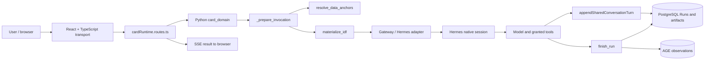

Main execution enters through the backend route, begins a saved Card Run in Python, resolves bounded native data, materializes exactly one IDF, executes through the repository-owned Hermes adapter, completes the same Run, persists the exact chat pair, and returns the result over SSE. There is no Jev stage in this path.

### Diagram 2 — CURRENT Card execution, grants, and Skills

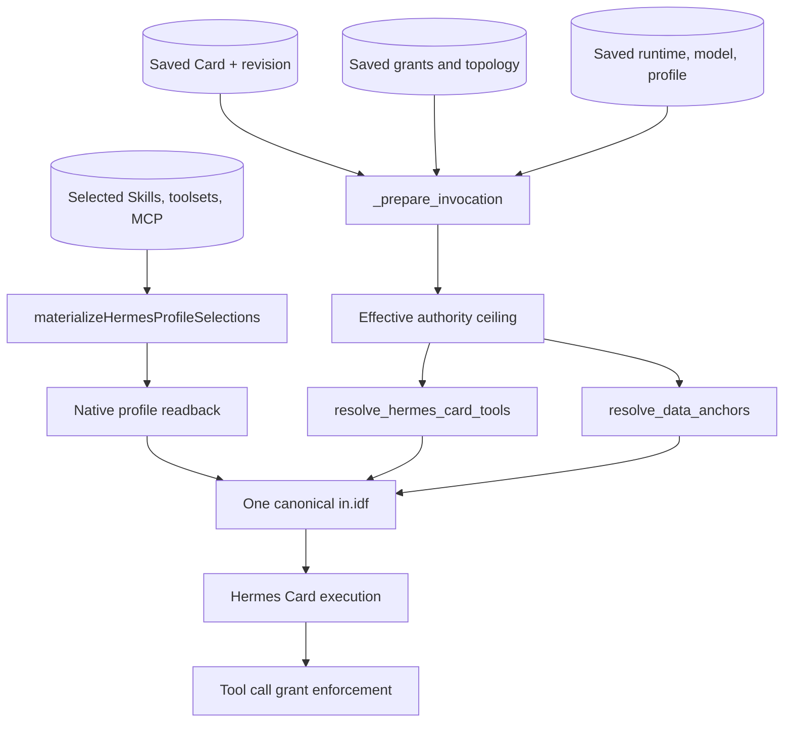

Current selection is largely saved-state materialization plus deterministic validation. There is no task-specific Jev ranking. Tool execution is still checked against actual grants after model selection.

### Diagram 3 — CURRENT Main, Builder, Magnetic, and worker path

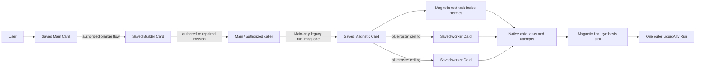

This is an important correction to the conceptual “Builder → Magnetic” phrase: Builder may prepare or repair the work order, but current application authorization makes Main the direct invoker through the legacy/current `run_mag_one` symbol. Magnetic then operates through Task Graph/Kanban inside the same Hermes runtime. Jev must diagnose this handoff without silently creating a new Builder authorization.

### Diagram 4 — CURRENT ThinkGraph and KnowGraph ownership

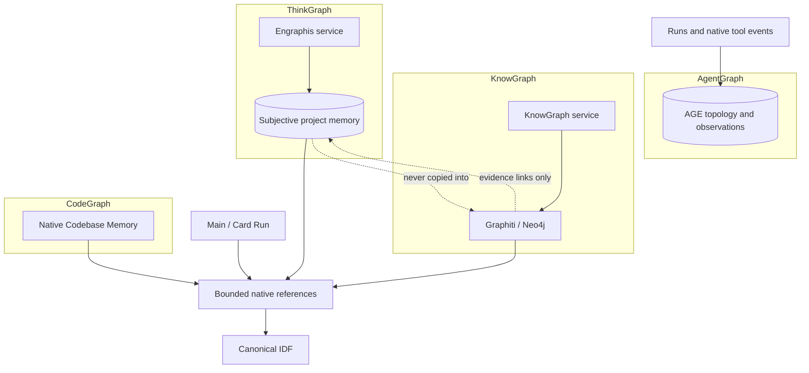

Existing `Attention` records what native resources were actually touched. It is durable execution activity, not the proposed `JevAttention` selector.

## 4. Current code architecture: exact owners and symbols

| Boundary | Current owner | Exact files / symbols | Current contract |
|---|---|---|---|
| Saved Card invocation | Python rails | `apps/python-models/app/python_models/card_domain.py::_prepare_invocation`, `materialize_invocation`, `prepare_run_invocation`, `begin_run`, `begin_main_chat_run` | Loads exact revision, runtime, model/profile, grants, context, sender authority, and Run identity. |
| Backend Run preparation | TypeScript transport | `apps/backend/src/routes/cardRuntime.routes.ts::prepareSavedCardRun` | Calls Python `/domain/runs/begin`; does not semantically rebuild the invocation. |
| Canonical runtime input | Python rails | `apps/python-models/app/python_models/idf.py::materialize_idf` | Sole writer/reloader of the one model-facing `in.idf`. |
| Native graph context | Python rails | `apps/python-models/app/python_models/data_anchor.py::resolve_data_anchors`, `read_knowgraph_exact`, `search_knowgraph_hybrid` | Resolves bounded native data and provenance before IDF materialization. |
| Hermes profile/model/Skills | TypeScript lifecycle | `apps/backend/src/hermes/profileMaterialization.ts::materializeHermesProfileSelections`; `agentTerminal.ts::savedProfileSelection` | Applies saved selections and reads native profile state back. It is durable profile state, not a per-attempt semantic selector. |
| Effective Card tools | Python + runtime enforcement | `card_domain.py::resolve_hermes_card_tools`; `apps/python-models/app/mcp_host.py::_execute_tool_request` | Resolves model-facing tools and rechecks grants before dispatch. |
| Card execution completion | Python rails | `card_domain.py::finish_run`, `record_explicit_artifact`, `_observe_run_finish`, `_observe_artifact` | Persists terminal Run outcome and artifact metadata; emits AGE observation. |
| Same-Run backend completion | TypeScript transport | `apps/backend/src/hermes/agentTerminalExecution.ts::completeStaged` | Completes the already prepared application Run. |
| Shared chat pair | PostgreSQL via TypeScript | `apps/backend/src/conversations/store.ts::appendSharedConversationTurn`; `/session/chat` in `cardRuntime.routes.ts` | Inserts exact user and assistant messages complete in one transaction; currently no post-chat intake marker. |
| ThinkGraph | Engraphis through Python rails | `apps/python-models/app/python_models/engraphis.py::get_service`, `private_operation`, `projection` | Sole Think writer. Automatic extraction/retention services are disabled. |
| Think cognition metadata | Python rails / Engraphis | `apps/python-models/app/python_models/thinkgraph.py::CognitionRecord`, `ResearchPolicy`, `research_seed` | Preserves legacy question/hypothesis metadata. `currentInterest` is persisted metadata, not `JevAttention`. Automatic research is disabled. |
| Think-to-Know evidence link | Python rails | `apps/python-models/app/python_models/question_evidence.py::link_question_evidence` | Idempotently links real Graphiti evidence back to a Think Question; it does not validate speculation or dispatch research. |
| KnowGraph ingestion | Graphiti/Neo4j service | `services/knowgraph/ingest.py::_ingest_episode`, `_record_episode_authority`, `_reference_time`, `_guidance_text` | Owns sourced episodes, entities/facts, provenance, and source/world time. |
| Existing Attention | Python + AGE | `apps/python-models/app/python_models/native_attention.py::build_native_attention_event`; `card_domain.py::observe_native_attention`; `mcp_host.py::_persist_native_attention` | Records actual successful native IDs and operations. It is factual activity, not semantic relevance scoring. |
| Existing Attention UI overlay | React | `client/src/features/agentbuilder/state/useAgentBuilderGraphAttention.ts` | Renders real activity over authoritative projections without inventing nodes. It is not `JevAttention`. |
| Native graph inspector | React | `client/src/components/knowledge/NativeAuthorityGraphSurface.tsx::NativeGraphProjectionSurface` | Renders real nodes, relations, evidence, provenance, and time properties. |
| Main chat telemetry seam | React | `client/src/components/builder/BuilderChat.tsx::BuilderChat`; `client/src/features/agentbuilder/state/useAgentBuilderMainChat.ts` | Current message model has no stable diagnostic-receipt reference. |
| Orange Card handoff | Saved topology + Hermes plugin | `card_domain.py::_project_hermes_bot_rosters`; `packages/hermes-card-tools/__init__.py::_rewrite_message_agent_target` | Orchestrator flag plus exact outbound orange edge authorizes a target; title maps only to already-authorized profile. |
| Blue Magnetic roster | Saved topology + Python | `card_domain.py::_connected_hermes_card_targets`; legacy/current `magentic_execution.py::_worker_scope`, `_worker_authorities` | Exact enabled blue-connected saved Cards define the worker authority ceiling. |
| Magnetic execution layer | Hermes Task Graph/Kanban ledger | Legacy/current `magentic_execution.py::submit_magentic_execution`, `read_magentic_execution`; `Hermes/.../kanban_db.py::create_task`, `claim_task`; `kanban_team.py::create_team_root`, `activate_staged_team_root` | Magnetic owns native tasks, dependencies, claims, attempts, retries, dispatch, and final sink inside the one Hermes runtime. |
| Native descendant authorization | Python + TypeScript checks | `magentic_execution.py::_native_lineage_for_source`, `_native_worker_authority`, `_validate_standard_native_child`, `authenticate_magentic_worker_tool_request`; `agentTerminal.ts::authenticateMagenticWorkerToolRequest` | Validates live claim/tenant/creator lineage and anchors descendants to the first saved blue worker authority. |
| Run and artifact persistence | PostgreSQL + AGE observation | `apps/backend/migrations/022_relational_agent_domain.sql::agent_runs`, `run_artifacts` plus later migrations | Stores outer Runs and artifact locators/hashes; not yet a Jev attempt/diagnostic ledger. |

## 5. Twenty-five-question code reality pass

| # | Question | Current answer |
|---:|---|---|
| 1 | Where does Main execute? | `/session/chat` prepares the saved Main Card Run, Python materializes the invocation/IDF, and the repository-owned Gateway/Hermes session executes it. |
| 2 | How does a Card run? | Saved revision and authority are loaded by `_prepare_invocation`; one Run and IDF are created; the selected runtime executes; `finish_run` closes the same Run. |
| 3 | How are Card profiles loaded? | `savedProfileSelection` and `materializeHermesProfileSelections` project saved profile/model/Skill/toolset/MCP choices and read them back. |
| 4 | Where do deterministic tool grants live? | Saved Card grants are resolved in `card_domain.py`; `mcp_host.py::_execute_tool_request` and backend worker authentication enforce them at execution. |
| 5 | Where are Skills loaded? | Native Hermes profile materialization loads selected installed Skills; native `skill_manage` and `/learn` exist but are not linked to product S-run receipts. |
| 6 | Where is graph context injected? | `resolve_data_anchors` reads exact native data; `materialize_idf` writes it into the one canonical IDF. |
| 7 | What owns ThinkGraph? | Engraphis, reached through Python rails. |
| 8 | What owns KnowGraph? | Graphiti/Neo4j through the KnowGraph service. |
| 9 | Does `JevAttention` already exist under another name? | No. Existing `Attention` records observed native activity and remains separate from `JevAttention`. |
| 10 | Where does Magnetic execute? | Magnetic operates as Task Graph/Kanban/team execution inside the one Hermes runtime. Python submits its root through legacy/current `magentic_execution.py`; Hermes performs worker execution and synthesis. |
| 11 | How are blue worker relationships represented? | Saved enabled `magentic_option` edges provide exact worker Card/revision authorities. |
| 12 | Where is task/run/claim/tenant authority enforced? | Python validates native source task/run/claim/creator/tenant lineage; backend matches the running saved authority Card and permitted plugin tool. |
| 13 | What blocks future run-scoped descendants? | Not the current lineage model: it already permits self-scoped descendants under a saved ancestor. Missing pieces are a run-scoped prompt/model/Skill/context descriptor and provenance. |
| 14 | What Agent-Maker/Skill-Maker functionality exists? | Durable Card creation/configuration and native Skill management exist. No separate Agent-Maker platform or provenance-bound S-run promotion flow exists. |
| 15 | How are Run results stored? | PostgreSQL `agent_runs`, `run_artifacts`, shared-conversation messages, and AGE observations; Hermes separately owns native task attempts. |
| 16 | How are agent-to-agent handoffs represented? | Orange saved flow authority plus Hermes bot-mode `message_agent`, and blue Magnetic authority plus native Task Graph lineage. A native handoff does not always create a separate app Run. |
| 17 | Where would a universal receipt attach? | Append-only diagnostic receipts should link either an application Run or a native handoff/descendant identity, with artifacts for large traces. |
| 18 | Where would post-chat Think intake attach? | To the exact IDs returned by `appendSharedConversationTurn`, using a durable structural marker in the same transaction and asynchronous Python consumption after SSE completion. |
| 19 | Where should the Jev wrapper live? | One server-side Python-rails adapter/policy boundary adjacent to invocation, graph, and Run-domain owners; exact module name belongs to a later ImplementationPacket. |
| 20 | What retry/controller abstraction exists? | Hermes owns native retries/attempts, but there is no cross-Run semantic repair controller. It must reference rather than duplicate Hermes attempts. |
| 21 | Where could S-run Skill learning attach? | A provenance-bearing versioned Skill-candidate artifact can attach to the accepted Run; later review/activation must use existing Skill authority. |
| 22 | Where could D-to-Builder escalation attach? | An artifact-backed failure packet plus an already-authorized Main-to-Builder/Card handoff; Jev cannot create Builder authority. |
| 23 | What UI could show telemetry? | Main chat can show a compact receipt summary; Run/graph inspectors can show full distributions, attempts, references, and traces. |
| 24 | What tests already cover boundaries? | Card-domain Run/graph/Magnetic tests, profile-materialization tests, same-Run terminal tests, Magnetic authorization tests, `test_native_attention.py`, and graph-surface UI tests. |
| 25 | What dead/duplicate paths must not be extended? | Removed automatic Think extraction, legacy executors, duplicate IDF assemblers, alternate schedulers, deterministic semantic routers, retired graph owners, and any second security/authorization path. |

## 6. TARGET Jev semantic contracts

### The three primitives, used narrowly

| Primitive | Correct role here | Examples | Must not become |
|---|---|---|---|
| **Noul** | One bounded yes/no proposition with probability | “Does this candidate materially matter now?”, “Is context sufficient?”, “Does this Think claim need sourced research?”, “Does output correspond to request?” | A vague spectrum, permission grant, truth oracle, or novelty admission gate. |
| **Choice** | One selection from a closed unordered set, retaining the whole distribution | Think/Know relationship label; one repair intervention; query shape when the shapes are mutually exclusive | Magnetic worker authorization, an unbounded ontology, or a forced answer without `NONE`/`OTHER`/`INSUFFICIENT_CONTEXT`. |
| **Score** | Position on a concrete ordered rubric, retaining level probabilities | Request Grade S/A/B/C/D; Execution Grade S/A/B/C/D; Note reuse quality 1–5 | Objective factual probability, user reputation, node importance, or an opaque combined quality score. |

Focus, Alignment, and Accuracy are Noul-shaped bounded propositions reported as percentages. Request Grade and Execution Grade are direct five-level Score judgments. They remain independent dimensions; no single arithmetic “AI quality” score is introduced.

### Diagnostic definitions

- **Focus:** probability the incoming work order preserves immediate local intent. Low Focus may be an intentional topic change.
- **Alignment:** probability the work order fits durable project mission, constraints, corrections, and direction. It must be graph-informed, not last-N-message similarity.
- **Request Grade:** direct S/A/B/C/D judgment of the work order's consistency, actionability, specification, and framing. It judges the request, never the person.
- **Accuracy:** probability that the output adequately corresponds to the complete supplied request and constraints. It is not factual truth or percent-complete.
- **Execution Grade:** direct S/A/B/C/D judgment of actual task performance, procedure, context/tool/Skill use, capability, failures, and deliverable quality.
- **`JevAttention`:** the transient, task-relative, probabilistic relevance and auto-selection layer over deterministic candidate universes. It is rerun as graph/task state changes, never becomes permanent node importance, and creates no graph or database.

### Relationship vocabularies

Treat “255 choices” as a **protocol capacity**, not a V1 ontology target. Start with versioned active vocabularies of roughly 12–32 high-value labels per graph plus `NONE`, `OTHER_RELATION`, and `INSUFFICIENT_CONTEXT`. Benchmark confusion and consolidate or split labels from evidence. Retain the full returned distribution, vocabulary ID/version/hash, model version, prompt/policy version, and evaluation time.

The accepted graph edge carries the selected native predicate and an assessment reference. The full distribution is an immutable **model assessment**, not graph truth, and stays in the receipt/owner-native assessment record.

### Time semantics

Do not overload one timestamp:

| Time | Meaning | Current reusable owner |
|---|---|---|
| `observedAt` | When source/chat state was observed | conversation messages / source ingestion |
| `learnedAt` | When a graph learned the record | Engraphis or Graphiti ingestion |
| `validFrom` / `validTo` | When a belief/fact applies in its world | Engraphis correction history / Graphiti validity |
| `evaluatedAt` | When Jev produced an assessment | new receipt |
| `retrievedAt` | When native data was selected for a Run | `GraphDataRecord.retrievedAt` |
| `runEventAt` | When execution activity occurred | Runs / existing Attention event timestamp |

Re-evaluation appends an assessment with `supersedesAssessmentId`; it does not overwrite the prior distribution. Think correction reuses Engraphis history. Know supersession requires sourced Graphiti validity/evidence; a Jev `SUPERSEDES` choice alone cannot invalidate a fact.

## 6.1 Required failure, fallback, and observability contract

**Jev failures are never silent.** “Fallback” never means manufacturing a Jev answer, calling a generic LLM and labeling it Jev, or widening a candidate/permission universe. Every attempted or intentionally bypassed Jev-controlled operation records which policy actually ran.

### Class A — safety, authority, and data integrity

This class includes permissions, tool grants, tenant authority, native claims, leases, Run lineage, immutable Card/revision/grant authority, schema integrity, transactions, and idempotency. These are deterministic checks, not Jev decisions.

**Behavior: fail closed.** Do not execute, do not fall back to broader permissions, and do not allow Jev to override the failure. Record the existing authority/integrity error and, when a Jev operation had been planned, record that it was not attempted because its authorized state was never established.

### Class B — semantic control and optimization

This class includes `JevAttention`, Focus, Alignment, Request Grade, Accuracy, Execution Grade, query shape, context/source/tool/Skill ranking, relation usefulness, retrieval sufficiency, and adaptive stopping.

**Behavior: visibly use a proven baseline where one exists.** Never fabricate a metric or distribution.

| Operation failure | Required behavior | Required receipt result |
|---|---|---|
| `JevAttention` | Use the unchanged existing retrieval/order/default behavior; use existing granted tools and existing available Skills. | `jevStatus = unavailable | timeout | invalid | error`; `selectionPolicyUsed = baseline_<version>`; baseline selections recorded. |
| Focus, Alignment, or Request Grade | Continue the ordinary user request. Do not use the missing metric for control. | Individual metric is explicitly unavailable; Run remains ordinary product truth. |
| Accuracy or Execution Grade | Preserve the completed Run. Do not auto-retry, learn, or trigger a D path from missing values. | Evaluation failure, raw Run/result reference, and no downstream automatic action. |
| Tool ranking | Preserve current already-authorized tool presentation/execution behavior. | Baseline tool policy/version; never any tool outside grants. |
| Skill ranking | Preserve current saved/available Skill behavior. | Baseline Skill policy/version; never any unavailable Skill. |
| Query shape or candidate relevance | Use the existing native retrieval path and its current bounds/order. | Baseline retrieval policy/version and actual candidate/selection refs. |
| Retrieval sufficiency/adaptive stop | Use a deterministic bounded fallback retrieval budget, then stop. | Budget, rounds, stop reason, and baseline policy recorded. |
| Relation usefulness during read traversal | Use the existing bounded native traversal; do not delete or rewrite relations. | Baseline traversal policy/version and actual visited refs. |

If no proven safe baseline exists, stop that optional feature visibly while allowing unrelated base-product behavior to continue.

### Class C — automatic mutation, learning, and semantic writes

This class includes relationship creation, relationship-born Think persistence, Note creation, Know enrichment, automatic research launch, automatic Skill creation, semantic retries/repairs, and any other durable semantic mutation.

**Behavior: fail closed for the mutation.** The underlying product Run or already-grounded evidence may remain valid, but the automatic mutation does not occur.

| Required Jev judgment fails | Required behavior |
|---|---|
| Relationship Choice | Do not invent a relationship or distribution; write no semantic edge. |
| Think pair birth | Do not commit the persistent new Think node. A staged unpublished candidate may remain only if the eventual Engraphis design explicitly supports it. |
| Know enrichment | Preserve valid sourced Graphiti material; skip only optional semantic enrichment/pairing. |
| Provenance/research decision | Do not automatically launch research; leave the question unresolved and available for explicit authorized research. |
| S Skill learning | Create no automatic Skill unless valid `Execution Grade == S` and valid `Accuracy >= 0.80` both exist. |
| Retry diagnosis/repair choice | Start no random retry; preserve the current/best attempt and record repair-selection failure. |
| D escalation diagnosis | Never infer D or low Accuracy from evaluator absence; no automatic D path. |

Phases 1–3 enable no Class C automatic mutation. The rules above are retained for the later Phase 4 boundary.

### Mandatory per-operation receipt

Every Jev request or controlled decision produces an inspectable `JevOperationReceipt`, including failures and baseline fallbacks:

```text
JevOperationReceipt
  jevOperation
  jevStatus                    // success | unavailable | timeout | invalid | error
  jevModel?
  jevModelVersion?
  questionSchemaVersion
  policyVersion
  baselineOrJevPolicyUsed      // jev_<version> | baseline_<version> | stopped
  candidateCount
  candidateRefs[]              // bounded, stable references
  selectedRefs[]
  decision?                    // only on valid success
  fullDistribution?           // only where returned and valid
  budgetUsed
  latencyMs
  providerUsage?
  errorCode?
  failureReason?               // bounded/sanitized, never a secret
  downstreamRunId?
  downstreamAccuracy?         // later correlation; never backfilled as if contemporaneous
  downstreamExecutionGrade?   // later correlation
  createdAt
```

For a successful batched API request, retain one transport-call receipt plus the typed status/result of every named question. A partially missing or schema-invalid question is unavailable for its feature even if sibling questions succeeded. Provider success is not semantic success unless the expected model/version and typed answer validate.

UI language must say which policy actually executed: **Jev**, **baseline fallback**, **not attempted because authority failed**, or **stopped because no safe baseline existed**. There is no hidden “it seemed to work” state.

## 7. TARGET architecture and required diagrams

### Diagram 5 — TARGET universal handoff receipt

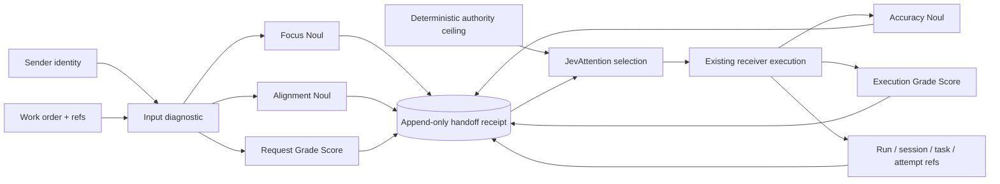

One receipt schema supports two identity shapes:

1. application Run: `runId`, `targetCardRevisionId`, `correlationId`;
2. native handoff/descendant: `outerRunId`, `nativeRootId`, `sourceTaskId`, `sourceTaskRunId`, `sourceProfile`, `authorityCardRevisionId`.

It must also distinguish `workOrderAuthor`, `authorizedInvoker`, and `receiver`. This is necessary for Builder-authored but Main-invoked Magnetic work.

### Diagram 6 — TARGET JevAttention and tool/Skill/context selection

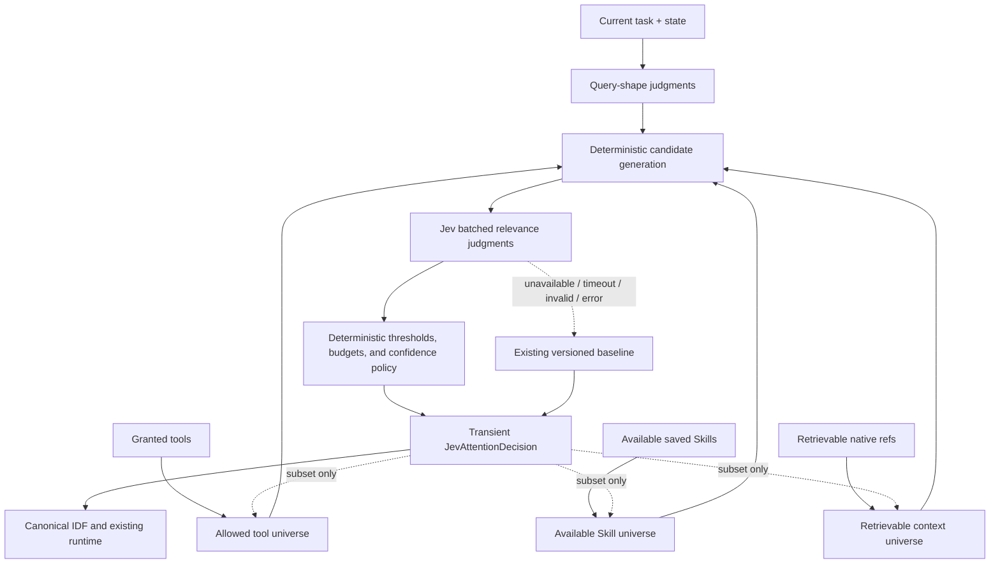

Hard invariants:

```text
selected_tools   ⊆ granted_tools
selected_skills  ⊆ available_skills
selected_context ⊆ retrievable_context
```

Jev ranks; deterministic code validates sets, applies budgets, and executes. Missing/invalid Jev output never widens authority. Until native run-scoped tool/Skill presentation is proven, tool/Skill decisions remain shadow recommendations rather than profile mutations.

### Diagram 7 — TARGET adaptive retrieval

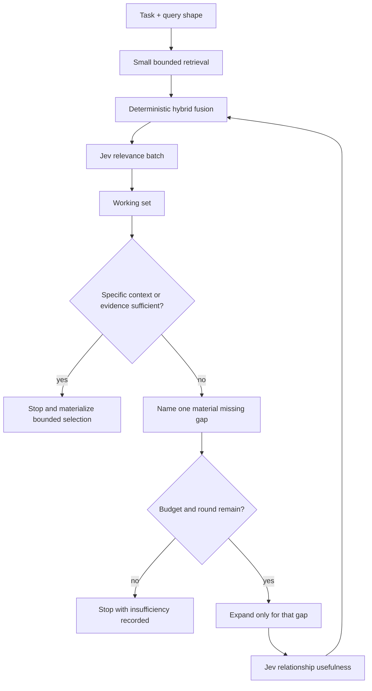

Candidate generation remains deterministic/native: graph neighbors, exact refs, BM25/text, vector similarity, entity references, recency, provenance, and current strong edges. Use a simple reproducible fusion such as reciprocal-rank fusion before Jev reranking. No open-ended research loop.

### Diagram 8 — TARGET Think node birth and maturation

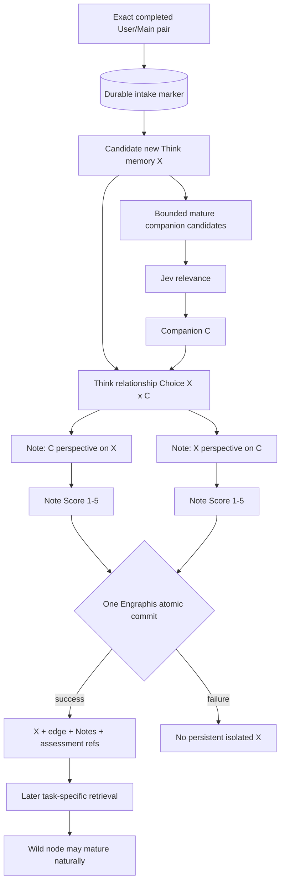

No novelty gate and no cold-start importance boost are added. A wild node may remain peripheral. A mature node can act as the semantic entry point for a new node. Notes have `triggersPair=false` (or equivalent origin typing), so Notes do not recursively create pairs.

### Diagram 9 — TARGET Think-to-Know research loop

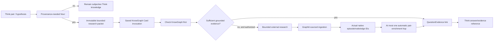

The Noul identifies a provenance need; it does not grant paid/web tools. KnowGraph checks its graph first. External research requires existing Card grants and budget. Graphiti writes first; one-hop pair assessment waits for actual native completion IDs. Evidence may qualify, contradict, or support a Think claim, but never automatically converts speculation into truth.

### Diagram 10 — TARGET repair, S learning, and D escalation

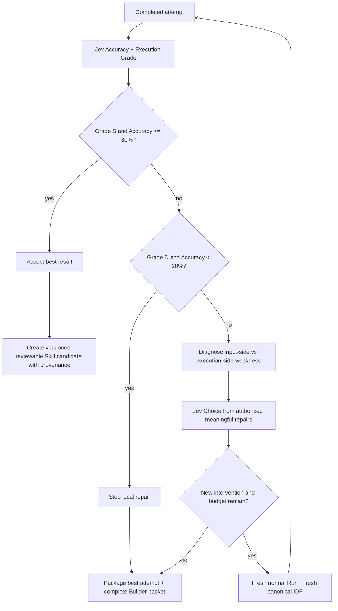

Every retry is a new attempt with immutable provenance. It never edits the previous Run or repeats the same failed intervention blindly. Magnetic's native attempts and retries remain owned by the Hermes Task Graph/Kanban ledger and are referenced, not replaced.

### Diagram 11 — TARGET complete Jev control plane

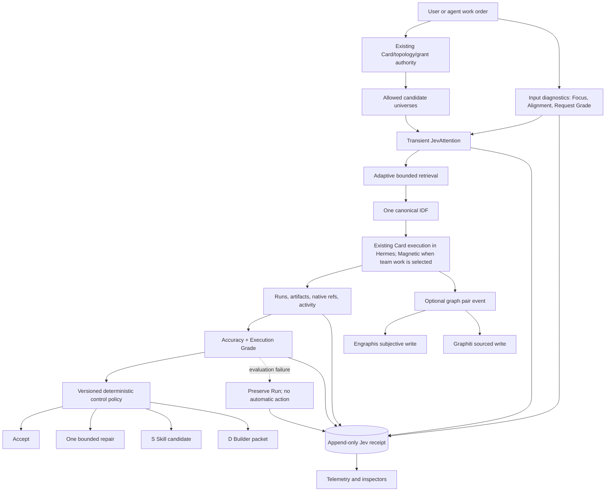

### Diagram 12 — CURRENT-to-TARGET ownership transition

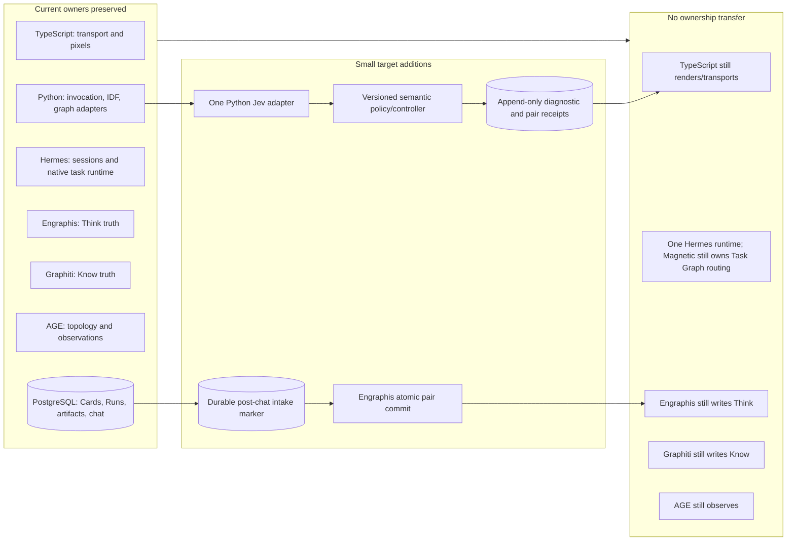

## 8. Universal handoff receipt and minimum data model

### Receipt contract

The receipt is append-only evaluation evidence, not runtime authority. A minimal logical shape is:

```text
HandoffDiagnosticReceipt
  receiptId
  schemaVersion
  policyVersion
  evaluatorModel
  evaluatorPromptVersion
  handoffKind
  workOrderAuthorRef
  authorizedInvokerRef
  receiverRef
  applicationRunRef?             // Card Run identity shape
  nativeExecutionRef?            // root/task/task-run/profile/authority shape
  parentReceiptId?
  attemptNumber
  intervention?
  inputStateRef + inputHash
  focusProbability
  alignmentProbability
  requestGrade + requestGradeDistribution + confidence
  jevAttentionTraceRef?
  outputStateRef + outputHash?
  accuracyProbability?
  executionGrade? + executionGradeDistribution? + confidence?
  status
  evaluatedAt
  providerUsage
  errorCode?
```

Do not copy raw IDFs, hidden reasoning, entire conversations, or graph subgraphs into this record. Store stable native references, hashes, versions, bounded explanations, and artifact locators.

### JevAttention decision

The working object is run/query-scoped and need not be a permanent table:

```text
JevAttentionDecision
  runId / queryId
  policyVersion
  queryShape answers
  candidates[]                  // authority + native ID + source signals
  relevance answers[]
  selectedContext[]
  selectedTools[]               // subset of grants
  selectedSkills[]              // subset of available Skills
  rounds + budgetUsed
  sufficiency answers
  stopReason
  evaluatedAt + expiresAt
```

Persist an inspectable, bounded trace as a Run artifact only when required for evaluation, replay, or UI. Do not make relevance permanent node importance.

### Pair assessment and Notes

```text
PairAssessmentReceipt
  pairReceiptId
  graphAuthority                // Think or Know
  endpointA + endpointC
  sourceEventRef
  vocabularyId/version/hash
  fullChoiceDistribution
  selectedRelation
  confidence
  evaluatorModel/prompt/policy versions
  evaluatedAt
  supersedesAssessmentId?

DirectionalNote
  nativeNoteId
  pairReceiptId
  focalNativeId
  companionNativeId
  direction
  text
  scoreLevel + scoreDistribution
  sourceSpanRefs[]
  sourceEpisodeRefs[]           // mandatory for grounded Know Notes
  authoredBy/model/promptVersion
  createdAt
  supersedesNoteId?
  triggersPair = false
```

### Durable post-chat intake marker

Main cannot be both fast and lossless if the system uses an in-process fire-and-forget callback. Add one small coordination/outbox record in the same PostgreSQL transaction as the exact completed pair:

```text
PostChatIntake
  sourcePairId                  // unique deterministic identity
  projectId
  conversationId
  userMessageId
  assistantMessageId
  runId
  state                         // pending, processing, completed, failed
  attemptCount
  receiptArtifactId?
  createdAt
  completedAt?
  errorCode?
```

The stable idempotency identity should derive from project, conversation, and the two persisted message IDs. Raw text remains in `conversation_messages`; the marker stores references only.

### Storage placement

| Data | Minimum owner | Why |
|---|---|---|
| Raw User/Main messages | Existing PostgreSQL conversation tables | Already exact and transactional; no duplicate chat history. |
| Outer Card Run | Existing `agent_runs` | Existing invocation authority and accounting. |
| Large Jev decision traces, research packets, S/D packets | Existing `run_artifacts` plus stable receipt reference | Reuses artifact provenance without inflating relational rows. |
| Handoff/attempt diagnostic index | New append-only relational receipt table(s) | Queryable cross-Run diagnostic facts do not fit terminal Run columns cleanly. |
| Post-chat coordination | New small outbox/intake record | Required for lossless asynchronous delivery across PostgreSQL and Engraphis. |
| Think relationship/Notes | Engraphis-native schema/operation | Engraphis remains sole Think writer and transaction owner. |
| Know relationship/Notes | Graphiti/Neo4j-native sourced annotation | Grounding, episode refs, and validity stay with Know authority. |
| Selected relation distribution | Immutable receipt plus native edge `assessmentRef` | Keeps model uncertainty separate from accepted graph predicate. |
| Transient `JevAttention` working set | Memory during a Run; optional artifact trace | Relevance is contextual and expires. |
| AgentGraph observation | Existing AGE nodes/edges may reference stable receipt/artifact IDs | AGE observes; it does not become semantic truth. |
| Skill candidate | Versioned artifact first, later existing Skill catalog/revision after review | Preserves provenance and reversibility. |
| Future temporary worker lineage | Existing native root/task/run/creator lineage plus a narrowing descriptor | Avoids permanent Card creation and duplicate task storage. |

No new database is justified.

## 9. Python versus TypeScript ownership

| Component | Current owner | Target owner | Reason |
|---|---|---|---|
| Jev provider client/wrapper | None | Python rails | Semantic computation sits beside current graph/runtime domain logic; credential stays server-side. One implementation only. |
| Graph candidate retrieval | Python rails / native services | Same | Existing exact native adapters and provenance already live here. |
| Graph writes | Engraphis or Graphiti through Python rails | Same | One authority and writer per graph. |
| `JevAttention` semantics | None | Python rails, Run-scoped | It interprets task relevance and must not be duplicated in UI/transport. |
| Retry/repair policy | None across Runs | Python rails | It consumes Run/receipt semantics and launches only ordinary authorized Runs. |
| Skill candidate generation | Native Skills exist; no product S flow | Python rails generates artifact; existing Skill owner reviews/activates | Separates semantic learning from durable profile authority. |
| Event delivery/outbox | TypeScript/PostgreSQL structurally owns exact chat transaction | TypeScript records IDs/state; Python consumes | TypeScript knows the persisted pair but does no semantic interpretation. |
| Card runtime | Python domain + TypeScript lifecycle/transport + Hermes | Same | Jev must wrap, not replace, the established boundary. |
| Magnetic integration | Python projection + Hermes Task Graph/Kanban inside the one Hermes runtime | Same | Jev neither selects nor dispatches workers. |
| Agent evaluation | None | Python rails with Jev | Evaluation is semantic and versioned. |
| UI telemetry | React/TypeScript | Same | UI renders receipt data and labels uncertainty; it does not compute it. |
| Background intake | None | Existing application process boundary, with PostgreSQL marker and Python worker/consumer | A bounded consumer is needed, not a second scheduler or agent platform. Exact lifecycle must reuse an existing owner proven during implementation. |

## 10. Tool, Skill, and context auto-selection mapping

### Safe ordering

1. `_prepare_invocation` resolves the exact saved Card/revision and deterministic authority.
2. `resolve_hermes_card_tools` and profile readback establish the permitted tool/Skill universe.
3. `resolve_data_anchors` and query-shape-guided native search produce retrievable candidates.
4. Jev batches independent relevance/sufficiency questions over bounded candidate descriptors.
5. Deterministic policy verifies every selected ID is a member of its authorized universe and applies thresholds/budgets.
6. `materialize_idf` receives only the final selected native data and unchanged authority metadata.
7. Runtime enforcement rechecks tool calls exactly as it does today.

### Important implementation constraint

Context selection is naturally Run-scoped. Current Hermes Skill/tool selection is not: `materializeHermesProfileSelections` mutates and reads back durable profile state that reused sessions may share. Therefore:

- Phase 1 records Jev tool/Skill rankings in shadow receipts only.
- A later hard-narrowing phase requires proof of a native attempt/session-scoped presentation mechanism.
- If no such mechanism exists, do not simulate it by rapidly rewriting the saved profile.
- A selected set is always an intersection beneath the saved grants; provider failure cannot fall back to the full catalog.

### 30k context proposal

Use 30k tokens only as a **benchmark ceiling for a deep System-2 execution IDF**, not as the state passed to every Jev judgment and not as persistent graph context. Jev state should contain compact candidate descriptors and the minimum task fields needed for the atomic judgment. Main begins far smaller; Builder may spend more under an explicit budget. Measure marginal task improvement per added retrieval round rather than filling the window by default.

## 11. ThinkGraph, KnowGraph, and JevAttention mapping

### ThinkGraph

- User/Main completed pairs become candidate source events, not automatic truth.
- TypeScript records exact pair IDs; Python/Jev decides semantic relevance asynchronously.
- A new persistent Think memory must be committed with a real companion edge, full relationship assessment reference, and directional Notes.
- The commit must be one Engraphis-owner transaction. Existing separate `remember`/`link` calls cannot enforce the invariant.
- Existing Engraphis batch support is a useful implementation seam but lacks the required arbitrary existing companion, full distribution, Notes, and receipt structure.
- A wild memory receives no artificial importance. Later task-specific relevance can make it useful.
- `CognitionRecord.currentInterest` remains historical authored metadata and is not repurposed as `JevAttention`.
- Current projection uses `include_memory_nodes=False`; implementation must explicitly choose an honest memory-level overlay/projection. The UI may not invent an entity edge from a memory-pair receipt.

### KnowGraph

- Graphiti ingestion remains source-first and provenance-bearing.
- One-hop automatic pair enrichment runs only after native completion returns actual episode/node/edge IDs.
- Relationship and Note assessments retain source episode references and are labeled controller interpretation, not sourced fact.
- No strict Think-style pair-birth rule is imposed on canonical Graphiti ingestion; sources may legitimately produce their native entity/fact topology first.
- `reference_time`, validity, ingestion time, and Jev evaluation time remain distinct.
- External research is bounded, checks KnowGraph first, and uses existing saved KnowGraph Card grants.

### JevAttention

- Existing `Attention`: durable fact that a native operation touched exact IDs.
- Target `JevAttentionDecision`: transient judgment that candidates matter for this task now.
- They may be correlated in a receipt, but never merged into one semantic field or AGE truth edge.

## 12. Retry and repair controller mapping

### Control rules

The controller is deterministic policy consuming typed Jev answers. It owns budgets, idempotency, allowed interventions, attempt creation, and stop conditions. Jev may choose **one** intervention from the currently authorized, meaningful set; it does not launch arbitrary work.

| Signal pattern | First diagnosis | Candidate repair family |
|---|---|---|
| Low Accuracy, decent/high Grade | Input, targeting, referent, handoff, or selected context | Clarify/rewrite work order; restore refs; remove misleading context; reconnect mission. |
| High Accuracy, low Grade | Execution capability/procedure | Rerank existing Skills/tools; improve procedure/execution prompt; examine allowed model/profile; add specifically useful context. |
| Low Accuracy, low Grade | Both sides broken | One high-information repair or early Builder escalation. |
| High Accuracy, high Grade | Healthy | Accept; learn only at exact S plus Accuracy >= 80% gate. |

### Attempt semantics

- A retry is a fresh normal Run with a fresh canonical IDF and a new receipt.
- `parentReceiptId`, `attemptNumber`, and `intervention` form cross-Run lineage.
- Magnetic attempts remain native to the Hermes Task Graph/Kanban ledger and are referenced by their task/run/attempt IDs.
- The prior output and receipt are immutable.
- The best attempt survives and is selected by versioned policy, not overwritten by the last attempt.
- The same failed intervention cannot be chosen again for the same diagnosed condition without new state.
- Exact retry counts and thresholds are configuration/policy versions to be tuned on real evaluation data.

### S learning

Only `Execution Grade == S` **and** `Accuracy >= 0.80` produces a Skill candidate. It includes the abstracted successful input pattern, procedure, prompt pattern, tools, Skills, context characteristics, output characteristics, and original Run/receipt provenance. It is versioned, reviewable, reversible, and does not rewrite the Card's core prompt automatically.

### D escalation

Only `Execution Grade == D` **and** `Accuracy < 0.20` forces terminal local stop. Bounded repair exhaustion may also escalate. The Builder packet includes original task, origin Card/profile/revisions, all five diagnostics, selected context/native refs, prompt variants, attempt history, outputs, runtime failures, tools/Skills, policy versions, best attempt, and explicit requested repair. Delivery uses an existing authorized Card handoff; Jev cannot invent the edge.

## 13. Magnetic compatibility and future AutoTeam seam

### Magnetic compatibility

- Saved blue `magentic_option` topology remains the complete worker roster ceiling.
- Jev does not rank, add, remove, assign, retry, or dispatch Magnetic workers.
- Magnetic uses its saved Card/profile to decompose, assign, enforce dependencies, manage attempts, and synthesize through Task Graph/Kanban inside the one Hermes runtime.
- Jev may grade the incoming Magnetic mission, observe worker-output receipts, rank allowed context for a worker invocation, and diagnose whether failure lies in the mission or execution.
- `run_mag_one` remains Main-authorized unless a separate owner-approved change explicitly alters that contract.
- A receipt may describe Builder as work-order author while Main is the authorized invoker and Magnetic is receiver.

### Future run-scoped descendants

Current native authorization already distinguishes the live descendant `sourceProfile` from its saved blue ancestor `authorityProfile`. Valid creator-chain, claim, tenant, and root continuity allow a temporary self-scoped descendant under the immutable saved authority ceiling. This is compatible with future temporary workers.

The missing future descriptor would need:

- run-scoped prompt/model/Skill/context specification;
- a capability subset strictly narrower than the saved ancestor;
- lineage to outer Run/root/task/task-run/creator identities;
- immutable Jev receipts for each attempt;
- no promotion to a permanent Card unless an explicit separate operation is approved.

### AutoTeam seam only

AutoTeam remains a future wildcard fallback invoked only after deliberate paths and bounded repairs are exhausted, through an already-authorized seam. It may create temporary run-scoped workers under the same narrowing and lineage rules. This plan does not define an AutoTeam scheduler, worker router, persistence layer, UI, or implementation.

## 14. Required gap table

| Capability | Current state | Owner now | Target owner | Files/symbols | Gap | Risk |
|---|---|---|---|---|---|---|
| Focus | Absent | None | Python Jev evaluation | `_prepare_invocation`; new receipt | Local continuity proposition/rubric and baseline calibration | Medium: topic changes may be mislabeled as defects |
| Alignment | Partial durable graph context, no metric | ThinkGraph + Run input | Python Jev using selected long-term refs | `resolve_data_anchors`, IDF | Graph-informed long-term continuity judgment | High: smooth drift and abrupt-but-correct shifts |
| Request Grade | Absent | None | Python Jev Score | invocation/receipt seam | Five concrete work-order levels and distributions | Medium: poor rubric can blame users |
| Accuracy | Absent | None | Python Jev Noul-shaped evaluation | `finish_run`, receipt | Request/output correspondence with complete input refs | High: must not be sold as factual truth |
| Execution Grade | Absent | None | Python Jev Score | `finish_run`, native receipts | Five-level run-performance rubric | High: confounded by bad input without independent Accuracy |
| Jev wrapper | Absent | None | One Python-rails provider adapter | adjacent to Card/graph domain; exact file deferred | Credentials, model pin, schema validation, timeout, usage | High: new network dependency and calibration drift |
| JevAttention | Absent; existing factual Attention exists separately | None | Python transient semantic decision | Existing `native_attention.py`, `observe_native_attention` code remains unchanged | New clearly named Run-scoped `JevAttentionDecision` | High: conflation could corrupt truth/telemetry |
| context ranking | Native bounded retrieval, no semantic final reranker | Python data anchors | Python Jev + deterministic policy | `resolve_data_anchors`, `materialize_idf` | Candidate descriptors, relevance, budgets, traces | Medium |
| tool ranking | Saved tools and deterministic grants only | Card/grant/runtime owners | Python shadow ranking, later proven run-scoped presentation | `resolve_hermes_card_tools`, `_execute_tool_request` | Safe per-attempt presentation mechanism | High: permission leakage/profile races |
| Skill ranking | Saved installed Skill selection | Hermes profile state | Python shadow ranking, later native run-scoped subset | `materializeHermesProfileSelections`, native Skill manager | Run-scoped narrowing without profile mutation | High |
| query-shape routing | Absent | None | Python `JevAttention` metadata | before candidate generation | Atomic semantic/temporal/causal/entity/multi-hop/recency judgments | Medium |
| hybrid candidate fusion | Exact/hybrid pieces exist | Python/native graph services | Python deterministic fusion | `search_knowgraph_hybrid`, graph adapters | One reproducible fused candidate contract | Medium |
| adaptive retrieval | Fixed bounded reads | Python data anchors | Python bounded retrieve/assess/expand policy | `resolve_data_anchors` | Gap-specific rounds and sufficiency stop | Medium: latency/runaway expansion |
| relation usefulness | Edge existence guides current traversal | Native graph queries | Python Jev relevance during traversal | graph neighbor readers | Suppress noisy/hub edges per task | Medium |
| relationship Choice | Native edges have accepted predicates only | Engraphis/Graphiti | Jev assesses; native graph owns accepted edge | Engraphis `link`; Graphiti facts/edges | Versioned vocab + full distribution + assessment ref | High: assessment mistaken for truth |
| Note Score | No target directional scored Note contract | Graph-specific evidence fields | Jev Score; Notes stored by native graph owner | graph projection/inspector | 1–5 reuse rubric plus level distribution | Medium |
| Think intake | Automatic extraction removed; exact chat pair exists | PostgreSQL chat + Engraphis manual ops | PostgreSQL marker + async Python consumer | `appendSharedConversationTurn`, `/session/chat` | Lossless post-SSE marker/consumer | High: synchronous latency or lost events |
| Think pair | Separate memory/link operations | Engraphis | Engraphis atomic pair operation | `engraphis.py`, native `remember_many`, `link` | X + C edge + Notes + refs atomically | Critical: isolated persistent nodes |
| provenance decision | Research policy exists but no active Jev gate | Think metadata | Python Jev Noul under grants/budget | `ResearchPolicy`, `research_seed` | Bounded need-for-sources decision | High: cannot grant research |
| Know research | Saved helper and ingestion exist; automatic policy false | KnowGraph Card + Graphiti | Same existing owners | `_ingest_episode`, QuestionEvidence | Real research-packet dispatch and graph-first policy | High: cost/source hallucination |
| Know pair | Native ingestion may create topology; no Jev one-hop enrichment | Graphiti | Graphiti write after Jev assessment | Graphiti completion instrumentation | Exact-ID, sourced, one-hop guard | High: recursive explosion / invented IDs |
| retry controller | Magnetic/Hermes-native attempt retries only | Hermes Task Graph/Kanban | Python cross-Run semantic controller; Hermes stays execution owner | Runs, receipts, Magnetic attempt refs | New bounded repair policy and best-attempt selection | High: duplicate scheduler/runaway loops |
| S Skill learning | Native `/learn` and Skill manager exist | Hermes native Skills | Python candidate artifact + existing review/activation owner | `skill_manage`, `/learn`, `run_artifacts` | Provenance, version, review, activation contract | High: false-S pollution |
| D Builder escalation | Builder Card/handoff exists, no diagnostic packet | Saved Card topology | Python packet + authorized existing handoff | artifacts, `message_agent`, Builder Card | Complete packet and idempotent linkage | Medium |
| decision traces | Objective Runs/artifacts/activity only | PostgreSQL/AGE/native stores | Append-only receipts/artifacts | `agent_runs`, `run_artifacts` | Typed answers, distributions, candidates, reasons, versions | Medium: privacy/retention growth |
| policy versioning | Card/profile revisions exist | Saved Card domain | Python receipt policy identity | revision IDs + new policy fields | Retry, threshold, rubric, vocab versions | Medium |
| UI telemetry | Chat and native graph activity surfaces exist | React | React read-only receipt rendering | `BuilderChat`, `useAgentBuilderMainChat`, graph surface | Stable receipt refs and uncertainty labels | Medium: probabilities presented as facts |
| Magnetic boundary | Strong saved roster/native lineage exists | Saved topology + Magnetic inside Hermes | Unchanged; Jev observes/evaluates only | Legacy/current `magentic_execution.py`, Hermes Task Graph/Kanban ledger | Receipt identity across app/native attempts | Medium: accidental second router or runtime |
| future AutoTeam seam | Not implemented | None | Future only under existing authority ceiling | no current implementation target | Run-scoped narrowing descriptor and lineage | High if prematurely built |

## 15. Test plan — design only

All Jev tests use injected deterministic transports/fixtures by default. Live billed/provider tests are opt-in, separately labeled, and never part of ordinary CI. Preserve full answer shapes in fixtures, including distributions, confidence where applicable, resolved model, usage, and errors.

### Input and handoff

1. Abrupt local topic change with durable project fit yields low Focus and high Alignment.
2. Smooth conversational drift away from repository invariants can yield high Focus and low Alignment.
3. Request Grade evaluates actionable work-order quality against explicit five-level criteria.
4. Human and agent work orders use the same receipt without writing a person/user reputation record.
5. Builder-authored/Main-invoked Magnetic receipt preserves three distinct identities.
6. Native `message_agent` handoff without a separate app Run still receives the native identity shape.
7. Every answer stores evaluator, policy, prompt, and input-reference versions.

### JevAttention and retrieval

1. Tool selection outside `granted_tools` is rejected even when Jev returns it.
2. Skill selection outside installed/available Skills is rejected.
3. Context selection outside retrievable native IDs is rejected.
4. Query-shape answers alter only candidate strategy, never authority.
5. Exact refs, text/BM25, vector, entity, recency, and graph neighbors fuse deterministically before reranking.
6. Jev reranking receives bounded descriptors in batches rather than one call per candidate.
7. An existing but irrelevant edge is suppressed for the current traversal without deleting it.
8. Retrieval stops when the explicit sufficiency proposition crosses a calibrated threshold.
9. Retrieval expands only for a named missing gap.
10. Round, token, time, and candidate budgets hard-stop expansion and record insufficiency.
11. Provider timeout/schema error does not widen context/tools/Skills or fake a successful selection.

### Graph

1. Inject failure after X creation but before edge/Notes and prove no persistent isolated Think X is visible.
2. Successful Think birth atomically contains X, companion C, one accepted relationship, two directional Notes, and receipt refs.
3. A wild node gets no artificial importance and may remain peripheral.
4. A formerly peripheral node may later rank highly for a different task without stored global relevance.
5. Full relationship distribution, vocabulary/version/hash, model, policy, and evaluation time survive reload.
6. `NONE`, `OTHER_RELATION`, and `INSUFFICIENT_CONTEXT` do not become misleading graph predicates.
7. Notes carry direction and Score and have an origin guard proving they cannot recursively trigger pair intake.
8. Know Notes/relations cannot commit without real source episode refs.
9. Know automatic enrichment performs at most one hop from native completion IDs.
10. Queue acceptance alone cannot seed enrichment; actual Graphiti completion is required.
11. Superseded assessments, Think states, and Know facts remain historically readable.
12. UI does not project a memory-level pair as an entity edge unless Engraphis supplies that projection.

### Evaluation

1. Accuracy responds to request/output correspondence, not general prose quality or factual-truth labels.
2. Execution Grade responds to task performance, procedure, tool/Skill use, and failures.
3. Fixtures prove high Accuracy/low Grade and low Accuracy/high Grade are representable independently.
4. S plus Accuracy >= 80% creates exactly one provenance-bearing Skill candidate.
5. S plus low Accuracy does not learn.
6. D plus Accuracy < 20% stops local retries and produces a Builder packet.
7. D plus high Accuracy remains diagnosable and eligible for bounded capability repair.
8. Best attempt remains selected even when a later retry is worse.
9. Only S/A/B/C/D are accepted; no sixth grade or implicit numeric-to-grade conversion exists.

### Repair

1. Low Accuracy biases candidate interventions toward work order, references, and selected context.
2. Low Execution Grade biases candidate interventions toward procedure, allowed tools/Skills/model/profile.
3. The controller chooses one intervention and records it.
4. The same failed intervention cannot repeat blindly without changed state.
5. Each retry creates a fresh Run, IDF, and receipt; prior records remain immutable.
6. Retry/cost/time caps escalate to Builder with best attempt and complete history.
7. Policy version changes do not rewrite historical decisions.
8. Native Hermes retry counts remain native and are merely referenced by semantic receipts.

### Orchestration

1. A weak Builder-authored mission can receive poor Request Grade while the authorized invoker remains Main.
2. A Magnetic worker failure attaches to the correct saved authority ancestor and native descendant task/run.
3. Jev cannot alter blue roster membership, assignment, dependency order, claims, or dispatch.
4. Existing native descendant authentication remains valid without promoting descendants to saved Cards.
5. A derived future descriptor can only narrow ancestor grants.
6. AutoTeam has no executable route, scheduler, storage, or UI in these phases.

### Failure, fallback, and observability

1. An authority/grant/claim/tenant/lineage failure blocks execution before Jev and never falls back to wider authority.
2. Provider unavailable, timeout, invalid schema, and general error each produce the exact non-success `jevStatus` without fabricated answers.
3. A failed `JevAttention` call executes the versioned existing baseline and records both the failure and `baseline_<version>` policy.
4. Missing Focus/Alignment/Request Grade does not block an otherwise authorized ordinary Run and renders each metric unavailable.
5. Missing Accuracy/Execution Grade preserves the Run and triggers no retry, Skill learning, or D escalation.
6. Tool/Skill baseline fallback remains within the original effective grant/availability sets.
7. Sufficiency failure consumes only the deterministic fallback budget and cannot loop.
8. Relationship/Think-birth/provenance failures cause no automatic semantic write or research launch.
9. Know enrichment failure leaves already-grounded Graphiti evidence intact.
10. Every operation, including zero-candidate and not-attempted-after-authority-failure cases, exposes operation/status/schema/policy/model/candidates/selection/budget/latency/error and actual policy used.
11. Batched response tests allow valid sibling questions to remain valid while an absent/invalid answer is unavailable only for its own feature.
12. UI tests distinguish Jev success, visible baseline fallback, authority stop, and no-safe-baseline stop without presenting probabilities as objective truth.

### Existing regression suites to extend later

- `apps/python-models/tests/test_card_domain.py`: Run lifecycle, graph context, Magnetic finish/edges, and Main-to-Magnetic authority.
- `apps/python-models/tests/test_magentic_execution.py`: root submission, dependency sink, unwired-assignee rejection, native lineage.
- `apps/python-models/tests/test_native_attention.py`: exact CBM/Engraphis/Graphiti IDs and phases.
- backend profile-materialization specs: exact prompt, Skills, toolsets, MCP, readback.
- `agentTerminalExecution.spec.ts`: completion of the same prepared Run.
- `NativeAuthorityGraphSurface.spec.tsx`: native predicates/evidence and honest isolated-node rendering.
- `MagneticTasksTab.spec.tsx`: native task graph and attempt details.

### Evaluation and ablation suite

Build a labeled, versioned replay set from consented/synthetic handoffs and graph tasks. Report calibration and task metrics separately for:

1. existing deterministic baseline;
2. hybrid candidate generation without Jev;
3. Jev relevance without adaptive expansion;
4. Jev relevance plus adaptive expansion;
5. relationship winner only versus full-distribution retention;
6. diagnostics without repair versus diagnostics plus one repair;
7. context ranking, tool ranking, and Skill ranking independently ablated.

Measure precision/recall or ranking utility where labels exist, calibration error/Brier-style metrics for probabilities, latency and provider cost, context tokens, task success, retry improvement, false-S learning, and D-escalation precision. Do not use one blended vanity score.

## 16. Performance and cost model

These are architectural call-count estimates, not provider benchmarks. Measure live latency/cost before setting policy.

| Turn type | Synchronous pre-execution | Post-response async | Conditional rounds | Expected Jev requests |
|---|---:|---:|---:|---:|
| Main, shadow phase | 0 | 1 batched input/output evaluation | 0 | 1 off critical path |
| Main, later bounded control | 1 batched input/query-shape request + 1 batched candidate relevance/sufficiency request | 1 batched output evaluation | at most 1 small retrieval expansion under policy | normally 3 total, 2 on critical path; hard cap defined by policy |
| Deep Builder | 1 input/query-shape batch + 1 initial candidate batch | 1 output batch | 0–3 gap-specific retrieval rounds; optional 1 repair-choice request | normally 3–7 per attempt; roughly 4–10 across a bounded repaired job |
| Think pair intake | 0 on Main response path | 1 relevance/companion batch + 1 relationship/Note-score batch after generative Notes exist | optional provenance Noul batched when state permits | 2–3 asynchronous |
| Know one-hop enrichment | 0 until Graphiti completion | 1 relationship/Note assessment batch | no recursive automatic hop | 1 asynchronous |

### Batchable

- Focus, Alignment, and Request Grade when they share input state.
- Query-shape propositions that do not depend on one another.
- Candidate relevance for many compact candidate descriptors.
- Accuracy and Execution Grade when they share the completed Run state.
- Relationship Choice and any independent sufficiency/provenance questions sharing the same pair state.
- Note Scores for multiple generated Notes sharing the same pair state.

### Cacheable

- Versioned relationship vocabulary definitions and hashes.
- Rubric/question definitions and policy metadata.
- Static tool/Skill descriptors keyed by Card/profile revision and grant hash.
- Immutable native candidate summaries keyed by native content/version hash.
- Exact Jev answers only when the full decision identity is unchanged: model, question set, structured state hash, policy, and relevant graph versions.

### Must rerun when state changes

- `JevAttention` relevance after task, graph, grants, or candidate set changes.
- Sufficiency after any retrieval expansion.
- Relationship assessment after either endpoint or vocabulary changes.
- Accuracy/Execution Grade after a new attempt.
- Temporal/current-state judgments after source validity changes.

### Latency controls

- Main begins with zero synchronous Jev calls in shadow mode.
- Move to live Main control only after p50/p95 latency, calibration, failure behavior, and task benefit pass explicit thresholds.
- Send compact structured state, not a 30k-token graph dump, to every judgment.
- Batch questions sharing state; do not issue one network request per candidate.
- Put Think intake, Know enrichment, output diagnostics, and fleet analysis off Main's response path.
- Builder may use larger retrieval and call budgets, but still has hard caps and gap-specific expansion.

## 17. Failure modes and concrete guardrails

| Failure mode | Guardrail / detection |
|---|---|
| Wealthy-node or hub domination | Candidate-source quotas, relation-usefulness judgments, per-source diversity, no global importance, compare against non-graph anchors. |
| Bad candidate generation | Log candidate provenance before Jev; measure candidate recall separately from reranker quality; Jev cannot recover an absent candidate. |
| Jev calibration drift | Pin model in production; version questions/policy; maintain labeled replay set; calibration alarms and shadow comparison before upgrades. |
| Irrelevant relation traversal | Ask task-specific usefulness, cap hops/degree, stop on low marginal relevance, never delete the underlying edge. |
| Accuracy/Grade disagreement | Preserve both distributions; diagnose by quadrant; never derive one from the other. |
| Bad Request Grade rubric | Concrete anchored levels, human review, disagreement analysis, no person-level aggregation. |
| Runaway retries | Hard attempt/time/token/cost caps; one intervention per attempt; changed-state requirement; Builder escalation. |
| False-S Skill pollution | Exact dual gate, provenance, review state, reversible version, offline replay before activation, monitor post-activation outcomes. |
| Stale Skills | Revision-level outcome history, last-validated timestamp, compatibility checks, deactivation/review without rewriting history. |
| Stale Cards | Track by Card revision and actual Runs, never a permanent agent reputation; Builder repair creates a new revision. |
| Tool-permission leakage | Intersect by stable IDs beneath saved grants twice: before presentation and at execution; fail closed on unknown IDs. |
| Prompt drift | Hash/version every evaluation question and execution prompt; compare receipts by version. |
| Soul/profile mismatch | Preserve saved revision/profile/model readback in receipt; surface mismatch, never silently replace it. |
| Think speculation leaks into Know | Research packet labels hypothesis; Graphiti requires source episodes; evidence link does not auto-validate Think. |
| Source hallucination | Only actual native source/episode IDs may ground Know; queue acknowledgement is insufficient; show source links and hashes. |
| Temporal confusion | Separate observed, learned, valid, evaluated, retrieved, and run-event times; current retrieval filters superseded state without deleting it. |
| UI presents probabilities as truth | Label “Jev assessment,” show vocabulary/model/time, expose uncertainty/full distribution, separate sourced fact from controller annotation. |
| Python/TypeScript duplicate ownership | One Python semantic controller; TypeScript transports structural IDs and renders results only. |
| Parallel old/new execution paths | Jev wraps existing Run/IDF/runtime seams; phase gates delete any superseded experiment before claiming cutover. |
| Provider outage or invalid response | Schema validation, bounded transport retry/backoff, explicit unavailable receipt; no fabricated score and no permission widening. |
| Post-chat delivery loss | Transactional intake marker plus idempotent Engraphis commit; no fire-and-forget callback. |
| Partial Think birth | One Engraphis-owner transaction; no visible X until relationship, Notes, and refs commit. |
| Note recursion | Structural origin field/guard (`triggersPair=false`), not prompt-only instruction. |
| Pair vocabulary forces wrong edge | Always include `NONE`, `OTHER_RELATION`, `INSUFFICIENT_CONTEXT`; confidence/risk threshold can decline a write. |
| Receipt/privacy growth | References and hashes by default, bounded trace artifacts, retention/redaction policy, never hidden reasoning or full duplicate chat/IDF. |
| Security work expands endlessly | Treat current authorization as preserved acceptance boundary; record adjacent concerns without redesigning System-4/Magnetic security. |

## 18. Top-priority phased implementation plan

The next authorized implementation program, when separately started, is exactly **Phase 1 → Phase 2 → Phase 3**. Work vertically and prove each phase before the next. The rubric/evaluation fixtures, privacy limits, and provider contract are prerequisites inside Phase 1 rather than a prolonged separate framework phase.

### Phase 1 — real Jev + shadow universal receipts

- Establish the intended real server-side TypeSafe/OpenRouter path, exact credential boundary, pinned model/version, Choice/Score/Noul schemas, timeouts, and status handling.
- Add the common append-only handoff/attempt and `JevOperationReceipt` foundation linked to real Run/Card revisions and input/output references.
- Produce Focus, Alignment, Request Grade, Accuracy, and Execution Grade for real Runs.
- Cover User-to-Main and ordinary saved Card Runs first; expand to other handoffs only where the common seam genuinely applies.
- Keep all Jev results shadow-only. Existing product execution and output remain authoritative.
- Do not retry, alter prompts/context/tools/Skills, add Skills, mutate graph semantics, or auto-escalate D.
- On any Jev failure, preserve ordinary Run truth, mark exact failure status, fabricate no metric, substitute no generic evaluator, and mutate nothing.

**Acceptance:** one real request executes normally and yields an inspectable receipt containing all five diagnostics, model/question/policy versions, status, latency, refs, and actual policy used, without changing execution behavior.

### Phase 2 — JevAttention + compare/prove

- Implement `JevAttention` as the only proposed semantic relevance/selection layer for context, graph nodes, sources, tools, and Skills.
- Generate candidates through current/native retrieval: graph neighbors, text/BM25, vector similarity, entity refs, recency/time, sources, and exact native graph retrieval.
- Apply simple deterministic fusion before Jev reranking.
- Add bounded query-shape judgments and retrieve/assess/expand/stop logic under deterministic budgets.
- Rank ThinkGraph nodes, KnowGraph nodes, Notes, context, sources, granted tools, and available Skills.
- Keep tool/Skill effects and all production selection in shadow/compare mode.
- Record baseline candidates/selections beside `JevAttention` rankings/proposals, selected-and-used, selected-but-unused, used-but-not-selected, latency, calls, downstream Accuracy, and downstream Execution Grade.
- Empty production graphs are a valid zero-candidate case. Use isolated fixtures to prove mechanics; do not seed real graphs for the comparison.
- On failure, visibly use and record the exact proven baseline; never silently continue under an unidentified policy.

**Acceptance:** a Run inspector shows what the existing system selected versus what `JevAttention` proposed for context, tools, and Skills, and correlates both with actual downstream use and diagnostics.

### Phase 3 — bounded production control

- Enable only Phase-2-proven `JevAttention` decisions on selected production paths.
- Control in this order: context selection, graph-node selection, Skill selection, then tool prioritization within existing grants.
- Start with the narrowest Main path; small initial aperture, gap-specific expansion, and deterministic hard budgets.
- Keep Accuracy and Execution Grade on every controlled Run and compare Phase 3 against Phase 1/2 baselines.
- Measure first-attempt quality, both output diagnostics, latency, context size, tool/Skill use, retrieval rounds, Jev-call count, and every failure/fallback.
- `JevAttention` failure uses `baseline_<version>` visibly. Authority failure still fails closed. No decision ever widens grants.
- Skill/tool control remains blocked until a real attempt/session-scoped presentation mechanism is proven; durable profile rewriting is not an acceptable substitute.

**Acceptance:** selected paths demonstrably use bounded `JevAttention` selection, every fallback is observable, authority is unchanged, and comparison evidence shows whether control improves outcomes.

### After Phase 3 — automatic changes remain disabled until separately authorized

Do not yet automatically:

- retry or repair failed work;
- create S-run Skills;
- rewrite prompts or update Skills;
- repair a Soul/profile;
- launch the D-to-Builder policy;
- create semantic graph relationships, relationship-born Think nodes, Notes, or Know pair enrichment from Jev output;
- implement AutoTeam or temporary-worker creation.

The S/Accuracy and D/Accuracy gates remain specified for later use, but are inactive. The graph pair/research architecture in this document remains the future car design; because the graphs are intentionally empty, its schemas, transactions, fixtures, and failure receipts must be proven before real graph data is ingested or automatic semantic writes are enabled.

## 19. Explicit STOP / DO NOT IMPLEMENT YET

This artifact authorizes **no production implementation**.

Do not yet:

- add Jev dependencies, credentials, environment keys, HTTP clients, migrations, or background processes;
- modify Main, Builder, Magnetic, saved Cards, profiles, grants, prompts, or topology;
- alter System-4/Magnetic task/run/claim/tenant authorization;
- add AutoTeam, temporary-worker creation, a scheduler, agent platform, graph, truth store, or alternate IDF;
- restore automatic Think extraction or run pair logic synchronously on Main's response path;
- implement a novelty Noul, cold-start boost, permanent node importance, user reputation, combined quality score, stock predictor, or Jev worker router;
- make TypeScript interpret semantics;
- encode a 255-label ontology before evaluation;
- mutate durable Hermes profiles per attempt to simulate tool/Skill `JevAttention`;
- claim current runtime proof from this plan.

Before implementation, create a bounded ImplementationPacket for **Phase 1 only**, re-read the then-current source and dirty diff, establish current CBM coverage, confirm the real provider/credential route without exposing or spending a key accidentally, and define exact acceptance fixtures and rollback. Continue immediately to Phase 2 and then Phase 3 only after each preceding acceptance is green. A later separate packet must own any Think pair transaction because it changes an Engraphis native-owner contract and is disabled during Phases 1–3.

## 20. Final architecture invariants

1. ThinkGraph is subjective cognition; KnowGraph is sourced knowledge.
2. `JevAttention` is transient working relevance; existing `Attention` remains factual activity telemetry.
3. Main stays fast; Builder handles deep work and repair.
4. Hermes remains the one execution runtime; Magnetic remains its deliberate Task Graph/Kanban/team-execution and worker-routing layer; AutoTeam remains future fallback.
5. Future temporary workers are Run-scoped beneath saved authority by default.
6. Jev never grants permission and never becomes an executor.
7. Focus, Alignment, Request Grade, Accuracy, and Execution Grade remain distinct.
8. Exactly five grades exist: S, A, B, C, D.
9. S plus Accuracy at least 80% is the only automatic Skill-candidate gate.
10. D plus Accuracy below 20% is the terminal local-retry gate.
11. Intermediate combinations diagnose one bounded repair; policy is versioned and empirically tuned.
12. Candidate generation precedes Jev; Jev cannot recover a missing candidate.
13. Retrieval is adaptive but bounded; relationship usefulness is task-specific.
14. Persistent new Think nodes are born through an actual pair and interpretation, with no artificial importance boost.
15. Relationship distributions and evaluation provenance are retained as assessments, not objective truth.
16. Notes are directional perspective enrichments, scored for reuse, and structurally non-recursive.
17. Think may trigger Know research; Know checks its graph first and never auto-validates Think speculation.
18. Know automatic enrichment is one hop and waits for actual native IDs.
19. Historical state is superseded rather than erased.
20. Card health derives from actual Run/revision history, not agent or user reputation.
21. Decisions remain inspectable and independently ablatable.
22. One IDF, one graph writer per graph, one semantic controller, and no duplicate runtime.
23. Current source and saved runtime state remain the authority for every implementation step.
24. Authority, safety, and integrity failures fail closed before execution.
25. Semantic-control failures visibly use an identified proven baseline or visibly stop; they never fabricate Jev output.
26. Required-Jev mutation failures write nothing semantic and trigger no random repair or learning.
27. Every Jev operation records exact status, versions, policy actually used, candidates, selections, budget, latency, and downstream correlation when available.
