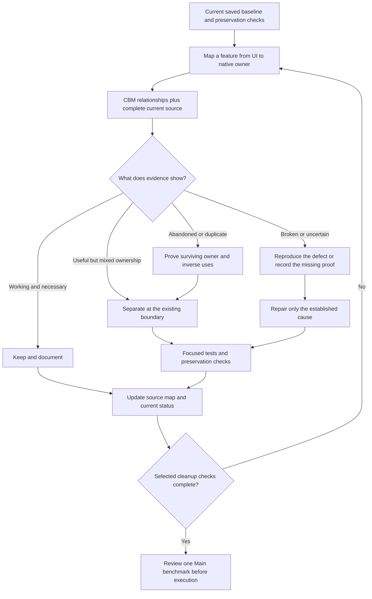
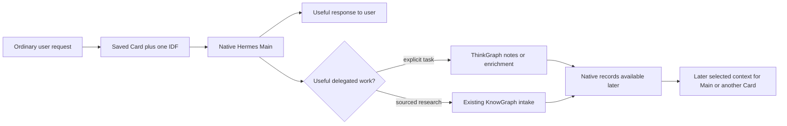
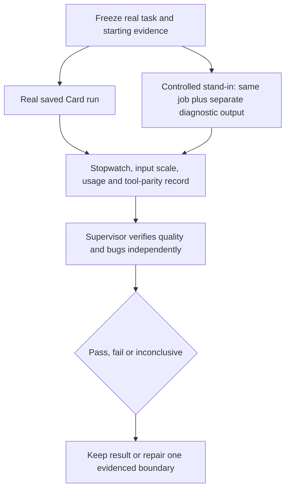
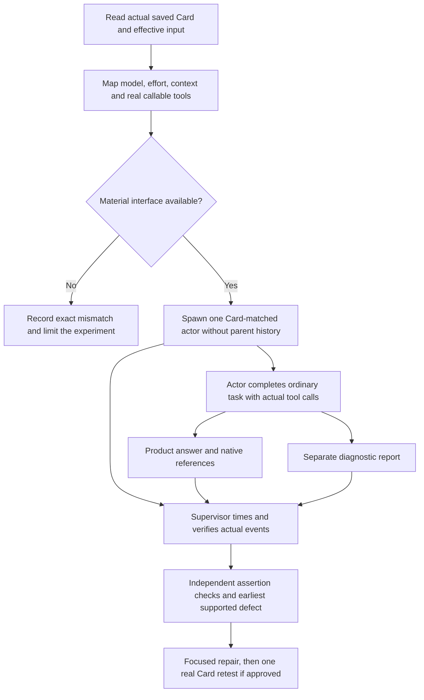

# LiquidAIty Core v0 Plan

This is the current product plan. It describes what the repository owns now, what must remain
separate, and the smallest proof required before live model testing. Historical failure records belong in `DONT.md`, clearly separated from current architecture.
Git retains exact historical source; old implementation instructions are not current requirements.

## September 9 context and measurement repair

Loaded acceptance after the supported restart remains PARTIAL. Normal UI Run `req_387c8e83`
compared tentative RKLB/MSFT interests. Submission at 23:55:38.779Z preceded Run creation by
101.3 seconds; the Run completed at 00:05:33.629Z (594.9 seconds after submission).
Ten native model requests retained 434,796 aggregate input tokens, including 361,856 cached,
5,066 output tokens and 1,485 reasoning tokens. These are aggregate provider totals, not a
single context length. The loaded usage repair works; the response is not a usable fast-chat baseline.
Main delegated research, but acceptance took 143.4 seconds, then Main repeated substantial research
locally and instructed its research child not to write KnowGraph. Its long report did not establish
the requested reusable graph context. The child `external-mcp:4fb3b2b5-6f8a-4c8e-8f42-ec438aec1c33`
was still running when a three-second status-read timeout made the native completion observer fail.
Main consequently reported a research timeout without proof of child failure. A focused regression
now proves that a status timeout resumes observation of the same Run without redispatch or stop;
all 44 plugin tests pass. That additional plugin fix is not loaded into the active CLI yet.
The owner explicitly requests a small graph representation of the existing comparison and comparison
of direct writes, focused extraction, and possible post-conversation processing. This does not enable
an automatic replay loop. Preserve actual records and source attribution while evaluating those options.
The first restart also exposed an orphaned app ngrok tunnel that caused the coupled supervisor to exit;
the exact orphan was stopped and the supported stack restarted successfully. Docker remained up.
Windows had roughly 0.8 GB free of 7.9 GB during startup; this is environmental evidence, not a complete
explanation of latency. No UI redesign, graph reset, saved Card change, or model substitution was made.

The owner requires latency, token usage and context-quality testing for Main and every system Card,
including prompts, selected tools, Scripts, skills, MCP and delegation. Inventory and retained Run
inspection cover the current eleven Cards; this is not eleven new acceptance runs. Historical tasks
and configurations differ, so their elapsed times and token totals are not comparable benchmarks.
Main's inspected Run `req_b773d1b1` took 66.55 seconds, retained one ThinkGraph reference and duplicated
that source's metadata in its input, and has no retained provider token totals.

The context repair preserves all references when native packed ThinkGraph context is included and
avoids a second copy of its source entries. A failing six-source/four-reference test reproduced the
defect before repair. The context/MCP suite passes 28 tests. Main CLI token reporting now carries
native per-request totals through completion to the existing Run fields; plugin tests (43) and
bridge/route tests (64) pass, as do backend typecheck/build and Python compilation. Saved Cards,
grants, prompts, graph data, sessions and the restored UI were not changed by this repair.
Repacking that saved Main input reduced its graph-context estimate from 407 to 310 tokens while
preserving the exact native context text and all its source IDs. This is input packing evidence,
not an answer-quality or latency claim. The broader backend spec typecheck still reports errors
in migration, Kanban recovery, earlier route fixtures and the MCP client unit fixture; the touched
production typecheck and focused executable tests pass.
Python rails and the persistent CLI plugin require reload before loaded acceptance. Per-tool
latency and context usefulness, current all-Card model measurements, and useful end-to-end graph
behavior remain unproven. Continue with `skills/conversation-graph-acceptance.md`; it no longer directs
tests through deleted automatic completed-pair code. Magentic-One remains on hold.

## Recovery scope

The September 9 recovery scope is defined by the controlled test plan below. Graph layout is
locked at saved baseline `5e86802162f380aa876a9348e862b2dfced7a372`. Historical graph experiments
later in this document explain prior observations; they do not authorize resetting data or
restoring their renderer. No new model benchmark is authorized until the owner approves cases.

## Recovery audit and documentation ownership

Local `main` and the local `origin/main` reference matched `5e868021` with a clean worktree at
2026-09-10 02:23:49 UTC; no fetch was needed or performed. The source map in `ARCHITECTURE.md`
is the entry point for unfamiliar features/libraries. `AGENTS.md` owns execution law, `DONT.md`
owns demonstrated failure lessons, and relevant `skills/*.md` own reusable methods. Keep precise
source references and current/target distinctions rather than another generated feature wiki.

### Restored procedure review

All fourteen paths deleted by `2ddadeeb` are present in the pushed baseline. Each was directly
read. Their consumer is the coding agent selecting a relevant procedure through repository law
and links; this is not evidence that Hermes loaded it. `materializeHermesProfileSelections`
uses saved selections and the installed native profile; restoring these files changes neither.
The table classifies current guidance, not the removed historical runtime.

| File under `skills/` | Disposition | Intended consumer / distinct use | Stale material and action |
| --- | --- | --- | --- |
| `catalyst-research-case.md` | keep | Requested event/issuer research; source mechanism and dates | Old assembler/seed commands already marked retired; preserve |
| `codegraph.md` | keep | Coding context selection and native provenance | Delegates detailed discovery to CBM skill; no second manual |
| `coder-report-protocol-skill.md` | keep | Implementer reporting evidence and preservation | Automatic reports-to-graph already removed |
| `double-agent-standin-skill.md` | refresh | Main/worker actor plus separate evaluator | Expanded position, parity, stopwatch, scale, quality, stop and retest protocol; no test run yet |
| `graph-context-prompt-writer-skill.md` | keep | Authoring a bounded task and selected evidence | Current sole IDF owner; no old importer prerequisite |
| `how-to-run-a-test-skill.md` | keep | Choosing a real UI/runtime versus mechanical test | Old Main-as-Mag-One assumption retired; CLI needs its own actual task |
| `issuer-evidence-case-loop.md` | keep | Requested company research and attribution | Retains evidence discipline without mandatory dossier or future trading work |
| `knowgraph-skill-ingestion-skill.md` | merge candidate | Maintainer publishing an explicitly selected procedure | Misleading historical name retained; current file/profile publication overlaps `skillgraph`; no deletion now |
| `knowgraph-skill-retrieval-skill.md` | keep | Selecting a relevant procedure with bounded context | Clearly separates catalog descriptions from loaded content and facts |
| `knowgraph.md` | keep | Sourced research/Graphiti intake and recall | Current native read family and intake path; fetch/parse proof still required |
| `no-fake-surfaces-skill.md` | keep | Verifying graph/inspector/activity claims | Native evidence and real usability; not permission to edit locked layout |
| `skill-packet-fable-handoff-skill.md` | keep | Bounded coding handoff; Builder versus Local Coder | Historical name explicitly does not select a Fable runtime |
| `skillgraph-neo4j-indexing-skill.md` | retire candidate, retain reference | Historical recovery/code-wiki assessment only | Already `@status reference`; no active indexer consumer claimed; linked historical guidance retained |
| `skillgraph.md` | keep | Procedure maintenance and evaluating future code-wiki benefit | Explicitly no automatic wiki/import runtime; source/profile owners retained |

No skill was renamed, merged, deleted or attached to a Card in this audit. Metadata/link checks
are structural validation; useful behavior still requires the approved cases below. The existing
CBM guide was corrected where it said Docker owned its host watcher and Python/qualified-name
tracing could not work. Current published calls disproved those claims. Old performance numbers
were removed as local expectations; actual application call timing is the relevant measurement.

### Main input evidence

Retained Run `req_387c8e83` used
`runtime/run-inputs/3e538b675b29088f409599814850c8a855da4a407102776ce9f380a2bcfcda52/in.idf`.
Its serialized tool definitions measured 22,299 characters; selected-tools/grants 24,479;
stable Card context 16,978; dynamic context 529. These are serialized character counts, not
tokens or UTF-8 byte measurements. Actual instructions were 8,627 characters; task 423.
The graph `modelText` was empty. This does not establish duplicated model input.

The verified source chain is saved Card preparation → `card_domain._retain_run_idf` →
`idf.materialize_idf`/reload → `runtime_projection` and `model_task`. The projection separates
system prompt, task/graph message, settings and descriptors. Native Hermes constructs the skills
index through `build_skills_system_prompt`, builds provider kwargs in `build_api_kwargs`, then
applies transport preflight/middleware before `pre_api_request`. The existing native plugin's
`on_pre_api_request` records tool names/schemas and counts; this is not a retained complete copy
of every final provider message. Exact loaded prompt/history/memory duplication remains unproven.
No schemas, Card prompts or capabilities were removed on the strength of retained file size.

Verified historical Main configuration in that input: `card_main_chat`, profile `liquidaity-main`,
OpenAI `chatgpt-account`, `gpt-5.6-sol`; selected native child model Luna. Presented tool IDs:
`run_mag_one`, `card.load_graph_references`, `engraphis_ingest`, `web_search`,
`engraphis_remember`, `engraphis_correct`, `engraphis_update_memory`, `engraphis_link`.
Native selections: `memory`, `session_search`, `todo`, `skills_list`, `skill_view`, `web_extract`;
skill selection `hermes-agent`. The Script wraps additional enabled read handles. This is a
historical snapshot, not proof of today's effective catalog or a recommended grant change.

### Historical removal audit boundary

Verified anchors: `e6cd8a3f` (July 15 native graph views), `585a4e4d` (August 17 attention),
`2a65be9c` (August 29 Main/Builder authority), `07ec833e` (Constellation introduction),
`2ddadeeb` (skill deletion), and current `5e868021`. `DONT.md` retains the intervening timeline.
Read-only history enumeration includes intermediate deletions, not only the endpoint diff.
The bounded paths were Python model owners, `apps/constellation-engine`, knowledge components,
`services/knowgraph` and `skills`. This is not an exhaustive audit of every repository symbol.

| Removed boundary | Current finding / disposition |
| --- | --- |
| `cognition.py`, `deliver_completed_pair` | Deleted automatic replay; no current exact symbol result. Preserve explicit Main writes/delegation |
| `constellation.py`, `apps/constellation-engine/bridge.cjs` | Retired adapter/bridge; current Engraphis owner retained; do not restore fallback |
| `ConstellationSigmaSurface`, `constellationSigmaGraph`, `ThinkGraphInspector` | Retired visualization family; accepted current graph remains locked |
| `graph_domain/contracts.py`, `executors.py`, `recipes.py` | Removed competing graph-operation layer; name search finds generic helpers in unrelated current owners, not evidence of dangling imports |
| `thinkgraph_engraphis.py` | Earlier adapter removed during switch; native `engraphis.py`/`thinkgraph.py` now own the boundary; generic `_text`/`_timestamp` matches do not authorize deletion |
| `services/knowgraph/skill_ingest.py` and tests | Retired Neo4j skill importer; restored documents explicitly retain file/profile ownership |
| Fourteen deleted skills | Recovered at baseline; reviewed individually above |

Python AST enumeration covered top-level functions/classes in removed Python files; text
references were searched in current bounded source. It does not prove removal of nested symbols,
dynamic external consumers or every JS export. CBM cannot inverse-trace nodes already absent;
history and current registrations are required. No historical runtime was restored. The owner's
subsequent route-organization request moved current editor/IDD helpers and handlers to
`cardEditor.routes.ts`, CodeGraph read to `codegraph.routes.ts`, and remaining shared execution
transport to `cardRuntime.routes.ts`. The old `coder.routes.ts` and test path are replaced;
`routes/index.ts` and `savedCard.routes.spec.ts` consume the new owners. All 36 top-level
function/route declarations match their former bodies exactly. Wider historical removals and
further decomposition of the runtime module remain audit work, not permission for a purge.

## Collaborator readiness and cleanup sequence

### Outcome, scope and preservation

The owner makes understandable, maintainable code a launch requirement. The requested result is
a repository a collaborator can navigate, change and verify without reconstructing the migration
history from chat. `coder.routes.ts` was an example of unclear ownership, not the sole cleanup
target. Audit the connected application boundaries below for abandoned implementations, mixed
responsibilities, duplicate authorities, misleading controls and explanatory text substituted for
working behavior. A suspicious filename, a large module or a keyword match is an investigation
lead, not sufficient evidence to delete code.

This extends the earlier bounded recovery audit into an ordered cleanup programme. It does not
claim that the wider audit has already happened. Work on one demonstrated defect at a time and
finish its preservation checks before moving on. No blanket formatter, package upgrade, renamed
public API, replacement framework or rewrite is part of this plan.

Keep the accepted graph renderer, layout, physics, labels, controls and CSS locked at the saved
baseline. Preserve graph records, Cards, prompts, models, grants, profiles, sessions, authentication,
Main Chat and the Builder pull-up. Builder remains full Hermes; Local Coder remains a distinct
saved Card with its own selected repository. CLI execution and model benchmarks remain outside
the cleanup phase. Stable IDs and compatibility routes survive until a separately justified
migration can preserve their actual consumers.

The practical end of cleanup is a trustworthy Main/graph testing baseline plus an honest map of
remaining repository debt. It is not zero TODOs or a claim that every vendor file was audited.
Unrelated optional improvements can remain in `FUTURE.md`; unresolved defects in the selected
user path cannot be hidden there to declare readiness.



### Step 1 — Close the present checkpoint

First resolve the two broader MCP catalog test failures already observed. Determine their exact
failed assertions and compare them with the IDD publication contract, current catalog construction,
authentication and filtering. Classify each as a production defect, a stale test assumption or an
environment/fixture failure using evidence. Repair only the established mismatch. Retain assertions
that private operations stay private and public schemas/security metadata are preserved; do not
expose extra tools or weaken tests to get a green result. One focused retry follows a specific repair.

The route separation has narrower proof: eight editor/IDD tests and production TypeScript checking
pass, and all 36 moved top-level function/route bodies are unchanged. This is useful preservation
evidence, but does not prove every execution or terminal route. Complete a route/mount inventory
before splitting the remaining runtime file. Verify that each retained URL has one registration,
the same authentication and request/response contract, and its existing consumer.

Expected result: the current edit set has a classified test baseline, no unexplained new failure,
and a reviewable changed-file manifest. Until that is true, this checkpoint is **partial** and is
not described as ready to save simply because the code is shorter.

### Step 2 — Trace features, not filenames

For each row, trace the user action through its current consumer, route, Python/native owner,
saved identity and observable result. Use the required CBM sequence before changing a production
symbol. Read complete source for the changed boundary; record excluded/partial coverage and
check dynamic registrations with direct source. Read Git history only where it answers which
capability was lost, replaced or left connected.

| Audit slice, in order | What to establish | Suspicious pattern to investigate | Current evidence and exit result |
| --- | --- | --- | --- |
| HTTP and saved Run transport | Route mount, authentication, current caller, receiving Card and native session owner | Multiple live entry paths, semantic decisions in transport, old Coder state shared with Builder | First three-module separation is checked; remaining runtime routes still need inventory. Exit with one documented owner per retained operation |
| Agent Builder workspace and Card editor | Which component edits a saved Card, which displays a Run, where values persist and reload | Page-level feature accumulation, agent panels in unrelated inspectors, hardcoded role inference, copied option catalogs | Small `AgentBuilderWorkspace.tsx` is rendering structure; the large page is not yet fully audited. Exit with preserved working controls and source-backed responsibilities |
| IDD, editor fields and Script controls | Same applicable definitions/defaults/catalog references reach the editor, Builder and template consumers | Parallel field lists, silent dropped values, whole Builder palette sent to an ordinary Run, a second IDF assembler | Selected editor tests pass; full consumer parity remains unproven. Exit with explicit supported fields and tested round trips for the affected ones |
| Main input and Hermes adapter | Exact instructions, task, tools, skills, history and memory at the final provider request | Repeated schemas/content in one request, unnecessary code/manual injection, competing prompt assembly | Retained IDF and source chain inspected; final-request duplication not yet proved. Exit with measured sections and identified owners, or an explicit capture gap |
| ThinkGraph and KnowGraph integration | One writer per native graph, intentional delegation, source attribution and later retrieval | Retired automatic replay, alternate graph adapters, report copies treated as entities, instruction-derived writes | Named Constellation/replay residue scan completed within its stated scope. Extend integration checks only; graph visuals and retained data stay untouched |
| Product controls and explanatory text | Real action/state behind each control in the audited surfaces | Decorative capability claims, fake status, task prose shown as a control, unused panels or sample defaults in production | No repository-wide claim of absence. Trace matches to rendering and real state before removal; preserve ordinary useful labels, errors and upstream behavior |
| GPT MCP entrance and restored skills | Current tool publication, canonical handlers, correct procedure discovery and current links | Stale tool names, duplicated catalogs, obsolete operating instructions, all skills loaded without selection | Fourteen skills reviewed; two catalog checks unresolved. Exit with a verified local contract and separately labelled external connection proof |

Do not expand an Agent Builder investigation into a WorldSignals, trading, vendor-runtime or
Magentic-One rewrite. If a traced dependency crosses one of those boundaries, identify the exact
contract and inspect it; a repair there needs a concrete prerequisite and its own preservation
set. Existing vendor modification law still applies.

### Step 3 — Make each refactor reviewable

Choose between keeping, documenting, moving, repairing and removing based on the observed
responsibility and consumers. Prefer a move with unchanged behavior when the issue is ownership.
Prefer a focused behavioral repair when there is a reproduced defect. Do not manufacture new
abstractions merely to meet a line-count target. If a large function genuinely coordinates one
operation, small named helpers or a clearer contract may be enough; if it owns unrelated routes,
place those operations with their existing domain owners.

Before removal, resolve exact qualified identities and inverse callers, imports, routes, tool
registrations, configuration and documentation. A zero-result graph query alone is insufficient.
Prove the retained replacement before removing the abandoned path in that same change. For a
move, retain public URLs and stored identities unless the user has approved a migration. Use
the existing tests to demonstrate that moved behavior remains the same; preserve assertions.

For UI text, inspect its actual rendering path and state source. An obsolete explanatory panel
can be removed with its abandoned consumer when proven. An error message, field label or help
provided by a retained native component is not automatically junk. No source scanner becomes a
production content filter. An accepted visual surface remains outside this cleanup even if a
search finds text inside it.

Expected result of each change: a simpler path to the same supported behavior, or a specifically
repaired bug, with no disappeared control, permission change, data rewrite or second authority.
If preservation fails, restore the affected behavior within the edit before continuing the audit.

### Step 4 — Document enough for the next collaborator

Update the existing feature section in `ARCHITECTURE.md` as its source is verified. Each section
should answer: what user action it supports; where the action enters; which module and native
library own the work; which saved IDs/data must survive; how results return; which tests exercise
the contract; and what remains unproven. Link to definitions and catalogs rather than copying
their schemas into another document.

Use `PLAN.md` for current work and acceptance gaps, `DONT.md` for demonstrated mistakes and their
prevention, and `skills/*.md` for a small set of reusable procedures. Record current and target
behavior separately. Update conflicting old guidance in its existing owner; do not create a
second documentation system, auto-generated feature wiki, task-file archive or new prompt layer.
The repository documentation is for maintainers; it is not injected wholesale into Main.

The navigation check is concrete: using these documents and CBM, locate the editor field owner,
route owner, receiving Run input owner and their focused tests for one existing feature. Explain
its data flow without relying on the word `coder`, a Card title or this conversation. This can be
rehearsed read-only now; an independent collaborator's first-use evaluation is a later usability
check, not proof that has already happened.

### Step 5 — Cleanup acceptance before model experiments

| Check | Method | Expected result | Failure or limitation |
| --- | --- | --- | --- |
| Source ownership | CBM ordered discovery, current complete source and registration inventory | Every audited feature has one documented entry and owner; old replaced path is absent | Unknown dynamic consumer blocks deletion, not further read-only investigation |
| Route preservation | Existing contract tests plus mount/auth comparison | Same URLs, field handling, authentication, streaming/status semantics and receiving Card | Eight current tests cover editor/IDD only; do not extrapolate them to the full runtime |
| Card/IDD preservation | Focused field/default/selection round trips in existing fixtures | Values remain editable and survive save/reload; no whole catalog added to ordinary input | Current full consumer parity is incomplete; test exact affected contracts before further change |
| MCP publication | Identity, schema, authenticated-context and public/private catalog tests | Canonical names and handlers; unchanged security and no private-operation leakage | Current two failures require classification and repair; a local pass still does not prove a refreshed external connector |
| Removed-path audit | Inverse traversal, exact old-name/path search and configuration/import checks | No abandoned live registration or dangling consumer within the changed scope | Vendored/excluded/dynamic coverage is explicitly reported |
| Build and types | Touched production typecheck/build only where safe for the active app | Edited production boundary compiles; unrelated baseline failures separately recorded | A build that cleans active output is not run blindly against the live stack |
| Accepted graph | Exact diff against `5e868021` for graph/layout files | No change to renderer, geometry, CSS, labels, controls or data | Any unintended change must be removed before forward work |
| Documentation | Local link checks, source-owner comparison and navigation rehearsal | New maintainer can find definitions, callers, tests and current gaps | File existence or a long manual is not usability proof |
| Final checkpoint | Inspect full current status/diff and report affected invariants | No unexplained regression; saved state and unrelated work preserved | Do not label the whole repo clean or launch-ready from a partial slice |

These are cleanup checks, not new production gates. Report the Regression Ratio only for the
previously working affected invariants actually exercised; the required result is 0.000. Unchecked
behavior stays unproven and is not counted as a pass. The owner decides when to save/publish;
the coding agent performs no Git writes. A save-ready checkpoint is distinct from launch readiness,
which also requires the real Main/graph acceptance below.

### Step 6 — Return to Main, then graph usefulness

Once the selected cleanup checks are complete, return to the original user problem: Main takes
far too long and produces results the user cannot readily use. Cleaning code alone will not prove
that solved. Start with the retained-input analysis and one approved ordinary Main exchange.
Separate time before Run creation, time to first useful text, model time, tool time, delegation
acceptance and child completion. Do not turn an ordinary chat test into another twenty-minute
research mission.

After the first failure, identify the earliest evidenced blocker and repair that boundary. Do
not repeat the same run with progressively more coaching. Proceed to graph work only once Main
can respond usefully and its measurements are reliable. Use preserved real conversation/research
material, the accepted native visualization and later natural recall. Do not teach the test user
to request internal tools or require immediate readback after every write.

## Controlled agent test plan

### Recovery checks before benchmark approval

The September 9/10 cleanup reached source/contract proof, not full product acceptance:

| Task | Result | Evidence / remaining limit |
| --- | --- | --- |
| P0-T1 baseline | complete | `main` and `origin/main` at `5e868021`; initially clean; no Git mutation |
| P0-T2 owners/input discovery | partial | CBM/source paths above; retained metadata measured; exact final provider-message duplication not established |
| P1-T1 skills/diary | complete for static review | Fourteen individual dispositions, valid metadata/local links; expanded double-agent method; behavioral usefulness still untested |
| P2-T1 historical residue | complete for bounded scan | Intermediate deletions and current imports inspected; no historical runtime restored; no claim of repository-wide absence |
| P2-T2 GPT entry | partial | SDK instructions now Main-first; four core identity/schema/auth tests pass; two broader catalog tests fail and remain unresolved; no external refresh |
| P2-T3 route organization | complete for requested first separation | Editor/IDD and CodeGraph modules separated; remaining execution transport accurately named; 36 declarations unchanged; eight focused route tests and production typecheck pass |
| P3-T1 benchmark design | ready for review | Ten cases below, two diagrams and reusable protocol; execution still needs owner approval |
| P3-T2 preservation/inverse proof | partial overall | Old route imports and CBM path nodes absent; relocated helpers source-identical; graph/client untouched; catalog failures and wider runtime audit remain |

Focused route tests passed before (11.30s runner duration) and after (7.82s); only the eight
editor/IDD cases were selected from 58. This did not launch native CLI/Builder work. A TypeScript
unused-import failure after moving the editor was repaired; the production typecheck then passed.
An in-memory TypeScript AST comparison verified all 36 original top-level functions/route
declarations unchanged across the three modules. Its first temporary command had an extra
parenthesis; the corrected command passed without changing production behavior.

MCP checks: initial four selected tests passed in 8.91s. Expanded selection produced four passes
and two failures in 32.02s: `test_external_transport_uses_the_unmodified_canonical_catalog_and_schemas`
and `test_gpt_tools_list_projects_the_canonical_catalog_without_rewriting_metadata`. These are
unresolved failures, not waived tests or confirmed new regressions. Full plugin acceptance and
external loaded instructions remain unproven. No catalog exposure was changed to satisfy a test.

Post-edit CBM returned the relocated editor helpers and their inbound module relationships;
their source matched the pre-move snippets. Exact old route-file path queries returned zero nodes.
Coverage still reports `metadata_changed`; `savedCard.routes.spec.ts` has partial ranges at
604 and 627, so direct source and executable tests own proof there. Hermes remains excluded.
No index maintenance was performed. Source-verified equality and focused checks do not prove
every migrated runtime path. Do not describe this checkpoint as a fully cleaned or launch-ready repo.

**Status: design ready for review; live execution not approved.** The reusable operating system
for these tests is [Double-Agent Stand-In](skills/double-agent-standin-skill.md). It uses existing
Card Runs, ordinary user input, native receipts and one separately evaluated actor when approved.
It adds no agent runtime, automatic team, permanent diagnostic store or graph writer.

### Execution and observation



Main's response and chosen delegation are separate branches; background completion is not a
barrier for an ordinary useful response. This is the acceptance target, not a claim of current
latency. Automatic conversation replay stays disabled; a comparison arm does not enable it.



Arms run serially. The diagram does not authorize two simultaneous model calls. Self-assessment
is checked against results; evaluator notes never enter product chat, native memories or episodes.

### Card-matched double-agent operation

The highest-priority reusable testing capability is a coding subagent that stands in for an actual
saved Card, performs its real job with actual tools, and separately diagnoses defects. A generic
code reviewer or a model reading a transcript is insufficient. The detailed dispatch contract is in
[the existing skill](skills/double-agent-standin-skill.md#bind-a-coding-subagent-to-the-actual-card).

Before spawning, resolve the saved parent model and effort, stable instructions, effective tool
schemas, Script surface, selected skills and bounded native context. Match those to the actual
Codex subagent controls and callable authenticated tools. Spawn without the parent conversation;
supply the selected role and data instead. This avoids copying the engineering discussion into a
pretend Main task. No Card settings are changed to accommodate the stand-in.



The actor receives a compact diagnostic instruction in addition to its role. That extra context,
any inherited host tools and the diagnostic report are measurement differences, not invisible
overhead. The supervisor records them, checks that no extra capabilities were used, and does not
coach the actor while it works. A prompt-selected tool list does not enforce native Card grants.
An unavailable native tool is reported, never replaced by a fabricated response. A different web
tool or unknown model effort prevents a clean causal model comparison.

This system succeeds when the actor produces a useful task result, the supervisor can tie a
specific defect to actual input/call/output evidence, and the resulting repair improves the real
Card on the affected case. It remains unproven until exercised. First-token timing and token cost
are recorded only where the host/provider exposes them; aggregate account usage cannot substitute
for per-run evidence. Start with Main, then apply the same method to a worker only when the Main
case has made that worker's actual job and boundary clear.

### Common contract for every case

Before execution, capture current saved Card/profile/provider/model, reasoning setting, child
selection, Script version, native tool names and exact schemas, selected skills, session state
and native context IDs. Compare against the historical Main snapshot above. Missing live identity
or interface parity makes the case **not ready**, rather than allowing an invented default.
Builder's known profile is `liquidaity-agent-builder`; resolve its actual saved Card ID rather
than inferring it from a label. ThinkGraph
was `card_a52fd511ecb14f53`; the existing research helper is `card_hermes_steward` with profile
`liquidaity-hermes-steward`. Their current models/grants must be read before execution, not assigned
from this document. No case changes permanent saved selections.

Use the existing healthy application, PostgreSQL and the selected native owner. KnowGraph cases
also need Neo4j/Graphiti; web cases need the existing configured provider. No startup or repair is
part of a benchmark. If Docker is down, stop and tell the owner. Preserve accepted graph visuals,
all Cards, grants, sessions and unrelated data. Do not use the Builder CLI in this plan.

For every model request record provider input/cached/output/reasoning tokens and request ID;
measure UTF-8 bytes by section at retained-input and final-request boundaries separately. Record
tool name/schema, elapsed time, result bytes and errors. Report output tokens, model/tool-call
counts and exposed cost. Missing usage/cost is **unknown**. Never estimate dollars from account
percentage. Reasoning/output counters may overlap; follow provider semantics before summing.

Hard deadlines below are experiment stop conditions using existing cancellation, not newly
imposed Card limits. Start at submission, include queuing, and report child cancellation separately.
Each case has one attempt per arm. No automatic retry, parallel matrix, changed prompt between arms
or output truncation to manufacture a pass. Stop subsequent cases on an unexplained failure.

Keep evidence in existing Run/artifact receipts and the coding conversation; record only durable
findings in this plan or a proven prevention rule in `DONT.md`. No new test-report folder or copied
prompt archive. Read-only cases need no rollback. Write comparisons require separately approved
isolated native storage and exact resulting IDs; cleanup uses native deletion only for those IDs.
If isolation or provenance cannot be proved, do not write. Never reset real graphs for a test.

### Cases, expected results and budgets

All numerical values are proposed targets, not achieved measurements. Time/token budgets apply
to the whole arm, including delegated work where visible. The historical ten-request Main total
of 434,796 input tokens is a failure investigation baseline, not an acceptable prompt-size target.

| Case | Question, real input and exact surface | Expected visible/native result | Target and hard stop | Verdict / value of spending |
| --- | --- | --- | --- | --- |
| A — Main fast path | Current saved Main through normal chat. One ordinary short exchange; use current granted surface unchanged, no requested research | Useful direct response; one correlated Main Run, no wait for graph/Mag One/all children | Warm first useful text ≤10s, answer ≤30s; hard 120s, ≤3 model requests, ≤4 tool calls, ≤2,000 output tokens | Pass useful answer within targets and truthful receipts. Fail unnecessary dependency barrier or timeout. Inconclusive service failure. Establishes whether user engagement works |
| B — Exact input weight | Existing `req_387c8e83` IDF/output/receipts first; source chain above and native `pre_api_request` shape. No provider call needed for replay | Section inventory and exact duplicate locations if any; retained metadata distinguished from actual payload | Read-only analysis ≤10min; zero model/tool-provider requests. Later authorized capture limited to A's budget | Pass evidence can account for final input; inconclusive if complete request unavailable. Do not remove context from an estimate. Avoids paying for blind optimization |
| C — Main web to KnowGraph | Same preserved RKLB/MSFT task/source links. Main `web_search`/native `web_extract`, existing granted research delegation and Graphiti intake; freeze actual selected tool schemas | Main gives useful interim result; existing research owner receives actual URLs/page evidence; source-backed native entities/facts with provenance, not a pasted report | Main useful text ≤30s, response ≤60s; hard Main120s, child300s; ≤6 model requests and ≤12 tools total, ≤6,000 output tokens | Fail if Main waits for all research, repeats it unnecessarily, or a bare URL is claimed as parsed content. Inconclusive queue-only result. Tests the most useful cross-agent handoff |
| D — Regex on then off | Saved ThinkGraph worker, exact same retained real conversation material. Native Engraphis extraction configuration only; obtain the actual supported switch/schema before running | Inspect identity, missed entities, false entities, useful predicates, source attribution, duplicates and notes; native IDs remain tied to input | Target ≤90s per arm; hard240s each, ≤4 model requests/≤8 tools each, ≤4,000 output tokens each | Pre-annotate explicit entities/relations from source. Precision = supported extracted / evaluated extracted; recall only against annotated explicit mentions. Zero records gives undefined precision, not success. Any invented accepted decision fails. Compare quality and cost; no policy choice beforehand |
| E — Graphiti versus prior intake | Existing research Card and preserved company page/document. Verify earlier Neo4j Python fetch/parser in Git before comparison; current `services/knowgraph/ingest.py`, granted Graphiti `search_nodes`, `search_memory_facts`, `get_episodes` | Separate evidence for fetch, document parsing, extracted entities/facts, episodes, source links, temporal changes and useful later recall | Read-only source comparison first, zero model calls. Later one approved ingestion per implementation, hard300s each; ≤6 requests/≤12 tools, ≤6,000 output tokens each | Pass only capabilities observed separately. Episode acceptance is not extraction or recall. Missing earlier runnable owner makes that arm inconclusive, not inferior. Resolves what Graphiti actually adds without replacing it |
| F — Double-agent Main | Actual A or C task and preserved context, one real Main arm and one external stand-in on the saved model where available. Current native tool schemas versus callable stand-in tools recorded | Actor completes the job; independent diagnostics locate waste/bugs with events. Product result and integration verdict separate | Use A or C's budget for each arm; one stand-in only, serial. Prior 173s stand-in is excluded from speed comparison because its web interface differed | Comparable only with documented parity; otherwise usability finding with no model speed ranking. Tests whether context/tools, rather than intelligence, block Main |
| G — Worker model fit | Choose one already-proven worker case. Reuse its saved-model baseline. Test one explicitly approved Luna or Terra stand-in with the same material/tool contracts; no permanent model change | Required assertions still pass, useful work complete, actual time/usage differences visible | Same case budget; one alternative only before review; no Sol default and no multi-role swarm | Pass only preserved correctness/attribution/required actions with lower measured cost or latency. Any mismatch is inconclusive. One success is provisional, not an all-Card recommendation |
| H — Builder preservation | Read saved Builder profile/grants and relevant input mapping; no Builder task, no CLI or model execution | Full Hermes capability unchanged; report selected context separately from capability ceiling | Read-only ≤5min; zero model requests, no writes | Fail any benchmark-induced restriction or model/grant change. Current live selection read required. Protects Builder while Main is evaluated |
| I — Procedure usefulness | Apply the relevant restored skill to A–G, not all skills at once. Use code-navigation/docs work for non-model rehearsal now; later actor gets only its role procedure | Correct owner found, obsolete commands avoided, product work done and diagnosis separated | Reuse existing case budget; zero extra evaluator-model calls unless separately approved | Pass observed decision/use, not file existence or number of skills. Inconclusive until behavior tested. Demonstrates whether recovery prevents the old failure pattern |
| J — Direct write / extraction / mix | Preserve existing Main reply. Use native `engraphis_remember`/`engraphis_link` for concise direct notes, `engraphis_ingest` through focused worker for extraction; third arm only if both identify a useful hybrid hypothesis | Same attributed intent retained; useful later references, not an immediate Main readback loop or instruction-derived entities | Direct arm hard120s; extraction240s; hybrid240s only separately approved; each ≤4 requests/≤8 tools, ≤4,000 output tokens | Compare time to useful chat and time to usable memory separately. No automatic post-pair workflow enabled. Inconclusive if arms share mutated state. Resolves the owner's original architecture question |

For model cases, propose stopping before another request once observed aggregate input exceeds
150,000 tokens (A: 75,000). This is a review trigger, not prompt truncation or a provider cap; an
in-flight request can exceed it. Capture cold/warm state and unavailable counters. A tokenizer
estimate is labelled with its method; no score claims that measured bytes were actually attended to.

Start with B and H without model execution, then approve A alone. If A fails, fix its earliest
proved blocker before C/F. D and J need isolated graph-write authorization. E begins with source
comparison, not an install or migration. G follows a quality-passing baseline. After each case,
report expected versus observed result and stop for the owner's decision on costly expansion.

### Decisions the comparisons must answer

These are experiment choices, not changes already made to production. The current default remains
Main's deliberate graph reads/writes and explicitly chosen delegation. Preserve the useful data
already retained. Fixing a graph integration defect does not reopen the locked visualization.

| Decision | Options to compare | What would justify the choice | Current recommendation / unknown |
| --- | --- | --- | --- |
| ThinkGraph writes | Main writes concise notes; focused worker extracts preserved material; a mix of small Main notes and selected worker enrichment | Supported intent/attribution and later useful recall, with time to chat and time to usable graph measured separately | Test direct and worker arms first. A mix is a third hypothesis only if both reveal complementary value |
| Post-conversation work | Explicitly submitted completed pair versus broader automatic intake | Same input, native extraction and isolated state; no operating instructions promoted into knowledge; useful memory arrives without holding Main's reply | The benchmark may use the pair as input. Automatic production replay remains off; its activation is a separate decision after evidence |
| Context retrieval | Model-selected native read; existing bounded context selection; later deterministic retrieval transport if a specific need is proved | Relevant facts/provenance reach the actual request once; unrelated graph content is absent; later-turn quality improves | Trace the existing path first. No new semantic router, hardcoded ontology or compulsory readback loop |
| Extractor preprocessing | Native regex enabled, then disabled on the same source | Compare supported entities, misses, predicates, duplicates and attribution as well as elapsed time and usage | Keep current native configuration until the controlled comparison; no assumption that regex is useless or essential |
| Research intake | Existing Graphiti intake; verified prior Neo4j URL/document fetch-and-parse capability | Fetching/parsing, extraction, provenance, temporal updates and recall each work separately | Use source comparison before any model call. Restore a missing ingestion capability only when demonstrated; do not replace Graphiti by assumption |
| Delegation mode | Main single with focused profile delegation; existing Card-owned team/worker mode when the job needs it | Useful Main response does not wait for unrelated completion; no duplicated research; completion reaches the correct owner once | Do not launch a team to diagnose an unexplained single-Card delay. Team comparison comes after the simple path works |
| Tool and skill selection | Current saved surface; a specifically justified smaller selected surface; existing Script compaction | Actual required tasks still complete, context is accounted for and needless tool exploration drops | Read final-request evidence first. Keep Builder's capability ceiling; do not remove grants or load all Hermes options for a benchmark |
| Worker model | Current saved model; one appropriate Luna or Terra alternative where actually available | Required quality/actions preserved with measured latency and usage improvement | No Sol-wide default and no automatic downgrade. A stand-in result alone does not change saved selections |

For an approved comparison, freeze the actual task, source material, assertions and starting graph
state before the first arm. Fill expected versus observed results in the existing coding report:
first useful text, useful answer completion, background graph completion, request/tool counts,
input/cached/output tokens, attribution, required facts/actions, and observed failures. Mark a
missing measure unknown. One case is a diagnostic observation, not a percentile benchmark or a
claim of reliability across all Cards.

If Main again takes many minutes, classify where the delay began before spending on another arm:
queue/startup, input preparation, provider request, tool execution, repeated reasoning/tool calls,
delegation acceptance, or an unnecessary completion barrier. If a response is fast but useless,
the case still fails. Conversely, an excellent long report does not pass a task whose requested
result is a concise answer and reusable entity context. Intelligence and speed are judged against
the actual job, not output length.

The next execution decision after cleanup is approval of one Main case and its exact stand-in
comparison, with current identities, real callable tools and isolation limits filled in. No model
matrix, CLI test, graph reset or new automatic processing is implied by accepting this plan.

## Product boundary

The owner's delivery target is to finish the existing Trading application and freeze that delivery,
then continue the reusable system as a separately named platform. Trading is an application built on
the platform; its brand and domain must not define shared agent, graph, editor, or execution code.
Shared identifiers describe their responsibilities. User-facing labels describe the action or content,
without implementation names or explanatory filler. Application branding belongs in application
presentation and configuration. Existing persisted and public branded identities require a coordinated
migration with data and contract preservation; finishing the current delivery does not authorize a
blanket replacement, a rebuild, or removal of working capabilities.

## Core v0

```text
Chat / GPT plugin
  → Main Chat Card (Hermes, profile liquidaity-main)
     ├─ flow → Agent Builder Card (Hermes delegate, profile liquidaity-agent-builder)
     ├─ flow → Graph Agent Card (Hermes delegate, profile liquidaity-hermes-steward)
     ├─ native delegate_task(team) → headless Auto-Team inside Main's existing Card Run/session
     └─ magentic_control → automatic or optionally reviewed Card handoff → native AutoGen Magentic-One
        └─ magentic_option → Local Coder Card (Hermes delegate, profile coder)

Direct Assistant Card
  → native AutoGen AssistantAgent

Every shared tool
  → one official Python HTTP MCP host
```

OpenClaude, the removed standalone LocalCoder runtime, and Bun are absent from the dependency graph.
`card_local_coder` and `template_local_coder` now identify the Hermes-backed user-facing Local Coder;
they do not select a runtime implementation.

## Current versus unproven

### Current source contracts

- Saved Cards own identity, prompt, provider/model/profile, runtime binding, enabled state, and grants.
- Each saved Hermes Card also owns a desired bounded-subagent model. Run start materializes that
  selection into the same native profile, reads it back, and records actual child provider/model plus
  fallback state without rewriting the parent model. Memory-provider choice remains native profile
  configuration; only Main exposes the bounded Honcho setup/status control.
- `runtime.kind` plus `runtime.mode` selects Hermes Main/delegate, AutoGen Assistant, or native
  Magentic-One. Card names and template text do not select runtimes.
- Main, Agent Builder, Local Coder, and Graph Agent are separate saved Hermes Cards with separate profiles
  and runtime homes.
- Any authorized ordinary Hermes Card may use native `delegate_task(role="team")` as a headless
  capability. The existing automatic SQLite ledger owns its configuration and execution. The later
  Card worker-count/retry/model-policy overlay is removed. Team selection authorizes the tool; it
  does not launch Team when a Card Run starts. Recovery uses Git b78b79ac, followed by the owner's
  explicit removal of the added 2–4 task-count clamp; existing dispatcher concurrency remains. Its
  historical acceptance is recorded below; loaded execution after recovery remains unproven. Native Leaf and
  recursive delegation remain internal execution. Exposing their real supported settings in Runtime
  is part of the approved Card target and is not yet complete.
- An enabled outgoing orange `flow` edge authorizes native
  `delegate_task(role="profile", target_profile=...)` to that exact ordinary Hermes Card/Profile.
  Direction is exact; blue Magentic-One edges grant no direct Card call. The receiving Card runs through
  the existing Card Run/IDF owner with its own saved prompt, model, tools, skills, memory, Script, grants,
  session, and optional private Team. The model-facing Card runner is the one native `delegate_task` tool;
  `card.run_assistant_agent` remains only the private canonical execution handler.
- The official Python MCP host is the shared tool doorway. Its catalog is discovered dynamically;
  documentation and tests must not promise a permanent numeric tool count. The external GPT connector
  publishes each IDD `external-mcp` operation once under its canonical unprefixed ID. LiquidAIty is the app
  name and is not injected into server tool IDs; ChatGPT owns its client-side app namespace. Public,
  Card/catalog-reader, and stdio dispatch all use the same canonical IDs without aliases or duplicate handlers.
  Source/SDK proof is not a substitute for a loaded-process readback and a genuinely fresh selected-plugin
  conversation.
  The MCP host owns OAuth/resource metadata and readiness; canonical startup launches ngrok directly as
  transport and does not place catalog or application policy in a tunnel helper.
- The published catalog preserves disabled/unavailable tools. `all_healthy` grants broad healthy
  read/search/discovery access while every write/effect remains an explicit saved Card grant with its
  confirmation contract. That broad read set is Script authorization, not default model presentation:
  explicitly saved tools remain `AGENT` by default, implicit healthy reads remain `OFF` unless the saved
  Script claims them as `SCRIPT` or `BOTH`.
- IDD supplies composable builder types, objects, templates and effect annotations, not runtime
  authentication or a second IDF validator. Agent Builder is Main's under-chat implementation/coding
  agent and also owns approved Card building; it receives the full palette only when a mission requires
  Agent Builder work. Local Coder never receives the full palette. Main delegation and direct under-chat
  invocation use the same saved Card Run authority; live provider-backed coding execution still requires
  separate acceptance proof.
- Hermes is the runtime platform; LiquidAIty composes native capabilities and contextualizes Runs.
  Native catalogs, profiles, tools and worker lifecycle remain Hermes-owned.
- Every Card has one saved Python Script field and the same Monaco editor in Agent Builder. IDD and the
  effective Tools-tab selection supply exact autocomplete/schema contracts. A valid Hermes Script wraps
  only its literal `tools.call()` handles behind one compact tool and runs through Hermes' existing
  child-process Python/tool-RPC path; unwrapped selected tools remain ordinary MCP tools. Blank/invalid
  source keeps exact selected MCP schemas. A runtime failure before any operation begins may restore only
  the Script's pre-registered wrapped handles for the current model iteration; a failure after any tool
  operation begins is terminal and cannot replay through the model. The active version/hash is immutable during a Run.
  AutoGen Cards retain the editor but cannot activate this Hermes-native execution path.
- Ordinary saved Cards may declare validated product-neutral `card-subsystem.v1` attachments. A named
  subsystem Card tab shows only the adapter contract, capabilities, readiness, lifecycle, and native-agent
  policy. The Agent UI renders live domain work, its adjacent Inspector owns durable domain settings, and
  the Card/IDF workspace continues to own agent configuration. The first source implementation attaches
  LumiBot beneath `card_trading_workbench`; no second Trading Card, runtime, scheduler, or broker owner is created.
- Agent Builder repository-backed construction starts with a bounded public-repository search and an
  evidence comparison. It prefers an upstream public API/protocol and records keep/remove criteria before
  code composition. Its exact edit operation can authorize prompt, tools, structured configuration, saved
  Python Script, and subsystem attachments without widening runtime or model authority.
- Ordinary Card Inspectors have CLI, Prompt, Runtime, Memory, and Tools. Main and Builder omit CLI
  and open on Prompt; their established chat and pull-up CLI remain separate. Prompt
  keeps separate Role, Goal, Constraints, IO Schema, and Output expectations fields plus the existing Soul editor.
  Runtime contains parent/subagent model selections and Delegate task, without an added Team policy.
  Memory contains installed skills and the profile learning graph, followed by the existing external-memory control.
  Automatic skill settings and complete save-on-leave persistence acceptance remain incomplete. Tools contains the existing Python Script editor
  below the tool selection. This is presentation consolidation,
  not another persistence owner or execution path. Optional ThinkGraph and KnowGraph Script examples call
  only the canonical `engraphis_*` and `graphiti.*` operations and remain inactive until explicitly inserted.
- After the repaired host-Script boundary is loaded, the first real Agent Builder Script acceptance should
  be one small graph-context recipe: leave unrelated authorized reads `OFF`, claim only the most useful
  bounded native graph reads, and assemble their native references into context for one ordinary Hermes
  turn. The recipe may wrap repeatable sequencing but cannot create a graph owner, widen grants, or run
  before the Card's explicit CLI/Run task starts.
- Python rails own deterministic runtime work, AutoGen, Magentic-One, native tools, and graph adapters.
- Python rails own the one Engraphis 1.7.1 service and database adapter. The official MCP host and exact
  reference hydration proxy through that owner and never open another engine or database.
- ThinkGraph, KnowGraph, CodeGraph, and AgentGraph have separate owners and never become one copied
  graph.
- KnowGraph UI reads are deterministically bounded and exclude embedding-vector properties; native IDs,
  provenance, and Graphiti's separate bounded semantic reads remain available.
- Reveal renders compact native attention events. It never infers hidden reasoning or writes graph
  meaning.
- The Agent Builder Graphs workspace uses the embedded CodeGraph renderer with bounded native CBM
  projections. The removed standalone CBM demo/package shell is not part of the product.
- Every Hermes-profile Card reads its profile Learning Journey/SkillGraph data in the Memory tab. The
  graph is a projection of profile skills, usage and curated-memory chunks, not another store.
- Eligible completed Hermes Runs may launch one deduplicated, asynchronous native background review.
  Review has independent saved profile settings. The source repair now materializes only the
  delegation model and preserves review enabled/disabled/unset state; focused tests pass, but
  loaded acceptance remains pending. Existing creation defaults still require alignment with IDD.
  Review can patch only the owning profile's native
  memory/skills and may legitimately make no change.
- Main context routing is mutually exclusive: contextualized external-plugin turns keep Honcho tools
  callable but bypass automatic Honcho inject/observe/write; direct native Main turns use Main-only
  Honcho fail-open. Workers and background-review children receive neither Main Honcho context nor sync.

### Still requiring live proof

- Native Main-to-Agent-Builder delegation with truthful child Run, tool, native-reference, and AGE lineage.
- Automatic and optionally reviewed one-IDF handoff to one native Magentic-One run.
- End-to-end Reveal pacing for graph consumption, traversal, handoff, and writes.
- A canonical reload must load the saved subagent selector chain, child receipt migration,
  Engraphis operation route, bounded KnowGraph/profile readback, and the corrected Main-only Honcho
  Inspector status. Local proof must record the startup-specific catalog count/hash and retain one actual
  account-Luna child receipt without issuing a duplicate paid call.
- The new Card Script path still requires one canonical loaded-process proof: saved Main, the Hermes helper and
  Agent Builder Scripts must retain their normal prompts/profiles/grants, one real account-backed Luna
  turn must return the compact Script/native receipt, and blank/broken exact-selected MCP fallback must
  be observed without a catalog-wide leak.
- The Trading reference now has canonical saved-deck reconciliation, loaded-process Card/profile/subsystem
  readback, its preserved Magentic-One worker edge, and one authenticated local LumiBot lifecycle whose
  snapshot, SSE events, replay candles and hashed artifacts render in the existing Agent UI. One native
  account-backed Luna Card Run has now exercised the saved `trading` profile and read back its parent model,
  assigned skill and holographic-memory availability without tools, Team, Magentic-One or subsystem execution.
  A real Magentic-One invocation remains a separate explicitly approved proof. Alpaca reports explicit broker
  unavailability; order submission and automatic strategy promotion remain blocked.
- Direct Main routing and fail-open completion are live-proven. Actual Honcho recall/write success remains
  unavailable until the intended service and account credential/base URL are present.

Live proof already completed before this integration pass: one direct saved Main account/model response;
one saved Local Coder account-backed Run; a real Holographic add/search/remove lifecycle with zero retained
test facts; and one deduplicated asynchronous Luna background-review child whose valid result was no new
skill. The prior child does not by itself prove the new saved-Card selector and actual-model receipt chain.
Native headless Team is now additionally live-proven through the fresh persistent-Main doorway: parent Run
`req_f4dc226f` bound before inference, allocated child Run
`hermes_child_ca3d74c5-0e66-4e9a-88f3-cb543946f36b`, attached native root `t_0c8618b6`, completed exactly
two Luna workers (`t_0a5610dc`, `t_91562520`), ran one Terra synthesis, and appended it once to originating
session `20260830_170231_2b1e6f`. No provider fallback, duplicate root/child/message, nested delegation or
acceptance retry occurred.

Structural tests are not substitutes for these live proofs.

## Authority model

```text
effective capability
  = saved Card capability ceiling
  ∩ installed native availability
  ∩ exact Run grants
  ∩ current input selections and native references
  ∩ saved AGE/ReactFlow relationship
  ∩ explicit user approval where required
```

Routing metadata, sender/target Card IDs, Run IDs, conversation IDs, and correlation IDs stay outside
the transient Card call. The call carries task meaning and selected context, not runtime control.

## Runtime roles

### Main Chat

- Card: `card_main_chat`
- Hermes mode/profile: `main` / `liquidaity-main`
- Owns the persistent conversation front door and approval of downstream work.
- May use only its saved tools and its saved outgoing relationships.
- Reads graph context, researches, reasons and gives substantive answers itself. Main chooses
  whether a specific task benefits from delegation; answer length or format never forces a handoff.
- The September 9 correction removes the saved one-paragraph limit and mandatory detailed-answer
  delegation. Main now selects `web_search` and `engraphis_ingest` alongside its existing reads and
  delegation capability. Its existing Script, model and connections remain. Saved configuration and
  next-Run preparation are verified. Run `req_cb34c031` used the read Script and `engraphis_ingest`,
  answered substantively, and did not delegate. It saved five facts; after-chat extraction saved four more.
  Read-back was blocked by pending review. The implementation-discussion test content and overlapping
  extraction are not accepted project-memory quality.
- The latest September 9 decision removes automatic completed-pair extraction. Main reads relevant
  graph context, answers in chat, and chooses useful explicit Engraphis writes. Delegated extraction
  is now an available model-selected option, not an automatic trigger. Operating instructions belong
  in saved Cards, never in stand-in user conversations. The bad architectural test above is rejected.
- ThinkGraph refreshes on Main completion and attention reconnect. Explicit `engraphis_ingest`
  receipts expose returned `facts[].id` to the existing attention observer. The removed background
  extraction notification path does not remain as a fallback. Loaded explicit-write proof is pending.
- The owner's final visualization decision supersedes the pre-Constellation restoration. ThinkGraph
  and KnowGraph use the unchanged Engraphis 1.7.1 `dashboard_assets/engraphis-graph.js` and its shipped
  dependencies. The owner rejected the shipped Galaxy/Cyber startup presentation: the host selects
  the shipped `original` force preset for both graphs, with `classic`
  style and labels enabled through the public API. No force values or drawing callbacks are replaced.
  ThinkGraph transports the complete
  engine scene; Graphiti records use field aliases. CodeGraph and the surrounding controls remain.
- The owner rejected the test graph. The exact project `1b1a6958-0658-4b1a-bf13-e2066582adb4`
  was cleared through Engraphis's workspace-delete operation: 12 memories removed; subsequent projection
  returned zero entities, zero relationships and no pending review IDs. Other graph engines and Cards
  were not cleared. Main delegation/team redesign remains undecided; no replacement data was generated.
- The exact inappropriate Main test turn (Hermes session `20260909_013436_8dc5a7`, user row 1575)
  was removed from active history with Hermes `rewind_to_message`: 13 rows rewound; the prior user/answer
  rows 1573 and 1574 compared unchanged. Hermes audit history remains; no other session was reset.
  The saved Main prompt no longer promises automatic enrichment (deck revision
  `1b48e53a-5028-4723-804e-e3b43817d316`). Its other settings and all other Cards/wires compared unchanged.


### Agent Builder

- Card: saved dedicated Agent Builder identity
- Hermes mode/profile: `delegate` / `liquidaity-agent-builder`
- Appears beneath Main Chat as a Run-based coding surface and executes explicit implementation missions:
  inspect current source, edit, run commands/tests, and return evidence.
- A stopped CLI pane can reattach to an already-running replacement with the same saved Card,
  project, deck, conversation and profile. This is a read-only session lookup on closure/focus,
  not permission to launch a process or select another Card.
- For a specific delegated task, the same saved profile can retrieve ThinkGraph and KnowGraph data
  and produce an artifact, report, plan or prompt. Main also answers and synthesizes in conversation;
  there is no blanket detailed-answer handoff. Writing does not authorize execution. The lower Hermes CLI
  does not switch Main into a terminal mode.
- Also owns approved Card creation/configuration, canvas wiring, agent UI, IDD, Agent Maker, and CBM work.
- Its actual available CBM operations come from saved grants and the live catalog. Follow the
  current CBM discovery procedure; this document does not narrow that catalog.
- Has no Magentic-One connection and receives no Local Coder state.

## Agent Builder product vision

Approved target; complete creation, customization, canonical reload and execution acceptance remain
incomplete. Existing restrictive validation and saved prompts must be repaired through their current
owners before this behavior is described as working.

- Main and Graph Agent prepare intent and useful references. Builder receives the actual dynamic mission.
- Builder reads the IDD dictionary, selects a template, creates a Card, then customizes that Card using
  the same field definitions, supported runtime settings, options and live catalogs used by the editor.
- A new-Card task does not require an existing target. Editing uses the chosen saved Card and preserves
  unrelated Cards, identities, unique profiles and grants. There is no approved AutoGen-only creation
  rule or prompt/tools-only edit rule. Real authorization remains at the existing Card operation boundary.
- Code work uses the actual selected workspace and CBM where covered. Missing index coverage permits
  bounded direct-source discovery; it does not silently switch projects or become an execution gate.
- Python routines use the existing Tools editor and Hermes execution owner. Ordinary Cards receive
  selected values and dynamic input, never the complete Builder dictionary.
- Report created/changed fields and genuine canonical readback. Execution is separately proven within
  the active mission; a saved Card or passing unit test is not proof of a successful agent Run.

### Local Coder

- Card: `card_local_coder` (user-facing name is Local Coder)
- Hermes mode/profile: `delegate` / `coder`
- Owns bounded work against an explicitly selected local repository.
- Uses CodeGraph/CBM first, then direct source and focused proof.
- Remains a Magentic-One worker option and has no direct Main flow.

### Graph Agent

- Card: `card_hermes_steward`
- Hermes mode/profile: `delegate` / `liquidaity-hermes-steward`
- Owns external research and sourced KnowGraph work within its grants. It is an ordinary Card, not
  the execution authority for Team; like other authorized Hermes Cards it may use the headless native
  Auto-Team capability internally.
- Has separate saved-Card identity, prompt, model, grants, stable native session, and native profile home.
  Its existing identity, saved history, model and Team configuration are preserved. It may read
  ThinkGraph references but no longer has ThinkGraph mutation or downstream prompt-staging grants.
  Migration `031_graph_agent_continuity.sql` creates a new current revision for an existing
  `card_hermes_steward` instead of rewriting historical revisions or Runs; only the product title and
  current runtime mode change.
  Main, Coder, and Graph Agent keep separate native memory and sessions. The ACP adapter reuses a process
  owner per profile; shared integration code does not imply a shared memory database.

### ThinkGraph

- The saved `thinkgraph` profile uses Engraphis, with Luna as its parent and native subagent selection.
  Its current delegation selection is off. Graph Agent's SQLite Team is unchanged.
- It maintains observed statements, revisable conclusions, decisions, preferences and summaries with
  source/turn identity and native relationships. Assistant proposals never imply user acceptance.
- Honcho is a behavioral reference for evolving understanding, not another runtime or storage owner.
  Main's native external-memory selection is now disabled; no Honcho data was deleted.
- Worker references locate graph evidence. Agent Builder retrieves that evidence itself before synthesis.

### Cognition implementation status

The project has the new ThinkGraph binding, the existing Graph Agent narrowed to KnowGraph research,
and the existing Builder extended for synthesis. Deterministic preparation verifies their grants and
Main's saved delegation edges without inference. The lower surface opens the saved Builder's native interactive Hermes CLI.
Historical completed-pair implementation (removed September 9):
The completed-pair source hook returns Main independently of background delivery. Following the owner's
September 8 correction, Python delivers retained Main input/output only to ThinkGraph through the
existing saved Run doorway. The automatic Graph Agent second stage and copied worker-result hints are
removed; KnowGraph retains sourced findings from research work, not every conversation. Stable
correlation IDs reuse completed results and halt on existing noncompleted children; no child is restarted.
Contract tests cover the sole recipient, duplicate/concurrent delivery,
identity checks and failure stops. This is not live model or graph acceptance.
Delivery queued in process is not restart-durable. Main reading conversation-scoped Builder output still
requires proof. Saved Main, Graph Agent, Builder, and ThinkGraph grants now use native Engraphis names;
Main's existing conversational prompt remains unchanged by this cutover.
Entity/relationship context linking remains unproven. Main context search and injection remain a separate
TODO; existing preload code is not acceptance of its relevance, selection, or data boundaries. Inspect
these pieces one at a time. Do not force a Question/answer workflow or add deterministic semantic routing.
Automatic message/embedding retrieval and latency tuning come last, after this graph-to-synthesis path.
For Main's next context decision, use a bounded prepared view of current attention as the starting
point: active work, pending/completed results and native graph references. AGE supplies observed
activity; ThinkGraph supplies accepted intent/decisions, and KnowGraph supplies sourced findings.
The durable graphs can grow; the context supplied to Main must not grow without bounds. Message and
embedding search may supplement this view. This is the owner's latest direction, not implemented or
latency-proven. The retained Main Run `req_c5b3ced4` took 9m32.6s; its aggregate record does not expose
the token/tool breakdown needed to attribute that delay.

Synthesis is requested through Main's existing profile delegation to Agent Builder, not automatically
rewritten after every conversation pair. Builder reads the native graphs directly and produces a report,
plan or execution prompt. Graph workers return compact references and changes, not recurring reports.
The completed-pair path does not invoke Builder. Its completed Run result remains stable; revisions
are new requested work. Attention preparation, explicit background research and synthesis delegation
form the intended blend; no semantic keyword router chooses between them.

Historical September 7 exploration (the engine choice below is superseded by the September 8 cutover):
Main's retained slow Run records sixteen CodeGraph searches, one
ThinkGraph write and one ThinkGraph read, with no recorded delegated child. That establishes work done,
not the cause of the entire elapsed time. Existing native profile delegation supports explicit
`background: true`; its default is synchronous. Main should retain focused searches for each graph and
delegate substantial research/synthesis without requiring those results before an ordinary reply.
The prior OpenRouter embedding repair from `d97582da` remains in source. September 7 live testing traced
the remaining connection failure to OpenAI 3/httpx2 loading standalone truststore after Databento's
Windows pip-system-certs injection. Pinning Python rails to Graphiti's required OpenAI 2.41.0 restores
the existing httpx transport. Real embedding/search and ingestion now succeed with the same provider,
model, credentials and dimensions; no reindex was performed.

September 7 component acceptance uses useful questions about sourced claims, conflicting evidence,
and graph visualization. ThinkGraph returned actual existing references in Run
`graph-visual-reasoning-20260907-01` (235.967 seconds, including first profile/session setup and a
semantic-search timeout). It launched no orchestrator child. The owner's single-mode comparison
changed only ThinkGraph's delegation selection to `off`; `graph-visual-single-20260907-01` completed
in 23.825 seconds using the same warm session. This is not a controlled orchestrator speed comparison.
Graph Agent's `graph-visual-research-20260907-01` found relevant web/code evidence but only queued
its KnowGraph write; no materialized native records were confirmed. Its saved Sol selection disagreed
with the restored session's actual Luna calls. The adapter repair applies the exact saved parent through
native ACP `session/set_model` before host configuration; native history and profile identity remain.
The separate ThinkGraph/KnowGraph delivery locks now pass a regression test proving slow research
does not block the next pair's reasoning while each stage remains serialized. Graph Agent's subsequent
`graph-visual-retain-20260907-01` used actual Sol and ingested episode
`313e8bb8-17c5-44de-a59f-d270d84a6cf9`; native fact searches return sourced relationships referring to it.
Agent Builder's `graph-visual-synthesis-20260907-01` directly read that episode and ThinkGraph, then
returned a cited proposal. Its unnecessary initial self-handoff read failed honestly; its saved prompt
now directs graph reads to the existing read tools. Main's saved prompt now delegates graph maintenance
to the post-pair workers, keeps compact searches and background research/synthesis, and no longer grants
the superseded ThinkGraph write tools. Other saved models, Scripts, topology and Team configuration remain.

ThinkGraph's `graph-visual-question-20260907-01` created the unresolved visualization question and links,
but the outer MCP 30-second timeout abandoned a still-running semantic write. The model then repeated
the write, creating duplicate links and self-supersession. The bounded semantic operation now receives
its existing native/HTTP allowance through the outer MCP deadline; ordinary read deadlines remain short.
A focused regression failed before this repair and passes after it. Existing affected edges are not
declared repaired: a disposable native forget/recreate experiment revived old links, so that experiment
was not applied to project data.

Connected Run `req_b65d06f4` answered and completed both automatic graph stages. ThinkGraph retained
the assistant's suggestion as an unaccepted proposal; KnowGraph reused the sourced episode instead of
ingesting a duplicate. Main's first response took 56 seconds and completion 73 seconds: not fast enough.
The next Run, `req_27804764`, exposed a real background profile-handoff failure: internal originating
identity was incorrectly supplied as public MCP arguments. Main substituted an ordinary Luna child,
so its claim that Agent Builder was writing was not accepted as proof. The adapter now keeps identity
in authenticated context; Python binds it for background execution. Focused tests reproduce and cover
the failure, forged identity rejection, and existing synchronous behavior. Live retry remains required.

KnowGraph now loads bounded records from its existing native projection endpoint instead of constructing
knowledge nodes from activity UUIDs. Activity decorates matching records; selecting another agent retains
the underlying graph. A real browser exposed two further renderer defects: Strict Mode recreated an empty
renderer while retaining its applied-topology flag, and the DTO's `source: know` was mistaken for an edge
endpoint instead of `from`. Both are repaired with regression coverage. Nine named native records and
eleven relationships were returned; final visual interaction verification follows database recovery.

During connected testing Neo4j reached 620% CPU and Windows had about 500 MB free RAM; queries timed out
while service health endpoints remained responsive. Docker initially could not stop the container. After
it exited, the existing image and native data/log volumes were verified and preserved during recreation.
The health check now uses installed wget to execute HTTP `RETURN 1` and requires an empty error array,
instead of launching Java command-line clients every three seconds. Native database health passed after
recreation. No graph data was deleted or reindexed. Recovered app/connector acceptance remains separate.
One subsequent startup failed the native CBM daemon deadline under severe Windows memory pressure
(121 MB available RAM). Later canonical startup recovered the existing app-owned catalog and watcher;
no direct CBM recovery or index mutation was performed. Native KnowGraph reads and the nine-node,
eleven-edge graph surface have since returned successfully.

The live Main Run `req_112496c0` accepted one asynchronous Builder child,
`external-mcp:7ed33033-e722-4812-aace-2f8f13a78d12`. Main returned before the child finished; native Hermes
delivered the completed result once. Both completed-pair graph workers finished separately. No child
was restarted. Backend focused tests (106), plugin tests including the real native asynchronous registry
(42), and Card-domain tests (95) pass. Main still took 111 seconds to finish its response and received
empty prepared context, so fast/smart acceptance is not complete.

A read-only preview reproduced all three preload sources timing out at about two seconds. Investigation
found roughly one second of unnecessary Windows certificate loading for loopback HTTP and the MCP SDK's
extra result-validation catalog request. Bounded preload now avoids those costs through the public typed
request API; existing non-preload behavior remains. Deadline, partial-result retention and transport
restriction tests pass. A warm loaded preview returned a sourced KnowGraph fact with native provenance;
ThinkGraph, CodeGraph and KnowGraph reads completed in 125, 156 and 562 milliseconds respectively.
Cold initialization can still exceed the two-second budget and correctly yields missing optional context.
Live Main Run `req_e845c33f` streamed first answer text at 39.7 seconds and finished at 42.7 seconds;
its first model call began at 32.2 seconds. Pre-inference startup/selection costs remain unresolved.
That answer incorrectly used irrelevant raw-sentence CodeGraph test matches as supporting evidence.
The automatic raw-sentence CodeGraph preload is therefore removed, including its unused projection branch.
Main's saved focused CodeGraph grants and exact native-reference hydration remain unchanged. Native
retrieval quality must be proven before reintroducing automatic code selection. The combined context,
Card-domain and internal-MCP regression suite passes 117 tests after this correction.

Activity polling now depends on agent IDs instead of the identity of the rendered node array, and unchanged
counts retain their state identity. The regression reproduced ten requests where two were required; all
four activity tests pass after repair. Client typecheck and build pass. The lower Detailed view now requests
the conversation's latest Builder root through existing AGE selection, reads that exact retained Run,
and rejects delayed older results. Two route tests cover scoped and empty selections; three state tests
cover out-of-order completion, terminal-state preservation and unrelated conversations. All 57 backend
route tests and both application typechecks pass. Fifteen frontend tests pass; one unchanged topology
assertion still expects a retired `runtimeOptions.team` template shape absent from unchanged current source.
No Team configuration was restored or changed to satisfy that assertion. Full artifact revision identity
and exact-current-artifact execution remain incomplete. Do not run further
paid acceptance prompts until the remaining latency and context-quality failures are addressed. Defer the long-term automatic
ThinkGraph-to-KnowGraph decision; preserve the current chain and separate web-research path meanwhile.

On September 7 the owner rejected the graph visualization test content and requested its removal.
Graphiti episode `313e8bb8-17c5-44de-a59f-d270d84a6cf9` was removed through the native cascading
episode operation; its dependent entities and facts no longer return. The four active ThinkGraph
test entries were made dormant through Constellation's native forget operation. Both application
projections returned zero nodes and zero relationships afterward. Earlier populated-view results
above are historical rendering evidence, not accepted knowledge quality or current data counts.
The unwanted identity/status/statistics/search panels and decorative backgrounds have been removed
from the graph surfaces. KnowGraph selection now exposes supplied entity summaries and edge claims.
Useful sourced relationship inspection and graph-wide AI summaries still require acceptance with
appropriate data; no replacement records were inserted and no new model run was launched for cleanup.

September 8 Engraphis cutover is PARTIAL. Native 1.7.1, semantic read-only recall, metadata updates,
history-preserving correction mechanics, exact relationship hydration, and the saved tool migration
have focused proof. Four ordinary Main pairs produced four real saved-Luna ThinkGraph records and two
native relationships; paraphrase recall returned the earlier native IDs. One record incorrectly marked
assistant-proposed journal details as a user decision. A claim-attribution prompt repair is saved, but
the follow-up Main Run failed after a 600-second provider timeout, so semantic repair remains unproven.
Current-report research hit a busy Graph Agent profile; Builder synthesis was not accepted. Do not scale
data collection or redesign the graph around these failures. The reusable boundary-testing procedure is
`skills/conversation-graph-acceptance.md`. Research, correction, synthesis, populated UI, and fresh external
GPT-plugin acceptance remain distinct proof obligations. After the canonical reload, all four native
IDs and two relationships remain; exact reads took 10-23ms after a 17.145s first initialization, and the
paraphrase returned the earlier memory first in 336ms. These are read-only persistence measurements,
not fresh agent interpretation or Main-context quality proof. The loaded public catalog publishes twelve
native Engraphis descriptors and no Constellation descriptors; existing conversations may retain old
client descriptors. The automatic KnowGraph second stage is removed, with seventeen delivery-contract
tests and exact saved Main/Graph Agent prompt readback; no new agent turn was run after that correction.

### AutoGen

- The checked-in first-party `autogen-main` fork is pinned to official Python AutoGen 0.7.5 and is
  the sole installed source for `autogen-core`, `autogen-agentchat`, and `autogen-ext`. Its upstream
  base is frozen; LiquidAIty maintains it instead of adopting later Microsoft versions.
- `AssistantAgent` is the direct single-Card rail.
- `MagenticOneGroupChat` is the native team rail.
- A saved Magentic-One Card with `openai` + `chatgpt-account` uses the official Codex app-server only
  as its `ChatCompletionClient`: one owned process per Run, one ephemeral tool-free thread per model
  completion, exact saved-model preflight, and no OAuth-token handling or provider fallback.
- Task and Progress Ledgers remain private AutoGen state.
- Saved `magentic_control` and `magentic_option` edges define control and worker eligibility.

## Graph and attention plan

```text
ThinkGraph  = Engraphis project reasoning and memory
KnowGraph   = Graphiti/Neo4j sourced knowledge and provenance
CodeGraph   = native CBM repository structure
AgentGraph  = Cards, relationships, Runs, delegation, references, tools, and artifacts in AGE
```

The owner rejected the ThinkGraph Sigma display on September 8. Its renderer, inspector and
view-only layout code are removed. Removing the ThinkGraph tab as well was an overbroad change;
the tab is restored using the existing force-graph projection surface, with hollow nodes and
native memory text in node and relationship inspection. ThinkGraph uses Engraphis's returned coordinates;
KnowGraph keeps its force layout. All three graph tabs remain available.
Engraphis and its Python-owned projection/reference APIs remain. The four rejected generated test
memories were retired through native Engraphis operations; the live projection then returned zero
nodes and edges. Historical records and original conversations remain. The subsequent fictional Sam
conversation initially produced eight native entities and six relationships through the saved ThinkGraph agent.
After a second ordinary turn, that rejected projection contained sixteen entities and fourteen relationships.
The worker reused prior memories, retained the hypothetical subject and undecided buying status, and kept
assistant proposals separate. A paraphrased native semantic read returned the relevant new memories first.
Semantic acceptance remains partial: several extracted triples have incorrect or incomplete endpoints.
The second worker Run also reported 179,161 cumulative input tokens over about 102 seconds; its public
transcript read is blocked by shared/unmapped native-session identity. Investigate that context cost and
repair extraction before increasing test volume. These examples were subsequently rejected and deleted.
The owner's subsequent correction conversation exposed two native Sam entities with different types
(`person` and `invented_persona`) and a separate Gene entity; identity reconciliation remains unproven.
Sam is a fictional test subject, not Gene. Main incorrectly inferred that no native entity relationships
existed from a compact memory-search result that omitted them. Missing fields in a search result are not
proof of absence in the graph. Direct native projection reads contradict that answer.
Both earlier Main Runs remain stored, but their native session IDs differ across restart. The Main history
route currently ignores its project/conversation query and returns only the live bridge snapshot; durable
conversation continuity is not proven. Do not repair this by merging unrelated histories.
Entity and relationship labels now share collision detection, giving entity names priority while retaining
all native edges and inspector access. This display repair does not establish extraction correctness.
The owner's subsequent instruction rejects this entire generated dataset and the person-centered model.
The native Engraphis workspace for project `1b1a6958-0658-4b1a-bf13-e2066582adb4` was hard-deleted:
ten records removed, with the live projection returning zero nodes and zero edges. Conversations and
the other graph authorities remain separate and were not deleted. The existing saved ThinkGraph worker
The September 9 follow-up enables `card_a52fd511ecb14f53` and existing incoming connection
`edge_dc7d538ab679` for explicit Main delegation. Main's saved Card now has conditional read, concise
note, correction, metadata-update, memory-link and extraction options. The worker receives a focused
task and actual material, not an automatic completed-pair job. Models, the Main read Script and
unrelated Cards are preserved. These saved settings are read back; useful live execution still needs proof.
Engraphis owns the scene and its stored entity/evidence links. Its configured regex graph extractor
is preserved and its structured LLM extractor uses the saved ThinkGraph account/model. The old custom
review service and complete dashboard mount are removed. The existing canvas loads the unchanged
Engraphis graph component with its Original force preset, Classic style and labels. The pull tab opens
graph settings; node selection opens the selected entry and stored relationships. Remove note retires
that exact Engraphis memory and reloads the scene, retaining history. Arbitrary entity or edge deletion
is not yet provided by this control. No application approval queue or automatic conversation ingestion
remains. ThinkGraph notes are brief, intentionally loose prose about evolving intent and perspective.
KnowGraph can retain longer source-backed research entries. Both are stored by their graph authority,
not composed by the browser. Real extraction and visual usefulness with accepted project content are still unproven.
The exact rejected workspace was checked empty after its final orphan entity was removed through
Engraphis workspace deletion; no replacement data was generated.
The later cleanup also cleared this project's KnowGraph group, removing 72 nodes (67 entities and
five documents). This was destructive, the owner rejected that expansion of the ThinkGraph repair,
and no restoration has been performed. Both project graph endpoints subsequently returned empty
results. No further deletion or replacement sample data is authorized by this recovery note.
After the supported app restart on September 8, the public MCP catalog reports 81 tools. The live
IDD endpoint exposes all 42 distinct Engraphis tools, with input schemas and annotations compared
against the installed package: no missing or extra entries. A discovered stats action was exercised
through the actual gateway in a disposable store, including rejection of a different workspace.
The two project graph endpoints remain empty after restart (573 ms ThinkGraph, 538 ms KnowGraph on
the observed reads). The preview shows the empty KnowGraph state. Thirty-three focused Python
checks, a separate gateway check, 22 client checks, client TypeScript checking, and the backend's
startup compilation passed. These are transport/preservation results, not extraction acceptance.
The KnowGraph server audit still finds different relationship-ID conventions between overview and
expansion, an undirected expansion match, and storage relationship types exposed instead of the
Graphiti fact predicate. Its backend was not edited in this removal. The subsequent restoration repairs
CodeGraph attention reads and expansion through the existing endpoint and app-published CBM queries,
using stored relationship IDs and direction. Browser conversion of call-tree rows remains removed.
Read-only Engraphis context recall, attention retention across refreshes, and the original NetworkX
analysis utility/test are restored. These restorations do not establish extraction quality or resolve
the KnowGraph backend discrepancies above.
The literature review remains incomplete; no claim of having read 100 papers is made. The proposed
repair must address source-faithful extraction, entity identity across conversation turns, qualified
relationships, and source-backed inspection/retrieval before changing layout or generating more data.
Retain proposals, uncertainty and negation instead of promoting them to established facts. Evaluate
actual answers and their supporting passages, not just non-empty results, graph counts or matching
words. These are research conclusions, not implemented behavior or approval for another framework.
Relevant primary reading: [Knowledge Graphs](https://kgbook.org/),
[DocRED](https://aclanthology.org/P19-1074/),
[MinIE](https://aclanthology.org/D17-1278/),
[CaRB](https://aclanthology.org/D19-1651/),
[relationship summaries](https://aclanthology.org/D19-5414/), and
[test-driven KG construction](https://w3id.org/kg-construct/workshop/2023/resources/paper4.pdf).
Current owner priority is Main, ThinkGraph, then delegated KnowGraph research and completion delivery.
Builder and attention-based CodeGraph work are deferred. Compare one-pair versus larger conversation
windows, paraphrased recall, corrections, and source-backed research separately; do not change engines.

September 9 comparison remains PARTIAL. The owner now requests a bounded comparison of Main's direct
writes, processing after a completed pair, and their combination; this does not enable an automatic
replay loop. Saved Main and ThinkGraph instructions finish writes from their receipts without immediately
reading them back. Fresh native Main Run `req_b773d1b1` took 66.546 seconds, made one write and no graph
reads, and preserved tentative ASTS/MSFT interests. Its graph omitted AST SpaceMobile. The subsequent
`thinkgraph-pair-comparison-20260909-01` took 140.320 seconds: the ingestion caller timed out, then the
worker added an assistant-proposed framework through a direct write. Subsequent native receipt and
inspector evidence confirms extraction continued and stored six pending records before that extra write.
They preserve the tentative interests and identify AST SpaceMobile, but their derived relationships
still contain generic User endpoints and long phrase endpoints. These records remain pending and inert
in the visible graph. No retry, deletion, or automatic approval was performed; this is not acceptance.
The MCP host incorrectly applied its ordinary 30-second deadline to ingestion despite the extractor's
135-second transport allowance. Ingestion now shares the existing 190-second semantic-write deadline;
the regression failed before repair and six focused checks pass. The repaired host has restarted, but a
new extraction receipt through that host remains unproven. After the owner restored Docker, PostgreSQL,
Neo4j, backend, Python rails, MCP readiness and the app page were verified; a warm graph projection took
0.400 seconds. Cold graph initialization exceeded a 45-second read deadline. Preserve the existing data
while resolving extraction quality and visibility; do not replay the same pair to hide the failed receipt.

The foreground graph starts empty and reveals only native objects actually returned, selected,
consumed, traversed, handed off, or written. Inspector detail may show technical receipts. Card faces
may show correlated tool activity, but Card animation is not a substitute for graph attention.

Engraphis is pinned to 1.7.1 and uses the local immutable MiniLM embedding model through one Python-rails
service. The public MCP catalog derives native read/write schemas and IDD publication from that owner;
there are no Constellation aliases. The owner's subsequent recovery direction authorizes removing
obsolete Constellation code and dependency residue now, while product acceptance remains partial. The
old adapter and bridge are removed and cannot act as a fallback. The later explicit rejection also
removed the experimental renderer. Preserve the native engine and durable graph files.

KnowGraph UI projection selects at most 500 project-scoped nodes and 1,000 in-window relationships and
does not transport embedding arrays. Graphiti remains the only native KnowGraph semantic/search authority.

## Stable prompt and procedure recommendations

These are recommendations for later saved-prompt review, not grant changes or catalog pruning:

- Main should begin with its exact server context, use ThinkGraph/Engraphis for project reasoning,
  and call downstream Cards only through saved topology. Contextualized plugin turns should keep the
  Honcho bypass marker; direct Main should retain native Main-only Honcho fail-open behavior.
- Memory use should stay deliberate: profile history and curated memory, then the profile's native
  external provider when explicitly configured, then a relevant native skill, followed by selected ThinkGraph/KnowGraph/CodeGraph reads. Do
  not inject all authorities or pass credential/receipt tokens between agents.
- Agent Builder should follow `CBM discovery -> complete direct source read -> edit -> focused command/test
  proof -> report`. For Card-building missions it additionally follows `IDD/catalog inspect -> select
  existing object/tool -> preview exact saved change -> save -> native/readback verification`; it does
  not send the whole IDD palette to ordinary Cards.
- Local Coder should follow `cbm.search_graph -> cbm.trace_path -> cbm.get_code_snippet -> complete direct
  source read -> inverse caller/residue audit -> focused tests/typecheck`. Literal `search_code`/`rg`
  remains the fallback for imports, configuration, ignored files, and coverage gaps.
- Graph Agent should use native Hermes task/history state for its current planning and KnowGraph/Graphiti bounded
  reads for sourced knowledge. Any Graphiti write remains an explicit saved grant and confirmed effect.
- Any Card may use healthy read/search/discovery tools when the saved `all_healthy` policy permits them;
  prompts should name the desired authority and ask for native IDs/provenance instead of copying graph
  schemas or passing receipt/token keys.
- Native skills should carry reusable tool-use knowledge. Promote an ordered procedure into a recipe only
  after repeated real lifecycle proof shows stable inputs, receipts, cleanup, and failure handling; do not
  create another skill/recipe engine.

## Supported repository commands

Node is pinned by `.nvmrc`, `engines`, and `packageManager`. Dependency lifecycle scripts are disabled
by `.npmrc` and must also be disabled explicitly during install.

```powershell
npm ci --ignore-scripts --no-audit --no-fund
npm run prisma:generate
npm run typecheck:all
npm --workspace apps/backend run build
npm --workspace client run build
npm test -- --run <focused-specs>
npm run dev:fresh
```

Python services keep separate existing virtual environments and requirement owners:

```powershell
apps\python-models\.venv\Scripts\python.exe -m pip install --no-cache-dir -r apps\python-models\requirements.txt
services\knowgraph\.venv\Scripts\python.exe -m pip install --no-cache-dir -r services\knowgraph\requirements.txt
apps\python-models\.venv\Scripts\python.exe -m pip check
services\knowgraph\.venv\Scripts\python.exe -m pip check
```

Ordinary startup is exactly `npm run dev:fresh`. It owns frontend, backend, Python AutoGen rails,
KnowGraph, official MCP, and readiness-gated ngrok. Component scripts are implementation details, not
alternate startup instructions.

## Ordered delivery

Current owner priority: clean obsolete code, instructions and memory, explain fixed automation and its
data destinations, then establish the graph behavior one boundary at a time. Main deliberately reads and writes ThinkGraph; automatic completed-conversation ingestion is removed. Graph Agent receives delegated research and retains
useful sourced findings in KnowGraph. Entity/relationship linking and Main context search/injection
remain separate work; actual-agent acceptance is paused during this cleanup. Do not impose Q&A.
The September 9 owner-requested restoration uses the September 6 pull-up behavior: Builder's native
Hermes terminal appears in every workspace; full-height expansion enables direct CLI input and the
handle restores Main Chat. Split mode shows Builder output while Main remains the input surface.
Their configuration Cards open on Prompt with no CLI tab. Mag One receives Main's
user-approved mission and usable connected agents, without an additional product gate.
Product controls should explain themselves through placement and behavior; do not add explanatory panels or filler copy.

Card configuration alignment remains incomplete: IDD must supply the actual editable Card fields, dropdown
options, template composition, and references to live catalogs consumed by both the Card UI and Agent Builder.
The source repair makes `/card-editor/options` and the Builder dictionary read the same IDD field
definitions; focused option tests pass. Team controls and creation/validation still need full alignment.
Complete that work through existing owners; do not
create another dictionary, catalog, runtime validator, or execution owner. IDF continues to combine the saved
Card configuration with real dynamic input and deliberately selected context at execution.

1. Keep cold install, typecheck, build, focused tests, and static startup proof green.
2. Prove Main alone with one bounded, explicitly approved model call.
3. Prove Main → Agent Builder and truthful child lineage.
4. Prove one ordinary Card's headless Auto-Team with its saved native configuration, actual bounded
   workers and synthesis, exact same-session result delivery, and durable rejoin. Do not restore the
   removed task-count clamp or Card-level Team policy overlay.
5. Prove transient Mag One Card input → native Magentic-One.
6. Prove native graph attention and Reveal from real read/write events.
7. Complete the loaded Card Script/selector/receipt proof, rebuild the canonical IDD/application/MCP
   catalogs, preserve disabled entries, and prove real local read/write/readback lifecycles before the
   separate external GPT-plugin acceptance.
8. Only then consider prompt/skill/recipe recommendations and later catalog reduction; recommendations
   do not change grants or remove tools.

## Core v0 acceptance

- One Card authority, one IDD, one transient Python call materializer, one official Python MCP host.
- One canonical `dev:fresh` tree and one root npm workspace lock.
- Hermes Main/Agent Builder/Local Coder/Graph Agent, the per-Card headless Auto-Team capability,
  AutoGen Assistant/Mag One, and four graph authorities remain distinct.
- Memory projections are named honestly: Learning Journey/native SkillGraph, episodic labels,
  attention, and Run artifacts do not become duplicate stores.
- No OpenClaude/standalone-LocalCoder/Bun implementation, package root, lock, fallback, or downloader.
- No fake graph activity, provider substitution, automatic embeddings, or product-data reset.
- Regression Ratio for every accepted change is `0.000`.

Card runtime bindings are fixed configuration supplied by their construction authority, not
editable kind/mode dropdowns. Mag One remains Mag One. Hermes `delegate_task` roles are separate
settings of the existing agent, never choices that turn it into Main or another runtime.
