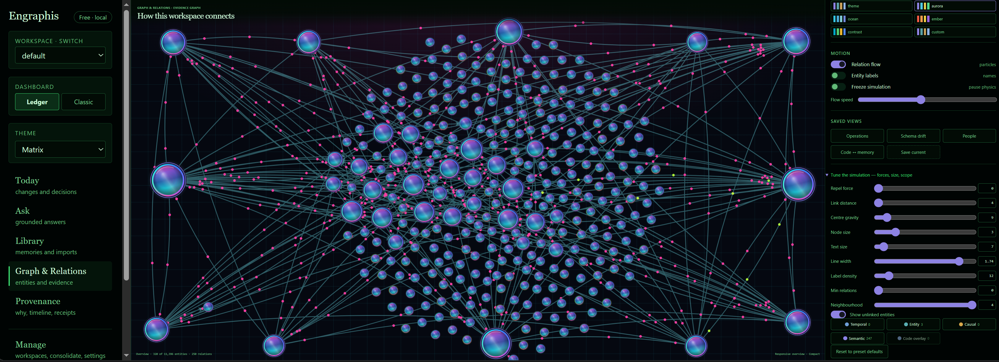
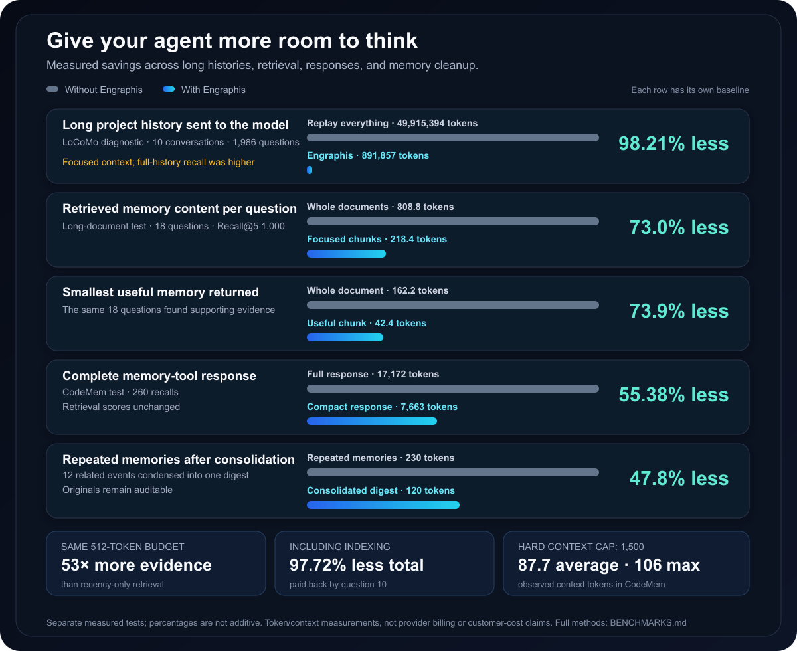
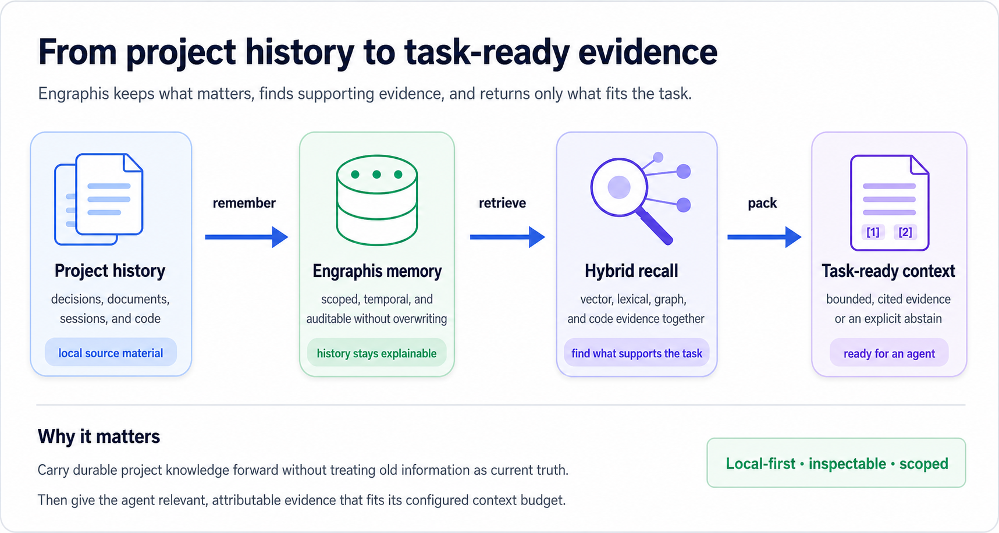
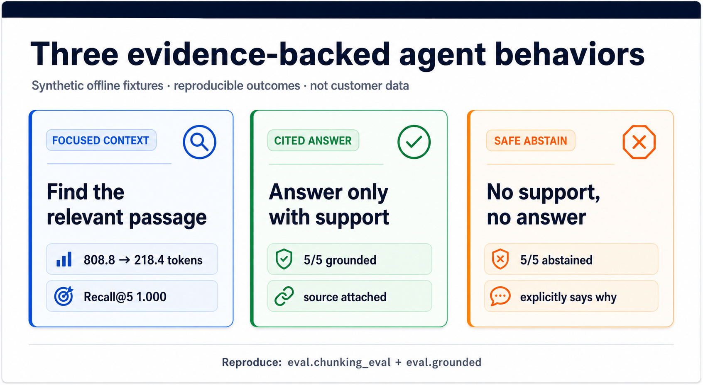

# Engraphis

[](https://pypi.org/project/engraphis/)
[](https://github.com/Coding-Dev-Tools/engraphis/blob/main/LICENSE)
[](https://buymeacoffee.com/Jaixii)

https://engraphis.com/

https://discord.com/invite/Wfr2ejBmY

**Give your AI agents a memory. See it, search it, and maintain it, all in a beautiful WebUI on your own machine.**

<p align="center">
  
  <br>
  <sup>Knowledge Graph · run <code>engraphis-dashboard</code> to see it live</sup>
</p>

---

> **Open-core boundary:** this repository contains the free local engine, dashboard, MCP server,
> and customer-side clients. Hosted sync, analytics, automation, and team services run on the
> official hosted service; their server implementations are not distributed here.

> **Support continued Engraphis development with Pro.** [Start a 3-day Pro trial](https://api.engraphis.com/account?plan=pro&interval=monthly&utm_source=engraphis&utm_medium=docs&utm_campaign=pro_conversion&utm_content=readme_intro&trial=pro#billing)
> or [subscribe to Pro](https://api.engraphis.com/account?plan=pro&interval=monthly&utm_source=engraphis&utm_medium=docs&utm_campaign=pro_conversion&utm_content=readme_intro#billing).

---

## Measured token and context savings

<p align="center">
  
  <br>
  <sup>Less repeated history means more room for the task, tools, and useful evidence.</sup>
</p>

> **Evidence boundary:** External LoCoMo-derived figures are not canonical. The historical
> workload run used an unpinned model revision and has no checked-in raw dataset artifact.
> Treat its 98.21% context figure as directional until an immutable rerun produces a validated
> public artifact and checksum. The checked-in deterministic fixtures below remain reproducible.

<details>
<summary>See benchmark details and reproduce the results</summary>

### Controlled before-and-after example

| Retrieval mode | Mean returned memory content | Recall@5 |
|---|---:|---:|
| Whole documents | 808.8 tokens | 1.000 |
| Engraphis structure-aware chunks | 218.4 tokens | 1.000 |

The chunked mode returns the relevant passage instead of the whole document: **590.4 fewer tokens
per question**. Under the same model-context budget, that leaves roughly **590 tokens** for task
instructions or other relevant evidence.

### Measurement details and reproducibility

The table below records every current token/context efficiency measurement and its counting
boundary.

| What is counted | Comparison | Measured reduction | Quality held constant |
|---|---|---|---|
| Cumulative reader context across a 1,986-question LoCoMo diagnostic | Full-history replay: **49,915,394** tokens → Engraphis: **891,857** tokens | **49,023,537 fewer context tokens** (**98.2133% lower**) | Focused retrieval used far less context; uncapped full history retained higher retrieval recall |
| Retrieved top-5 memory content, averaged per question | Whole documents: **808.8** tokens → structure-aware chunks: **218.4** tokens | **590.4 fewer tokens per question** (**73.0% lower**, about **3.7× smaller**) | Recall@5 **1.000** in both modes across 6 documents and 18 questions |
| Smallest returned memory that contains the reference evidence | Whole documents: **162.2** tokens → chunks: **42.4** tokens | **119.8 fewer tokens to evidence** (**73.9% lower**, about **3.8× smaller**) | The same 18 questions had a returned evidence-holding memory in both modes |
| Serialized MCP recall response across 260 timed CodeMem recalls | Full result: **17,172** `engraphis.regex.v1` tokens → compact result: **7,663** tokens | **9,509 response tokens avoided** (**55.38% lower**) | Recall@5, hit@5, and answer-token recall all **1.000** |
| Repeated-memory consolidation fixture | 12 related episodic memories: **230** tokens → one digest: **120** tokens | **110 tokens removed from the active digest** (**47.8% lower**) | Original memories remain available for provenance and audit |
| Small histories across 26 CodeMem agent tasks | Always retrieve: **2,194** total agent-facing tokens and **26** memory calls → adaptive: **1,942** tokens and **0** memory calls | **252 tokens avoided** (**11.5% lower**) and all 26 unnecessary searches skipped | Both completed **24/26** tasks with the same deterministic offline task agent |
| Packed prompt-context usage in the same CodeMem performance fixture | Hard budget: **1,500** tokens; observed mean: **87.73**; observed maximum: **106** | A hard cap prevents a recall from exceeding its configured context budget | This is usage accounting, not a before/after savings comparison |

The compact MCP response avoids duplicating full memory bodies when the packed context and source
list are enough. That can reduce what an agent must inspect or pass onward, but the fixtures do
**not** measure model-provider charges, end-to-end task time, or customer cost savings.

The measures are deliberately separate and **must not be added together**: chunking counts the
content of retrieved memory records before `ContextPacker`, whereas compact recall counts the
serialized MCP response returned to a client. “Tokens to evidence” is the size of the smallest
retrieved memory record holding the reference evidence; it is not latency or end-to-end answer
accuracy. Chunking creates more focused stored records (24 chunks rather than 6 whole-document
memories in this fixture), so this is a context-efficiency result, not a storage-reduction claim.

Reproduce the quality and token/context measurements without a network connection or API key:

```bash
python -m eval.harness --dataset eval/datasets/codemem.jsonl --k 5
python -m eval.grounded
python -m eval.chunking_eval
python -m eval.performance --dataset eval/datasets/codemem.jsonl --k 5 --iterations 10 --json
python -m eval.productivity --dataset eval/datasets/codemem.jsonl
```

These are small deterministic correctness and efficiency fixtures, not official LoCoMo /
LongMemEval QA scores or a third-party leaderboard result. Compact-response counts use the exact
`engraphis.regex.v1` counter; the chunking evaluation uses its documented deterministic
normalized-character estimator. Chunking measures retrieved memory content, while compact recall
measures serialized MCP response size. See [`BENCHMARKS.md`](BENCHMARKS.md) for definitions,
limitations, canonical external-evaluation requirements, and the no-unsupported-claims policy.

</details>

---

## What Engraphis gives an agent

An agent should not have to reconstruct a project from scattered chat history on every task.
Engraphis turns local project knowledge into scoped, time-aware memory; retrieves the evidence
that supports the current question; and returns a bounded, attributable context packet.

<p align="center">
  
  <br>
  <sup>Store durable project knowledge · retrieve supporting evidence · give the agent only what it needs</sup>
</p>

The flow is the essential path. See [measured token and context savings](#measured-token-and-context-savings)
for the short version of how much less history an agent has to carry.

| Agent need | What Engraphis changes |
|---|---|
| Remember a project across sessions | Stores typed memory in a `workspace → repo → session` hierarchy and provides a last-session handoff. |
| Find support for the current task | Fuses vector, lexical, graph, and code-aware retrieval instead of relying on one search signal. |
| Know what is true now and what changed | Preserves bi-temporal history and supersession chains instead of silently overwriting a fact. |
| Avoid confident guesses | Returns cited evidence or explicitly abstains when support is too weak. |
| Avoid dragging the whole project into every prompt | Packs context to a configured hard budget and can return a compact MCP response. |
| Keep knowledge in the operator's control | Runs local-first and offline-capable, with scopes, audit records, and optional privacy-safe receipts. |

### See the behavior in reproducible fixtures

The examples below use synthetic, checked-in evaluation inputs. They show three different
contracts: retrieving focused evidence, returning an answer only with support, and explicitly
abstaining when no support exists.

<p align="center">
  
  <br>
  <sup>Each card names its deterministic offline fixture and test scope. The examples are illustrative; they are not customer data or external benchmark results.</sup>
</p>

Run `python -m eval.chunking_eval` and `python -m eval.grounded` to reproduce the behavior;
the former measures evidence retrieval and context size, while the latter measures the
answer-versus-abstain decision.

## Full Engraphis install: pip install "engraphis[all]"

Engraphis-Dashboard opens `http://127.0.0.1:8700`. Local memory needs no cloud account,
signup, or API key and stays in a SQLite file on your machine.

**Ledger** is the primary local interface for recall, memories, graph exploration, provenance,
workspaces, and manual consolidation. **Classic** preserves the former full tool suite; both use
the same local data. Switch in **Manage → Settings → Interface** (Ledger) or **Settings →
Appearance & Engine** (Classic).

### Managed compute

Managed compute is separate from Cloud Sync. A connected installation may send a bounded,
non-secret snapshot for a hosted proposal; the hosted service must read it to produce a proposal,
so this is not end-to-end-encrypted processing. Local-only installations send nothing. Set
`ENGRAPHIS_MANAGED_COMPUTE_CONSENT=0` to opt out; `ENGRAPHIS_RETENTION_SUPERVISOR=none` keeps
retention supervision local (the default).

### Start it on every platform

| Platform | How |
|----------|-----|
| **Windows** | Double-click **Engraphis Dashboard** on your Desktop or Start Menu (install: `engraphis-dashboard --install-shortcuts`) |
| **macOS** | Double-click **Engraphis Dashboard.app** on your Desktop (install: same command) |
| **Linux** | Desktop entry in Applications → Development (GNOME/KDE/etc.) |
| **Docker** | `docker compose up`: see `docker-compose.yml` for the one-command deployment |
| **Any** | `engraphis-dashboard` in a terminal |

### Accessibility-first inspection, built in

Inspect memories, supersession diffs, recall scores, timelines, links, consolidation, and audit
records in the dashboard. The offline graph renderer is vendored, and the interface is keyboard-
navigable with light and dark themes.

---

## How it works

Engraphis gives agents durable, scoped, *explainable* project knowledge. The local engine combines
Ebbinghaus decay, bi-temporal facts, and hybrid vector/lexical/graph recall; it runs offline with
SQLite, local embeddings, and `numpy` only.

- **Grounded and governed:** deterministic conflict resolution, cited answers or abstention,
  explicit correction/promotion/forgetting, and a complete history.
- **Agent-ready:** MCP tools, hard-budget context packets, handoffs, and code-aware retrieval.
- **Auditable:** content-free receipt chains, provenance, and temporal/entity/code relationships.
- **Practical:** local file and code ingest, optional PDF/OCR/transcription, and SQLCipher at rest.

### Optional LLM providers

The memory engine, embeddings, conflict resolution, and recall stay local without an LLM. An
explicitly configured provider adds structured extraction, cited synthesis, consolidation, and
retention supervision. Configure it in **Settings → Connect an LLM**. The activity view records
outcomes, never keys, prompts, or raw provider responses. See the
[LLM provider guide](docs/LLM_PROVIDERS.md) for setup and privacy choices.

> Privacy boundary: text sent to an explicitly selected provider leaves the local process under
> that provider's terms. Use `ENGRAPHIS_RETENTION_SUPERVISOR=none` (the default) and the offline
> `chunk` extractor when ingestion must remain entirely local.

Choose and configure an external LLM with the [LLM provider guide](docs/LLM_PROVIDERS.md),
including OpenAI, Anthropic, Google, OpenRouter, Ollama, Cohere Command, Command Code, and
compatible endpoints.

---

## Install

```bash
pip install "engraphis[all]"        # self-hosted dashboard, MCP, code graph, documents, transcription, PostgreSQL, and Cloud Sync
pip install "engraphis[server]"     # dashboard + REST API
pip install "engraphis[mcp]"        # MCP server only
pip install "engraphis[documents]"  # PDF + image OCR bindings
pip install "engraphis[transcription]" # faster-whisper audio/video
pip install "engraphis[postgres]"   # PostgreSQL schema introspection
pip install "engraphis[code]"       # tree-sitter code graph indexing
pip install "engraphis[cloud-sync]" # Cloud Sync client crypto/runtime
pip install "engraphis[encryption]" # SQLCipher encryption-at-rest extra
pip install engraphis               # core library: numpy only, fully offline
```

The official Docker image includes the local Tesseract executable for image OCR. Outside
Docker, the `documents` extra installs its Python bindings; install Tesseract through your
operating system as well if you enable image OCR.

The NumPy-only core library supports Python 3.9+. Current patched releases of the WebUI
stack, MCP SDK, image parser, and Cloud Sync client require Python 3.10+, so use Python 3.10
or newer for the `server`, `mcp`, `documents`, `cloud-sync`, or `all` installation paths.

The default `NumpyVectorIndex` performs an exact full scan. There is no universal memory-count
cutoff because latency depends on vector size, hardware, filters, and the rest of the recall
pipeline. Measure your machine with `python -m eval.vector_scale`, then run
`python -m eval.performance` on a representative corpus. If exact scans miss your latency target,
create the engine with `vector_backend="sqlite-vec"` and remeasure. See [BENCHMARKS.md](BENCHMARKS.md)
for the reproducible commands and reporting limits.

`sqlcipher3-binary` publishes CPython manylinux x86-64 wheels. On that target,
`engraphis[encryption]` installs the driver. The cross-platform `all` extra deliberately
omits it so `all` remains resolvable on macOS, Windows, Linux ARM, and musl; on those
targets, provision a compatible SQLCipher driver separately before enabling a database
key. Plaintext SQLite remains the explicit default on every platform.

> **Linux / macOS:** if `pip install` fails with `error: externally-managed-environment`,
> your system Python is marked read-only (PEP 668). Install into a virtual environment
> instead. Run `python3 -m venv venv && source venv/bin/activate && pip install "engraphis[server]"`
> Alternatively, use Docker (`docker compose up`). `pipx install "engraphis[server]"` also works.

> First run downloads `all-MiniLM-L6-v2` (~80 MB). Without it, the engine falls back
> to a deterministic offline embedder so it always runs.

---

## Quickstart: dashboard (the headline)

```bash
pip install "engraphis[server]"
engraphis-dashboard                   # → http://127.0.0.1:8700
engraphis-dashboard --install-shortcuts   # → Desktop + Start Menu icons
```

### Docker

```bash
docker compose up                     # → http://127.0.0.1:8700
```

A fresh clone needs no `.env`: the service runs `engraphis-dashboard --no-open`, stores the v2
database plus the optional customer-side cloud session and non-authoritative entitlement display
cache on a named volume mounted at `/data`, and accepts overrides from `.env` or the shell.
License issuance, trials, leases, and revocations remain on the private control plane.
`engraphis-server` and `engraphis server` are headless compatibility aliases
for this same v2 service, so every public surface has the same scoped recall and retention model.

Compose publishes the service on host loopback only. Set a strong `ENGRAPHIS_API_TOKEN` before
changing its port mapping to a non-loopback host address.

Set `ENGRAPHIS_API_TOKEN` to require API authentication and `ENGRAPHIS_DB_KEY` to encrypt
the local database at rest. Hosted-plan credentials configure customer clients; they do not
install premium server implementations into this image. See `docker-compose.yml` for options.

---

## Quickstart: MCP server (for coding agents)

```bash
pip install "engraphis[mcp]"
engraphis-init                     # writes .env + prints config snippets
claude mcp add engraphis -- engraphis-mcp
cmd mcp add engraphis -- engraphis-mcp  # Command Code CLI
```

For Command Code scopes, verification, and its optional Provider API setup, see the
[Command Code section of the LLM provider guide](docs/LLM_PROVIDERS.md#command-code).

Your agent now has 31 tools for memory, recall, grounded answers, timelines, consolidation, code
graph work, and privacy-safe receipts. The full inventory, including `engraphis_check_update`, is
in the [MCP tool reference](docs/MCP_TOOLS.md).

For unattended jobs, `engraphis_start_session`, `engraphis_remember`, and
`engraphis_record_event` use workspace `default` when `workspace` is omitted.

## Quickstart: repository graph

```bash
pip install "engraphis[code]"
engraphis-graph index -w acme -r api --root .
engraphis-graph search -w acme -r api "UserService"
# `query`/`explain` blend code search with your stored memories: query matches symbol
# and file NAMES (a full question sentence won't match anything), and explain's answer
# is drawn from memories recorded against the repo; both are empty on a fresh index.
engraphis-graph query -w acme -r api "UserService"
engraphis-graph explain -w acme -r api "why does deploy depend on approval?"
engraphis-graph path -w acme -r api UserService DatabasePool
engraphis-graph impact -w acme -r api --root . --git-range origin/main...HEAD
engraphis-graph prs -w acme -r api --base main --head HEAD
engraphis-graph export -w acme -r api -o engraphis-graph-out
engraphis-graph install-merge-driver --root .
```

The export contains `graph.json`, a self-contained `graph.html`, and `GRAPH_REPORT.md`.
Indexing supports Python, JavaScript, TypeScript, Go, Rust, Java, C#, C, C++, SQL, and
Terraform. Tree-sitter is used when available; the dependency-free regex backend remains a
functional fallback. Definitions, methods, calls, imports, ownership, variables,
inheritance/implementation, and docstrings/comments are indexed. Indexing is incremental by
content hash, honors `.engraphisignore`, and does not follow file symlinks outside the repository
root. Call edges are name-based and best-effort rather than type-resolved. The optional Git merge
driver validates bounded graph JSON and deterministically unions nodes and edges instead of
choosing one export side.

For a read-only recall and graph API that can be shared without exposing write operations:

```bash
pip install "engraphis[server]"
engraphis-graph-server                 # API at http://127.0.0.1:8720; schema at /openapi.json
```

A non-loopback bind fails closed unless `ENGRAPHIS_GRAPH_TOKEN` (or
`ENGRAPHIS_API_TOKEN`) is set. See [the v3 architecture/design document](docs/ARCHITECTURE_V3.md).

---

## Quickstart: Python library

```python
from engraphis.service import MemoryService

mem = MemoryService.create("engraphis.db")
mem.remember("Auth migrated from JWT to PASETO.", workspace="acme", repo="api")
hit = mem.recall("why did we change auth?", workspace="acme", repo="api")
print(hit["context"])
```

The same `MemoryService` backs the dashboard and the MCP server.

Agent hosts can avoid retrieval when their existing history already fits:

```python
decision = mem.adaptive_context(
    "what should the agent do next?",
    current_history,
    workspace="acme",
    repo="api",
    max_context_tokens=8_192,
    retrieval_token_budget=1_024,
)
prompt_context = decision["context"]
```

The decision is `history_bypass` when the history fits, `retrieval` when compact evidence is
strong, and `history_fallback` when weak retrieval should widen back to recent raw history.

For an agent prompt, prefer `engraphis_recall_context`: it returns one hard-budget packed
`context` plus compact `sources`, deterministic `usage` accounting (`budget_tokens`, `context_tokens`,
`source_tokens`, `saved_tokens`, `savings_ratio`, `packed_count`, `omitted_count`, and
`token_counter`), and optional diagnostics. Accounting is exact for the named counter; inject the
reader's tokenizer when reader-model token parity is required. `engraphis_recall` remains the compatible full-recall
surface; use `response_mode="compact"` when the packed context is enough and full memory bodies
would duplicate it. Both default to the `balanced` retrieval profile; `auto` remains opt-in.

For bi-temporal reads, `valid_at` selects what was true at a Unix timestamp and `known_at` selects
what Engraphis had learned then. `as_of` remains a compatibility alias for `valid_at`; supplying
both is allowed only when they match.

For a mutable claim, pass a stable `subject_key` and optional `claim_kind`, such as
`subject_key="api.rate_limit", claim_kind="configured_value"`. Offline conflict resolution
deterministically adds, reinforces, relates, or supersedes records while preserving temporal
history; it does not need an LLM. Matching claim identities let it supersede substantially
reworded mutable facts. Without them, the dependency-free lexical embedder cannot reliably infer
that a paraphrase is a contradiction, so keep both records or use an explicit `correct` operation.

---

## Govern memories without losing history

Engraphis separates automatic write resolution from explicit human governance:

| Operation | Use it when | What happens to history |
|---|---|---|
| `remember` | Adding or restating one fact | Adds, reinforces, safely supersedes, or relates an uncertain neighbor |
| `correct` | Replacing one known-wrong memory | Closes the old validity window and links the replacement |
| `promote` | A narrow learning now applies more broadly | Writes a wider-scope successor and closes/links the source instead of editing scope in place |
| `merge` | Combining two or more overlapping memories | Retires every source and creates one memory that supersedes all of them |
| `forget` | Removing a memory from live recall | Bi-temporally closes it; the audit/history record remains |
| `consolidate` | Distilling recurring episodic memories automatically | Creates linked semantic digests; sources stay live unless explicit supersession is requested |

Manual N→1 merge is available through `MemoryService.merge()` and `POST /api/merge`:

```python
a = mem.remember("Deploys happen Friday at 3pm.", workspace="acme")
b = mem.remember("We deploy Fridays around 15:00.", workspace="acme")

merged = mem.merge(
    [a["id"], b["id"]],
    "Deploys ship every Friday at approximately 15:00.",
    workspace="acme",
    reason="deduplicate the deployment schedule",
)
print(merged["compaction"])
```

All sources must belong to the named workspace. The result inherits the strictest source
sensitivity, remains untrusted if any source was untrusted, and stays pinned if any source was
pinned. The full multi-predecessor chain remains visible through inspection, Why, and Timeline.

---

## Free forever vs. hosted plans

The core engine, local dashboard, MCP server, and manual consolidation are Apache-2.0 and free.
**Pro and Team are services**, not hidden modes in this package: a subscription authorizes the
official hosted service, whose private control plane, relay, compute, billing, and Team identity
run in a private repository. **Pro is $10/mo ($100/yr); Team is $20/seat/mo ($200/seat/yr).** The
email-confirmed, no-card trial lasts **exactly 3 active days**.

After a denial, `workspace_write_grace` may retain only private-service-approved hosted-account
continuity operations for at most **24 hours**. It never extends trial or subscription expiry or
grants Cloud Sync, Analytics, Automation, Auto Dreaming, Auto Consolidation, Team access, seats,
or credentials. Then `recovery_read_only` provides recovery and data export. Neither state
restricts local dashboard, MCP tools, or local writes. Cloud Sync encrypts eligible shared-workspace
changes end-to-end; managed compute is a separate readable-snapshot service. See
[`docs/HOSTED_PLANS.md`](docs/HOSTED_PLANS.md), [`docs/LICENSING.md`](docs/LICENSING.md), and
[`docs/SYNC.md`](docs/SYNC.md) for the full boundaries.

[Subscribe to Pro](https://api.engraphis.com/account?plan=pro&interval=monthly&utm_source=engraphis&utm_medium=docs&utm_campaign=pro_conversion&utm_content=readme_pricing#billing)
to support the project and add hosted services.

| | Free (available now) | Pro: $10/mo or $100/yr | Team: $20/seat/mo or $200/seat/yr |
|---|---|---|---|
| Dashboard WebUI (with built-in inspector) | ✓ | ✓ | ✓ |
| Memory engine + 31 MCP tools | ✓ | ✓ | ✓ |
| Version-chain diffs, offline knowledge graph | ✓ | ✓ | ✓ |
| Manual local consolidation (dry-run by default) | ✓ | ✓ | ✓ |
| Local workspace export (JSON: memories, sessions, audit) | ✓ | ✓ | ✓ |
| Hosted Cloud Sync | | ✓ | ✓ |
| Hosted Analytics | | ✓ | ✓ |
| Hosted Auto Consolidation + retention policy | | ✓ | ✓ |
| Hosted Auto Dreaming + managed proposals | | ✓ | ✓ |
| Priority support | | ✓ | ✓ |
| Hosted multi-user dashboard: invitations, logins, roles, seat management | | | ✓ |
| Hosted Team audit log + CSV export | | | ✓ |
| 72-hour pending invitations (resend/revoke) | | | ✓ |
| Scoped, expiring per-user agent and sync tokens | | | ✓ |

---

## MCP tools

Engraphis exposes 31 MCP tools across memory, recall, code graphs, governance, sessions, and
privacy-safe audit receipts. The focused [MCP tool reference](docs/MCP_TOOLS.md) is the source for
the full inventory and parameters.

---

## Layered graph and privacy receipts

Memory relationships, extracted entities, and code structure stay normalized in one SQLite
database. Edges are tagged as `temporal`, `entity`, `causal`, or `semantic`, so callers can
select a logical overlay without maintaining separate graphs. Schema migrations are additive
and idempotent: existing memories and bi-temporal history remain in place, while legacy edge
layers are inferred once.

`MemoryService.intent_remember()`, `intent_link()`, and `intent_recall()` provide a
transport-neutral agent protocol while the existing `engraphis_remember`, `engraphis_link`, and
`engraphis_recall` tools remain the canonical MCP vocabulary. Explicit links can persist both a
layer and a durable rationale. Intent recall maps `explain`, `summarize_history`, and
`locate_code` to appropriate layer filters; code intents also return matching symbols when a
repository is supplied.

The operation-receipt chain is deliberately content-free. It records bounded operation metadata
and chained hashes, while excluding raw memory/query text, workspace names, memory IDs, and actor
identities from exported receipt payloads. Use `engraphis_receipts`,
`engraphis_context_savings`, `engraphis_verify_receipts`, and `engraphis_export_receipts` to
inspect the chain, aggregate retrieved-source versus packed-context tokens, or compare it with a
previously saved head/count anchor. Savings stay separated by token-counter identity and are
reported with chain validity; they are packing measurements, not provider bills. A separately
maintained local count/head anchor and persistent integrity marker make interior edits, reordering,
and tail truncation detectable.

See [the v3 architecture document](docs/ARCHITECTURE_V3.md) for the data flow and
[SECURITY.md](SECURITY.md) for the trust boundaries.

---

## Cloud sync

**Cloud Sync is a hosted Pro/Team service.** The private service owns relay storage,
organization authorization, credential rotation, scheduling, isolation, and operations. This
Apache package contains only the customer protocol, deterministic merge implementation, and
one-shot client needed to participate after the hosted service authorizes an installation. No
environment switch turns the public image into an Engraphis relay.

The merge remains a state-based CRDT: every field resolves by a commutative, idempotent rule so
`merge(A, B) == merge(B, A)`. The current format carries memories and memory-to-memory links;
entity/code graph reconciliation is not yet part of sync. `secret` memories and all live or
invalidated session-scoped memories are device-local and excluded from every exported sync
bundle; links are exported only when both endpoints remain. Inbound bundles cannot create or
overwrite session state. Cloud Sync encrypts eligible shared-workspace changes end-to-end before
they leave this device; the relay stores ciphertext and cannot read bundle contents.

Cloud Sync fails closed without its client-held workspace key: install `engraphis[cloud-sync]`
on Python 3.10+ and set the same 32-byte URL-safe-base64 `ENGRAPHIS_SYNC_E2EE_KEY` on each
authorized device using a secure out-of-band transfer. The relay and Engraphis Cloud never
receive that key. [`docs/SYNC.md`](docs/SYNC.md) includes the key-generation command and the
`--relay-e2ee-key` one-off CLI alternative.

For development, backup interchange, and offline testing, the public client retains an explicit
one-shot folder exchange. That manual primitive is not the official Cloud Sync product and has
no hosted identity, seat, managed-storage, availability, or support guarantees. See
[`docs/SYNC.md`](docs/SYNC.md) for the exact boundary, security model, and client usage.

---

## Security, reliability, and trust boundaries

The public runtime and its hosted-service clients enforce:

- **Single-user local access**: loopback is the default; an optional constant-time-checked
  bearer protects a remotely exposed customer node. Local Team accounts, invitations, roles,
  seats, password handling, and organization administration are not shipped here.
- **Hosted authorization boundary**: Cloud Sync, Analytics, Automation, Team identity, and
  cost-bearing work require current authorization from the private service. Any bounded
  `workspace_write_grace` and later `recovery_read_only` state is enforced by that private
  service for hosted account continuity; neither state grants cloud access or account growth,
  and neither restricts the free local core.
- **SQLite transaction safety**: shared v2 connections serialize complete write transactions;
  a failed statement that opened a transaction rolls it back and releases its lock. Legacy
  decay is frequency-independent, and sync preserves future bi-temporal validity horizons.
- **Customer-client isolation**: workspace allow-lists are enforced while applying fetched
  data, and device-local `secret` memories cannot be uploaded or remotely overwritten,
  invalidated, or downgraded. Bundle size and record counts are bounded before application;
  hosted tenant and storage enforcement remains private service responsibility.
- **Hostile-input handling**: sync-folder peers, graph merge inputs, repository walks,
  resource files, and PostgreSQL selectors are treated as untrusted; traversal,
  symlink/replace races, oversized/deep payloads, malformed rows, and non-finite JSON are
  rejected.
- **Proxy and network hardening**: default loopback CORS follows `ENGRAPHIS_PORT`;
  proxy-reported HTTPS produces Secure session cookies, and redirects use the configured
  dashboard URL rather than a caller-controlled Host header. Managed-service clients reject
  insecure or malformed endpoints and never forward bearer credentials across HTTP
  redirects.

See [SECURITY.md](SECURITY.md) for supported versions, deployment requirements, known gaps,
and the vulnerability-reporting process.

---

## Encryption at rest

Set `ENGRAPHIS_DB_KEY` (or `ENGRAPHIS_DB_KEY_FILE`) and install the extra:

```bash
pip install "engraphis[encryption]"
```

The entire main memory database file is transparently encrypted with AES-256 via SQLCipher;
full-text search, the graph, and every query keep working unchanged. Customer authentication
and managed-service state use their respective deployment protections. When a key is set for the main database, Engraphis
**fails loud** rather than silently falling back to plaintext. Generate a strong key:

```bash
python -c "import secrets; print(secrets.token_hex(32))"
```

> An existing plaintext database cannot be opened with a key: migrate it (dump → import
> into a fresh keyed DB). See `.env.example` for all encryption options.

---

## Import files & folders

Drag-and-drop or server-side import, access-controlled and bounded:

- **Dashboard upload**: accepts text, Markdown, code, JSON/CSV/HTML, DOCX, and exported
  Google Workspace documents directly; optional adapters add PDF text extraction, image OCR,
  and audio/video transcription. Native `.gdoc` pointer files contain no document body, so
  export them as DOCX, PDF, HTML, or plain text before local ingestion.
- **Server-side folder import**: `MemoryService.import_folder()` reads a directory on the
  machine running Engraphis. Large resources are chunked deterministically even when the
  configured extractor is `none`; path-traversal guards still apply.
- **PostgreSQL**: `engraphis_ingest_postgres_schema`, `POST /api/resources/postgres`, or
  `engraphis-graph postgres` converts tables, columns, constraints, and foreign keys into a
  schema memory and entity graph. The DSN is never persisted.
- **MCP ingest**: `engraphis_ingest` accepts raw text and applies the configured extractor
  (`chunk`, `llm`, or `llm_structured`); with `none` it stores one verbatim memory.
- **Sub-file chunking**: set `ENGRAPHIS_EXTRACTOR=chunk` to split long, multi-topic
  documents into retrieval-sized, structure-aware pieces (headings start new chunks;
  ~256-token target with sentence-level overlap) *without an LLM*. Each chunk becomes
  its own memory, so recall returns the relevant **passage** instead of a whole file,
  a big context-reduction win on long docs. Works across all three ingest paths
  (dashboard upload, `import_folder`, and `engraphis_ingest`). Measure the payoff with
  the bundled eval: `python -m eval.chunking_eval --dataset eval/datasets/longdoc.jsonl --k 5`
  (whole-file vs. chunked, same recall pipeline, offline). The dependency-free default
  uses the named `engraphis.chars4.v1` estimate. Set
  `ENGRAPHIS_CHUNK_TOKENIZER_MODEL` and, for reproducible runs,
  `ENGRAPHIS_CHUNK_TOKENIZER_REVISION` to size prose chunks with the actual reader
  tokenizer; the chosen counter identity is preserved in each chunk's metadata.
- **Structured LLM extraction**: `ENGRAPHIS_EXTRACTOR=llm_structured` validates typed
  facts, entities, relations, and keywords before storage. Its preserved entity/relation
  metadata feeds the knowledge graph automatically. A successful dashboard connection test
  enables this mode by default; the Settings switch can disable or re-enable it immediately.

---

## Manual consolidation and hosted automation

Manual consolidation is free and remains local. Use the dashboard's **Consolidate** tab,
`MemoryService.consolidate`, `POST /api/consolidate`, `engraphis_consolidate`, or
`python -m scripts.consolidate`. Dry-run is the default.

Pro and Team add **hosted** Auto Consolidation and Auto Dreaming. On a connected workspace, the
first Automation view automatically starts the recommended daily maintenance policy and uploads
its bounded snapshot; there is no separate enable step. Customers can later pause or tune that
policy. The public Automation tab displays reviewable jobs or proposals. The scheduling, analytics, dreaming, and
consolidation automation algorithms run in Engraphis Cloud; this repository ships no premium
background loop, cron wrapper, or worker.

Secret-class and session-scoped memories are excluded before a managed snapshot is serialized;
secret-class rows are rejected again by the hosted service. The encoded payload is capped at
16 MiB. A connected installation sends that bounded, non-secret snapshot to Engraphis Cloud
over HTTPS, where the hosted service must read it to produce a proposal; this is not
end-to-end-encrypted processing. Local-only installations send nothing. Managed compute is
enabled by default once an installation is connected to Engraphis Cloud. Connecting accepts
the terms that cover it, and it stays off for a local-only installation with no cloud session;
cloud entitlement is also required. `ENGRAPHIS_MANAGED_COMPUTE_CONSENT=0` opts a connected
installation back out. A managed proposal never silently rewrites the local database.

Manual consolidation can also use schema-validated LLM output through
`MemoryService.consolidate`, `POST /api/consolidate`, `engraphis_consolidate`, or
`python -m scripts.consolidate --structured`. Source memories remain live by default;
`supersede_sources` / `--supersede-sources` closes them only after validated replacement
facts are written.

---

## Configuration

All via environment (or `.env`):

| Env Var | Default | Description |
|---------|---------|-------------|
| `ENGRAPHIS_DB_PATH` | Source: `<repo>/engraphis.db`; installed: platform user-data directory | SQLite database file. Installed defaults are `%LOCALAPPDATA%\engraphis\engraphis.db` (Windows), `~/Library/Application Support/engraphis/engraphis.db` (macOS), and `$XDG_DATA_HOME/engraphis/engraphis.db` or `~/.local/share/engraphis/engraphis.db` (Linux). The environment variable overrides every default. |
| `ENGRAPHIS_HOST` | `127.0.0.1` | Server bind address |
| `ENGRAPHIS_PORT` | `8700` | Dashboard port |
| `ENGRAPHIS_SERVICE_MODE` | `customer` | The public package supports only `customer`; hosted vendor, relay, compute, and worker roles are not distributed here |
| `ENGRAPHIS_API_TOKEN` | Not set | Optional bearer credential for this single-user local customer node; never reuse a hosted credential |
| `ENGRAPHIS_CORS_ORIGINS` | loopback on `ENGRAPHIS_PORT` | Comma-separated REST CORS allow-list; defaults to `127.0.0.1` and `localhost` on the configured port |
| `ENGRAPHIS_WORKSPACES` | Not set | Optional comma-separated server-side workspace allow-list |
| `ENGRAPHIS_INDEX_ROOTS` | Working, home, and temporary directories | Optional path-separator-delimited absolute-path allow-list that replaces the default roots accepted by local code indexing |
| `ENGRAPHIS_HTTP_INDEX_ROOT` | First `ENGRAPHIS_INDEX_ROOTS` entry, or current directory | Single root for dashboard and REST `POST /api/code/index`; submitted paths resolve beneath it. An explicit root (or fallback entry) must be absolute; an explicit HTTP root is included in the engine-approved set. MCP and CLI indexing continue to use `ENGRAPHIS_INDEX_ROOTS`. |
| `ENGRAPHIS_DB_KEY` | Not set | Encrypt the database at rest (SQLCipher). Or use `ENGRAPHIS_DB_KEY_FILE` |
| `ENGRAPHIS_EMBED_MODEL` | `sentence-transformers/all-MiniLM-L6-v2` | sentence-transformers model |
| `ENGRAPHIS_EXTRACTOR` | `none` | `none` = verbatim; `chunk` = offline structure-aware chunks; `llm` = free-form LLM facts; `llm_structured` = schema-validated facts + graph metadata |
| `ENGRAPHIS_CHUNK_TOKENIZER_MODEL` | Not set | Optional Hugging Face tokenizer used to enforce chunk budgets with the downstream reader's real tokenization; requires the optional `transformers` package |
| `ENGRAPHIS_CHUNK_TOKENIZER_REVISION` | Not set | Optional immutable tokenizer/model revision recorded in the chunk-counter identity; pin this for reproducible benchmark artifacts |
| `ENGRAPHIS_GRAPH_EXTRACTOR` | `regex` | `regex` = offline heuristic NER; `none` = disable heuristic text extraction (validated `llm_structured` metadata still feeds the graph) |
| `ENGRAPHIS_RETENTION_SUPERVISOR` | `none` | `none` = deterministic only; `llm` = sends a bounded excerpt to the configured provider for advisory ephemeral/normal/critical classification |
| `ENGRAPHIS_WHISPER_MODEL` | Not set | Enables local faster-whisper audio/video transcription |
| `ENGRAPHIS_POSTGRES_DSN` | Not set | CLI-only PostgreSQL source; used for the connection and never stored |
| `ENGRAPHIS_POSTGRES_CONNECT_TIMEOUT` | `10` | PostgreSQL introspection connection timeout in seconds (bounded to 1–120) |
| `ENGRAPHIS_POSTGRES_STATEMENT_TIMEOUT_MS` | `30000` | Per-introspection PostgreSQL statement timeout in milliseconds (bounded to 1–300000) |
| `ENGRAPHIS_GRAPH_TOKEN` | Not set | Bearer token for `engraphis-graph-server`; required off-loopback |
| `ENGRAPHIS_GRAPH_HOST` / `ENGRAPHIS_GRAPH_PORT` | `127.0.0.1` / `8720` | Read-only graph/recall server bind address |
| `ENGRAPHIS_LLM_PROVIDER` | `openai` | `openai \| anthropic \| google \| openrouter \| custom` |
| `ENGRAPHIS_LLM_MODEL` | `gpt-4o-mini` | Model name (provider-specific) |
| `ENGRAPHIS_LLM_API_KEY` | Not set | API key for chat/synthesis, `llm` / `llm_structured` extraction, and structured consolidation |
| `ENGRAPHIS_LLM_BASE_URL` | Not set | Base URL for openrouter / custom OpenAI-compatible endpoints |
| `ENGRAPHIS_LLM_AUTO_EXTRACT` | `0` | Opt in to switching the running engine to `llm_structured` after a successful live connection test; the dashboard's extraction Off button persists `0`, and its On button restores `1` |
| `ENGRAPHIS_FORWARDED_ALLOW_IPS` | *(none)* | Proxies trusted for forwarded client/TLS headers (`*` only when the service is reachable exclusively through that proxy) |
| `ENGRAPHIS_LOCAL_TRUSTED_PEERS` | *(none)* | Exact peers/CIDRs treated as local without forwarding headers; intended for the shipped loopback-published Compose bridge, not public deployments |
| `ENGRAPHIS_CLOUD_CONTROL_URL` | hosted default | Official entitlement, organization, and credential control API |
| `ENGRAPHIS_CLOUD_COMPUTE_URL` | hosted default | Official Analytics and managed-automation API |
| `ENGRAPHIS_CLOUD_ORGANIZATION_ID` | Not set | Hosted organization bound to this customer session |
| `ENGRAPHIS_CLOUD_REFRESH_CREDENTIAL` | Not set | Bootstrap-only rotating hosted credential; after first use the owner-only cloud session replacement takes precedence |
| `ENGRAPHIS_CLOUD_TOKEN_SUBJECT` | `member` | Subject fixed during hosted bootstrap (`device` or `member`); set explicitly with an environment-only refresh credential |
| `ENGRAPHIS_CLOUD_ACCESS_TOKEN` | Not set | Optional short-lived access token for ephemeral jobs |
| `ENGRAPHIS_MANAGED_COMPUTE_CONSENT` | *(auto)* | Operator override only; default follows whether a cloud session is configured (connected = allowed, local-only = never). `0` opts a connected installation out, `1` forces it on |

See `.env.example` for the full customer-runtime and managed-service client options.

---

## Project structure

```
engraphis/
├── engraphis/
│   ├── core/                # v2 engine: interfaces, store, recall, scoring, schema, sync
│   ├── backends/            # pluggable embedder / vector index / reranker / codegraph / sync transports / encryption
│   ├── service.py           # validated MemoryService facade
│   ├── mcp_server.py        # MCP server: 31 tools
│   ├── dashboard_app.py     # dashboard WebUI (FastAPI)
│   ├── dashboard_assets/    # primary Ledger interface + graph engine
│   ├── classic_assets/      # selectable full operator dashboard backup
│   ├── read_only_api.py     # token-protected recall/repository-graph HTTP surface
│   ├── hosted_client.py     # hosted URLs, plan labels, and endpoint validation only
│   ├── licensing.py         # compatibility facade for hosted presentation metadata
│   ├── cloud_session.py     # rotating hosted customer-session client
│   ├── cloud_features.py    # consented managed-feature protocol client
│   ├── config.py / app.py   # env settings / REST server
│   └── static/              # compatibility dashboard asset paths
├── eval/                    # offline retrieval eval harness + datasets
├── tests/                   # pytest suite (300+ tests, offline numpy-only core)
├── scripts/                 # dashboard, server, graph, CLI, connect, update, consolidation, sync
├── docs/                    # product, API, hosting, sync, and provider guides
├── Dockerfile / docker-compose.yml
└── pyproject.toml
```

New capability belongs in the v2 path (`engraphis/core/`, `engraphis/backends/`, and
`MemoryService`) behind the interfaces in `core/interfaces.py`. The flat-namespace v1 server
under `engraphis/app.py`, `routes/`, `stores/`, and `engines/` remains a compatibility/reference
surface; `engraphis-dashboard`, the MCP server, and the Python quickstart above use v2.

---

## Development

The offline quality gate (no network, no API key):

```bash
pip install numpy pytest ruff
python -m pytest tests/ -q
python -m eval.harness --dataset eval/datasets/sample.jsonl --k 5
python -m eval.harness --dataset eval/datasets/codemem.jsonl --k 5
python -m eval.ablation
ruff check .
```

Numbers, not assertions: the offline harness is a **correctness floor** (deterministic embedder).
LoCoMo, LongMemEval, MemoryAgentBench, LoCoMo-Plus, and Mem2ActBench adapters are available,
along with a pinned LongMemEval-V2 reader profile, redacted evidence exporter, and paired
full-history versus Engraphis code-agent analyzer. External adapters measure only the layer they
declare; retrieval or tool-argument context coverage is not presented as end-to-end answer,
action, or task success. Reproduction commands and remaining official-run requirements are in
[`BENCHMARKS.md`](BENCHMARKS.md).

---

## Release evidence

Each tagged release includes `release-evidence.json` and a reproducible CycloneDX JSON SBOM as
GitHub Release assets. The evidence binds the matching tag and commit to the built wheel and
source distribution hashes, SBOM hash, source-input hashes, and the completed release-gate checks.
It is intentionally limited: it does not attest to publication, hosted services, payments,
deployments, or runtime data; the SBOM describes the build job's Python environment rather than an
operating-system or container image.

---

## License

Apache-2.0. See [LICENSE](LICENSE) and [NOTICE](NOTICE). "Engraphis" is a trademark of the
Engraphis project; the license does not grant trademark rights. Code already distributed
under Apache-2.0 keeps that grant; later releases cannot retroactively withdraw it. The
official hosted control plane, its production credentials and records, managed operations,
support, and future separately delivered commercial modules are outside the public source
grant. See [`docs/LICENSING.md`](docs/LICENSING.md) for the complete boundary.
