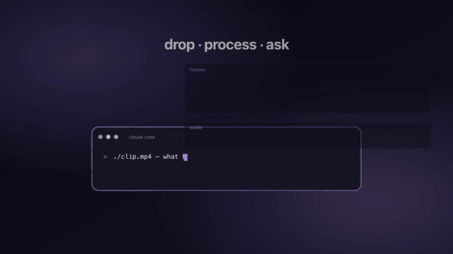
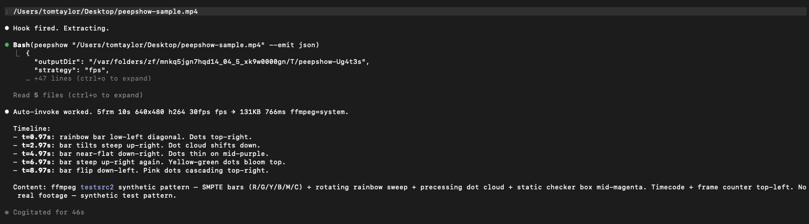

<p align="center">
  
</p>

<p align="center">
  <a href="https://www.peepshow.dev/"></a>
  <a href="https://www.npmjs.com/package/peepshow"></a>
  
  
  <a href="https://x.com/tom_taylor"></a>
</p>

<p align="center">
  <a href="https://www.peepshow.dev/">peepshow.dev</a> ·
  <a href="https://www.peepshow.dev/sinks/">Sinks</a> ·
  <a href="https://www.peepshow.dev/agents/">Agents</a> ·
  <a href="https://x.com/tom_taylor">@tom_taylor</a>
</p>

# peepshow

> **video → frames → LLM.** Any LLM CLI. Any storage backend. Zero glue code.

Turn a video — or an animated GIF, APNG, or WebP — into a timeline of still frames plus an extracted audio track and its transcript, so an LLM can "watch" and "listen" to what's inside.

<p align="center">
  
</p>

Static images (JPG, PNG, static WebP) are already handled natively by most LLMs — drag, drop, done. **`peepshow` only steps in for things that have multiple frames across time**: videos and animated images, which today's LLMs can't consume directly.

**Same drag-and-drop UX as images.** Drop a `.mp4` / `.mov` / `.gif` into the Claude Code prompt and a `UserPromptSubmit` hook auto-invokes `/peepshow:slides <path>` behind the scenes — Claude extracts frames, reads them, and answers. No slash command, no Bash call, no copy-paste. Works with natural-language prompts too ("what's in ~/Desktop/bug.mov?") and with every other CLI entry point (explicit `/peepshow:slides`, shell `peepshow ...`, pipes into `--sink`).

**Pluggable sink backends — write your own, or use the built-ins.** Every run can fan out to downstream systems via `--sink <name>` or `--sink-cmd <shell>`. A sink is any executable that reads a JSON payload on stdin — write one in bash, Node, Python, Go, whatever. The full `video` + `tags` + `frames` + `audio` + `extraction` payload (same as `--emit json`) flows to each sink, so they receive the full context, not just the frame paths. **71 sinks ship built-in** across SQL (SQLite · Postgres · MongoDB), vector + AI memory (Chroma · Qdrant · Pinecone · pgvector · Weaviate · Milvus · MemPalace · Zep · Mem0 · Letta), object + file storage (S3-compatible · GCS · Firebase Storage · Azure Blob · Supabase · Dropbox · Google Drive · Box · OpenAI Files), chat (Slack · Discord · MS Teams · Telegram · WhatsApp · iMessage · Mattermost · Rocket.Chat · Zulip · Matrix), issue trackers (Linear · Height · GitHub Issues · Jira · Asana · ClickUp · Shortcut · Trello), whiteboards (Miro · Figma), wiki/notes (Notion · Obsidian · Logseq · Outline · Confluence · Apple Notes · Bear), product analytics (PostHog · Plausible · Mixpanel/Amplitude/Segment), observability (Sentry · Datadog · New Relic · Honeycomb · PagerDuty · Opsgenie · Grafana Oncall), and workflow glue (Webhook · GraphQL · IDE · Aider · Continue · Cody · Raycast · Pipedream · Zapier · Shortcuts · Apple Reminders · Things 3). Browse [`docs/sinks/`](./docs/sinks/) or use the [use-case finder](https://www.peepshow.dev/sinks/find/). Full spec: [`docs/PLUGINS.md`](./docs/PLUGINS.md).

**Audio is extracted too, not just frames.** When the input has an audio track (MP4 / MOV / WebM / MKV), `peepshow` runs a second ffmpeg pass that emits a compact mono 16 kHz AAC track next to the frames and probes loudness peak + silence ratio. Animated GIF, APNG, and animated WebP inputs skip this cleanly — they can't carry audio at the format level. The extracted `audio.m4a` + its analysis fields land in the JSON payload alongside `video` + `frames`, so any downstream sink sees the full picture. Opt out with `--no-audio`.

## Audio transcription

When audio is extracted, `peepshow` can also transcribe it. **If [`whisper.cpp`](https://github.com/ggml-org/whisper.cpp) is on your `PATH`, transcription auto-enables with the `base.en` model — no flag, no API key, nothing leaves the machine.** The model file downloads to `~/.peepshow/whisper-models/ggml-<model>.bin` on first use (override with `PEEPSHOW_WHISPER_MODEL_DIR`). Skip entirely with `--no-transcribe` or `PEEPSHOW_TRANSCRIBE=off`.

Prefer a cloud provider? Pick one in a single flag and set the matching API key — peepshow uploads the extracted `audio.m4a` and stores the result back on the same payload:

| Provider | Install / key | CLI |
| :------- | :------------ | :-- |
| `whisper-cpp` (default when on PATH) | `brew install whisper-cpp` (macOS) · `scoop install whisper-cpp` (Windows) · [prebuilt Linux releases](https://github.com/ggml-org/whisper.cpp/releases) | `--transcribe whisper-cpp` |
| `openai` | `OPENAI_API_KEY=…` | `--transcribe openai` |
| `groq` | `GROQ_API_KEY=…` | `--transcribe groq` |
| `deepgram` | `DEEPGRAM_API_KEY=…` | `--transcribe deepgram` |
| `assemblyai` | `ASSEMBLYAI_API_KEY=…` | `--transcribe assemblyai` |
| `custom` | any shell command — reads audio on stdin, writes `{segments,text}` JSON on stdout | `PEEPSHOW_TRANSCRIBE_CMD='my-asr'` + `--transcribe custom` |

The transcript lands on the JSON payload as `audio.transcript` (`{provider, model, language, durationSeconds, segments: [{start, end, text}], text}`). Because it rides on the same payload as frames and `video.tags`, **every sink gets the transcript for free** — search SQLite by spoken phrase, embed segments into pgvector/Chroma/Pinecone, drop it into Obsidian next to the frames, pipe it to Slack.

Full reference + provider caveats: **[peepshow.dev/transcription/](https://www.peepshow.dev/transcription/)**.

## TL;DR

```bash
# 1. Install peepshow from npm — https://www.npmjs.com/package/peepshow
npm i -g peepshow                            # global bin: `peepshow` + sink bins
#   or: npm i peepshow                       # local dep
#   or: npx peepshow ./video.mp4             # one-shot

# 2. (Optional) install ffmpeg natively — faster, more codecs
brew install ffmpeg                          # macOS
choco install ffmpeg-full                    # Windows
sudo apt install ffmpeg                      # Debian/Ubuntu
#   Skip the above entirely — peepshow falls back to the bundled
#   ffmpeg-static that `npm i peepshow` pulls in automatically.

# 3. Use it anywhere
peepshow ./bug.mov                           # stdout: human-readable summary + frame paths
peepshow ./demo.mp4 --emit json | jq         # structured output
peepshow ./loop.gif --emit caveman           # token-compressed output for LLMs
peepshow ./keynote.mp4 --sink folder:/shared # fan out to folder/mysql/webhook/...
```

Inside Claude Code — **just drag the video into the prompt**. A `UserPromptSubmit` hook detects the path and auto-invokes `/peepshow:slides`, so dropping a `.mp4` / `.mov` / `.gif` works the same as dropping an image:

<p align="center">
  
</p>

Explicit invocation works too:

```
/peepshow:slides ./bug.mov
```

Or describe the task in natural language — the skill auto-invokes:

> "Watch ~/Desktop/demo.mp4 and tell me what happens in the first 10 seconds."

## Why

- **Drag-and-drop into Claude.** UserPromptSubmit hook spots video/animated-image paths in your prompt and auto-invokes the skill — same UX as dropping an image.
- **Scene-change detection by default** — ffmpeg's `select='gt(scene,…)'` filter catches visually distinct moments, no fixed-fps noise.
- **Perceptual frame dedup** — every extraction runs an 8×8 dHash post-pass and drops near-identical frames (default hamming threshold 5). Means a static talking-head, a security-cam loop, or a slideshow recording emits a handful of frames covering the actual visual changes — not 600 thumbnails of the same face. Survives `--fps` fallback (where fixed-rate sampling normally wastes frames). Off via `--no-dedup`. Real numbers across the hero reels: `earth-at-night` 6→2 frames (−67%), `UI demo` 18→10 (−44%), `jellyfish` 6→6 (0% — high-motion content keeps every distinct frame, zero false drops).
- **Motion signal + adaptive density** — the dHash pass also computes the average pairwise hamming distance between kept frames, classified as `low`/`medium`/`high` and surfaced on the manifest as `extraction.motionSignalAvg` + `extraction.motionSignalLevel`. When the signal reads `high` AND dedup dropped 0 frames AND there's still budget under `--max`, peepshow auto re-extracts at ~80% of `--max` so high-motion clips get proportionally more frames in the same budget (verified live: `big-buck-bunny.mp4` 6→14 frames). Disable with `--no-adaptive` when you need a deterministic fps every run. See [`/optimised/`](https://www.peepshow.dev/optimised/) for the full benchmark.
- **Ships native agent manifests for 8+ tools.** Claude Code plugin (`.claude-plugin/`), Cursor (`.cursor/rules/`), Windsurf (`.windsurf/rules/`), Cline (`.clinerules/`), Codex CLI (`.codex/hooks.json`), Gemini CLI (`gemini-extension.json` + `GEMINI.md`), generic `AGENTS.md` convention, `.agents/plugins/` marketplace. Plus integration snippets for Copilot CLI, aider, `llm`, Continue, Cody, Zed AI, Perplexity, Ollama in [`docs/INTEGRATIONS.md`](./docs/INTEGRATIONS.md).
- **Hardware-accelerated decoding** by default — VideoToolbox on macOS, VAAPI on Linux, D3D11VA on Windows. `--no-gpu` to force CPU.
- **Pluggable sink backends.** Fan out each run to folders, SQL, vector DBs, object storage, chat, wikis, issue trackers, observability, workflow glue — 71 ship built-in across 10 categories. Contract is one JSON stream on stdin. See [`docs/PLUGINS.md`](./docs/PLUGINS.md) and the [sinks hub](https://www.peepshow.dev/sinks/).
- **Pairs with [JuliusBrussee/caveman](https://github.com/JuliusBrussee/caveman)** for token-aware LLM setups (`--emit caveman`).
- **Live statusline badge.** `[PEEPSHOW:decoding:42%]` mid-run, `[PEEPSHOW:5frm:scene:system]` after, `[PEEPSHOW]` idle.
- **Context-aware hints on stderr.** Missing ffmpeg → OS-specific install command. Bundled ffmpeg → one-time nudge toward native. Zero frames / short clip / heavy pruning → actionable flag suggestions. `PEEPSHOW_NO_HINTS=1` to silence.

## Where peepshow fits

`peepshow` is a CLI first — anything that can spawn a child process can use it. The intended use cases break down like this:

- **Claude Code plugin** — drag-and-drop UX via the `UserPromptSubmit` hook. Native skills `/peepshow:slides` and `/peepshow:sink`. Already covered above.
- **Cursor / Windsurf / Cline rules** — the per-agent rule files in `.cursor/rules/`, `.windsurf/rules/`, `.clinerules/` teach each agent to call `peepshow` when the user mentions a video path.
- **Codex CLI / Gemini CLI** — `.codex/hooks.json` and `gemini-extension.json` + `GEMINI.md` ship native manifests.
- **Aider / Continue / Cody / Zed AI / Copilot CLI / `llm`** — copy-paste snippets in [`docs/INTEGRATIONS.md`](./docs/INTEGRATIONS.md). Generic `AGENTS.md` covers anything that follows that convention.
- **Standalone shell** — pipe video bytes in on stdin, pipe JSON out, fan out to sinks. Works inside any shell pipeline, CI job, cron task, Makefile target, or sandbox.
- **Electron desktop AI client** — pre-process video in the main process before forwarding context to a cloud LLM. See below.
- **Server-side AI portal** — extract once, fan a single JSON manifest out to multiple LLMs. See below.
- **`peepshow serve` dashboard** — local HTTP server that browses run history, streams frames, manages auto-sinks. Loopback by default. Full reference: [`docs/SERVE.md`](./docs/SERVE.md).

### Electron desktop AI client

Drop-target a video onto a `BrowserWindow`, pre-process locally in the main process, only forward the distilled JSON to your cloud model. Frames + transcript stay on disk; the LLM sees a compact manifest.

```js
// main.js — Electron main process
import { spawn } from 'node:child_process';

ipcMain.handle('peepshow:run', async (_evt, videoPath) => {
  return new Promise((resolve, reject) => {
    const child = spawn('peepshow', [videoPath, '--emit', 'json', '--quiet']);
    let out = '';
    child.stdout.on('data', (b) => { out += b; });
    child.on('close', (code) => code === 0 ? resolve(JSON.parse(out)) : reject(new Error(`peepshow exit ${code}`)));
  });
});
```

Sandbox the renderer (`contextIsolation: true`, `nodeIntegration: false`); only the main process gets `child_process`. If you expose `peepshow serve` to the renderer over HTTP, bind it loopback or pass `--token`. Pattern: pre-process locally → keep frames + transcript on disk → only forward distilled context to the cloud LLM.

### Server-side AI portal / multi-LLM pre-processor

A Node service that ingests user uploads, runs `peepshow` once, then fans the JSON manifest out to multiple LLMs. Cuts upload bandwidth and per-token cost vs sending the full video to each provider.

```js
// portal.js — fan one extraction out to N models
import { spawn } from 'node:child_process';
import express from 'express';

const app = express();
app.post('/analyse', express.raw({ type: '*/*', limit: '500mb' }), async (req, res) => {
  const ps = spawn('peepshow', ['-', '--emit', 'json', '--no-index', '--no-report', '--quiet']);
  ps.stdin.end(req.body);                                    // upload bytes → stdin
  let manifest = '';
  ps.stdout.on('data', (b) => { manifest += b; });
  ps.on('close', async (code) => {
    if (code !== 0) return res.status(500).json({ error: 'extract failed' });
    const payload = JSON.parse(manifest);
    const replies = await Promise.all([
      callClaude(payload), callGPT(payload), callGemini(payload), callLocal(payload),
    ]);
    res.json({ replies });
  });
});
```

`--no-index --no-report` keeps the service stateless. Pattern: one extract, many models. Cuts upload bandwidth + cost vs sending the full video to each LLM.

### Telemetry + privacy

`peepshow` sends an anonymous run beacon by default (version + OS family + outcome — no paths, no payload). Opt out with `peepshow config set telemetry off`, `PEEPSHOW_TELEMETRY=0`, or `DO_NOT_TRACK=1`. Full details + every switch in [`docs/PRIVACY.md`](./docs/PRIVACY.md).

## Requirements

- **Node.js ≥ 22** — enforced by `npm i peepshow` via the `engines` field.
- **ffmpeg** — `npm i peepshow` pulls in `ffmpeg-static` automatically, so it works out of the box on linux-x64/arm64, darwin-x64/arm64, win32-x64. Install a native build for faster hardware decoding (see matrix below).

## ffmpeg install matrix

`peepshow` auto-discovers ffmpeg in this order: **`PEEPSHOW_FFMPEG` env var → native `ffmpeg` on PATH → bundled `ffmpeg-static`**. Native builds are preferred because distro packages are typically linked with full hardware-acceleration support (VideoToolbox on macOS, NVENC/QSV/VAAPI on Linux, D3D11VA on Windows) while the `ffmpeg-static` binary is a conservative generic build.

| OS | Recommended install | Notes |
| :-- | :------------------ | :---- |
| macOS (Apple Silicon & Intel) | `brew install ffmpeg` | Bottle includes VideoToolbox + most codecs. |
| Windows 10/11 | `choco install ffmpeg-full` or `winget install Gyan.FFmpeg` | Full build has hardware accel and extra codecs. |
| Windows (Scoop) | `scoop install ffmpeg` | Smaller install, still usable. |
| Debian / Ubuntu | `sudo apt install ffmpeg` | Needs `universe` repo enabled on some Ubuntus. |
| Fedora / RHEL | `sudo dnf install ffmpeg-free` (Fedora 41+) or enable RPM Fusion for `ffmpeg` | `ffmpeg-free` omits some patented codecs. |
| Arch / Manjaro | `sudo pacman -S ffmpeg` | |
| Alpine | `sudo apk add ffmpeg` | |
| openSUSE | `sudo zypper install ffmpeg-7` | |
| NixOS | `nix-env -iA nixpkgs.ffmpeg-full` | |
| Any OS, no admin rights | nothing to do — `npm install` inside the plugin pulls `ffmpeg-static` | Works on linux-x64/arm64, darwin-x64/arm64, win32-x64. |

Override the selection explicitly:

```bash
export PEEPSHOW_FFMPEG=/opt/homebrew/bin/ffmpeg     # any absolute path
peepshow ./video.mp4
```

Combine with `--gpu` to pick a hardware-accel backend (`videotoolbox`, `cuda`, `qsv`, `vaapi`, `amf`, `d3d11va`), or `--no-gpu` to force CPU-only decoding.

## Install

Two steps. Both required — **install the runtime from npm, register the Claude plugin from GitHub.**

### 1. Install the runtime from npm

Published on npm as [`peepshow`](https://www.npmjs.com/package/peepshow):

```bash
npm i -g peepshow        # global — adds peepshow + all peepshow-sink-* bins to PATH
# or
npx peepshow ./video.mp4 # one-shot, no install
```

Every sink bin (`peepshow-sink-sqlite`, `peepshow-sink-postgres`, `peepshow-sink-s3`, `peepshow-sink-webhook`, `peepshow-sink-slack`, `peepshow-sink-discord`, `peepshow-sink-graphql`, `peepshow-sink-notion`, `peepshow-sink-obsidian`, `peepshow-sink-ide`, `peepshow-sink-linear`, `peepshow-sink-github-issues`, `peepshow-sink-sentry`, `peepshow-sink-chroma`, `peepshow-sink-qdrant`, `peepshow-sink-pinecone`, `peepshow-sink-pgvector`, `peepshow-sink-mongodb`, `peepshow-sink-mempalace`) installs alongside. Heavy driver libraries (`better-sqlite3`, `pg`, `@aws-sdk/client-s3`, `mongodb`) are **optional deps** — if one fails to build, the rest of peepshow still works; the missing sink prints a one-line install hint when invoked.

Verify:

```bash
peepshow --help
```

### 2. Register the Claude Code plugin

Two commands pull the skill, hooks, and agent manifests from the public GitHub repo:

```bash
claude plugin marketplace add t0mtaylor/peepshow
claude plugin install peepshow@peepshow-marketplace
```

After that, `claude` launches normally with peepshow enabled. The skill is available as `/peepshow:slides` — and the drag-and-drop hook fires automatically on every prompt.

> **Why two steps?** This GitHub repo ships only manifests, hooks, and docs — no compiled code. The runtime lives on npm so everyone gets minified, versioned binaries. Step 1 supplies the `peepshow` command; step 2 lets Claude Code know about it.

## Drag-and-drop auto-invoke

Claude Code attaches dropped images inline but inserts a plain path for videos. peepshow's `UserPromptSubmit` hook closes that gap:

1. Drag `clip.mp4` (or any of mov/m4v/mkv/webm/avi/flv/wmv/ts/mts/m2ts/3gp/3g2/ogv/mpg/mpeg/gif/apng) into the Claude prompt.
2. The path text gets inserted. Hit Enter.
3. Hook scans the prompt, spots the video extension, injects a reminder: _"run `/peepshow:slides <path>`"_.
4. Claude auto-runs the skill, extracts frames, reads each one, and answers your question.

No explicit slash command required. If you just drop the path with no message, Claude describes the timeline. If you add a short question (`what's in ./bug.mov?`), that gets answered against the frames.

**Silent when:** the path points to a static image (JPG/PNG/static WebP — Claude handles those natively), the prompt is plain text with no media path, or the prompt is a long narrative that merely mentions a filename.

## Usage

Inside Claude Code:

```
/peepshow:slides ./demo.mp4
/peepshow:slides https://example.com/keynote.mp4
/peepshow:slides /Volumes/share/meeting.mov --max 20
```

Or just describe the task — Claude will auto-invoke the skill based on its description:

> "Here's a video of the bug: ./bug.mov — what do you see?"

The skill runs the CLI, reads each frame back as an image, and answers your question.

## Standalone CLI

You can also use `peepshow` directly from a shell:

```bash
./bin/peepshow ./video.mp4
./bin/peepshow https://example.com/clip.webm --threshold 0.2
cat video.mp4 | ./bin/peepshow -          # bytes on stdin
./bin/peepshow ./v.mp4 --fps 1 --max 30   # fixed-fps sampling, cap at 30 frames
```

Default output (paths + one-line stats):

```
peepshow: extracted 12 frames via scene detection to /tmp/peepshow-abc123
peepshow stats: 0:42 1920×1080 h264 30fps 12.4MB → 12 via scene, 410KB, 187.24ms
/tmp/peepshow-abc123/frame_0001.jpg
/tmp/peepshow-abc123/frame_0002.jpg
...
```

Machine-readable output (`--emit json`):

```json
{
  "outputDir": "/tmp/peepshow-abc123",
  "strategy": "scene",
  "frames": [{ "path": "/tmp/peepshow-abc123/frame_0001.jpg", "bytes": 34201 }, ...],
  "video": { "container": "mov", "codec": "h264", "width": 1920, "height": 1080, "fps": 30, "durationSeconds": 42.0, "sizeBytes": 12994816, ... },
  "extraction": { "strategy": "scene", "framesEmitted": 12, "elapsedMs": 187.24, ... }
}
```

LLM-friendly markdown output (`--emit markdown`) emits one `` link per frame plus an optional stats table.

### Options

| Flag | Default | Purpose |
| :--- | :------ | :------ |
| `--threshold <0-1>` | `0.3` | Scene-change sensitivity. Lower = more frames. |
| `--max <n>` | `40` | Maximum frames to keep (evenly pruned if exceeded). |
| `--min <n>` | `4` | Minimum frames; falls back from scene detection to fps sampling when scene yields fewer. |
| `--fps <n>` | — | Force fixed fps sampling. Skips scene detection. |
| `--width <px>` | `1280` | Max output width. Aspect ratio preserved. |
| `--format jpg\|png` | `jpg` | Output format. |
| `--output <dir>` | temp dir | Where to write frames. |
| `--emit paths\|json\|markdown\|caveman` | `paths` | Output format — see [`docs/INTEGRATIONS.md`](./docs/INTEGRATIONS.md) for when each one shines. |
| `--stats off\|short\|full` | `short` | Verbosity of the stats block. `--no-stats` / `--full-stats` are shortcuts. |
| `--quiet`, `-q` | off | Alias for `--stats off`. |
| `--gpu auto\|off\|videotoolbox\|cuda\|qsv\|vaapi\|amf\|d3d11va` | `auto` | ffmpeg hardware-decode backend. **`auto` is duration + resolution aware**: clips <30s (or 30–60s at <1080p) decode on CPU because GPU init + memory-copy overhead exceeds per-frame savings — measured up to ~3× faster than forced GPU on short H.264 clips. 1080p+ longer than 30s uses the platform default (VideoToolbox/macOS, VAAPI/Linux, D3D11VA/Windows). Override via `PEEPSHOW_GPU_MIN_SECONDS=<n>` (default 30) or `PEEPSHOW_GPU_MIN_HEIGHT=<px>` (default 1080). Pass an explicit backend (`--gpu videotoolbox` / `cuda` / `vaapi` / `amf`) to force GPU regardless. `--no-gpu` shortcuts `--gpu off`. |
| `--dedup on\|auto\|off` | `on` | Perceptual frame dedup post-pass via 8×8 dHash. `on` runs in both scene + fps modes; `auto` only fps fallback (scene already filters); `off` disables. `--no-dedup` is a shortcut. Adds ~50–100ms for 40 frames; drops near-identical thumbnails so static talking-heads don't waste tokens. |
| `--dedup-distance <0-64>` | `5` | Hamming-distance threshold. Lower = stricter (drops fewer near-duplicates); higher = looser (drops more). 0 means only bit-identical hashes drop. |
| `--adaptive on\|off` | `on` | Adaptive density second pass. When dedup drops 0 frames AND motion is high AND there's room under `--max`, peepshow re-extracts at higher fps to amortise the headroom. Targets ~80% of `--max`. Recursion-guarded (single retry only). `--no-adaptive` shortcuts disable. |
| `--help`, `-h` | — | Show usage. |

### Input sources

Auto-detected from the first argument. Any ffmpeg-readable format works; animated image formats are treated as videos.

| Form | Example |
| :--- | :------ |
| Local path | `./video.mp4`, `/Volumes/share/clip.mov`, `./loop.gif` |
| HTTP(S) URL | `https://example.com/v.mp4` |
| Video data URI | `data:video/mp4;base64,AAAA...` |
| Animated image data URI | `data:image/gif;base64,...` (plus `apng`, `webp`, `png`) |
| Stdin bytes | `cat v.mp4 \| peepshow -` |

### Container metadata (tags)

peepshow reads the video's top-level `Metadata:` block from ffmpeg and exposes it as `video.tags` in the JSON emit (plus in the full-stats block and markdown table). Every narrative tag ffmpeg surfaces flows through — common keys include:

`title`, `artist`, `album_artist`, `album`, `composer`, `performer`, `director`, `producer`, `publisher`, `network`, `show`, `episode_id`, `season_number`, `genre`, `description`, `synopsis`, `comment`, `copyright`, `encoder`, `creation_time`, `date`.

Container-boilerplate keys (`major_brand`, `minor_version`, `compatible_brands`, `handler_name`, `vendor_id`, `timecode`) are dropped — they add noise without LLM value. Unknown custom tags pass through verbatim after the curated set.

The short-stats line surfaces the title (if present) so a quick run on a tagged movie looks like:

```
peepshow stats: "The Heist" 1:32:18 1920×1080 h264 24fps 2.8GB → 40 via scene, …
```

Because the tags ride inside the JSON contract, every **sink** (folder archive, Postgres, webhook, S3, Obsidian, Chroma, …) receives them too — store them next to the frames, index by director, group by show, whatever.

### Runtime hints

peepshow prints short, context-aware tips to stderr when it can nudge you in a useful direction. Hints never block or fail a run — they're just hints.

| Situation | Hint |
| :-------- | :--- |
| `ffmpeg` not found (exit 3) | OS-specific install command (`brew install ffmpeg` on macOS, `choco install ffmpeg-full` on Windows, `sudo apt install ffmpeg` on Ubuntu, etc.) |
| Using bundled `ffmpeg-static` | One-off tip that native ffmpeg is faster + the install command for your OS. Shown once per machine. |
| 0 frames extracted with scene detection | Suggests lowering `--threshold` or forcing `--fps 1`. |
| Short clip (<3s) where scene detection missed | Suggests `--fps 2` for tiny clips/loops. |
| Many frames pruned to meet `--max` | Suggests raising `--max` or tightening `--threshold`. |

Opt-out per-invocation: `PEEPSHOW_NO_HINTS=1 peepshow ...`

"Shown-once" hints are tracked in `~/.peepshow/hints-shown` (override path with `PEEPSHOW_HINTS_FILE`). Delete the file to re-show them.

Inside Claude Code, hints flow naturally — Claude reads the stderr alongside the stdout output, so if ffmpeg is missing or a setting is off, it can act on the tip without you re-typing anything.

### Auto-compression

If peepshow detects a known token compressor on your `$PATH`, it will automatically route its output through it — no flag required. Preference order:

1. **`boom-llm`** (future-facing binary — not yet released)
2. **`caveman`** — [`JuliusBrussee/caveman`](https://github.com/JuliusBrussee/caveman)

When auto-detection fires, peepshow prints a one-line note to stderr:

```
peepshow: auto-compressor detected → caveman
```

Under the hood, peepshow emits its standard JSON payload to the compressor's stdin and uses the compressor's stdout as the final output. Any compressor failure falls back silently to the default `paths` emit (the error is logged to stderr).

**Explicit `--emit` always wins.** Pass `--emit json` (or `paths`/`markdown`/`caveman`) and auto-detection is skipped entirely.

**Opt out globally** with an env var:

```bash
PEEPSHOW_AUTO_COMPRESS=0 peepshow ./video.mp4
# also accepted: PEEPSHOW_AUTO_COMPRESS=false
```

The internal `--emit caveman` format (ultra-terse, no external binary required) remains available whether or not the `caveman` binary is installed.

### Exit codes

| Code | Meaning |
| :--- | :------ |
| 0 | Success, at least one frame written |
| 2 | Argument parsing error |
| 3 | `ffmpeg` not found |
| 4 | Input could not be resolved |
| 5 | ffmpeg produced zero frames |
| 6 | ffmpeg exited non-zero |

## Sink plugins

peepshow can fan out extracted frames + metadata to any downstream system. A **sink** is just an executable that reads the run's JSON payload on stdin and forwards it somewhere — written in any language.

**71 sinks ship built-in** across 10 categories. Browse them on the [sinks hub](https://www.peepshow.dev/sinks/), pick by use case at the [finder](https://www.peepshow.dev/sinks/find/), or read the per-sink docs in [`docs/sinks/`](./docs/sinks/). A short cross-section:

| Category | Examples |
| :------- | :------- |
| **SQL & document** | sqlite · postgres · mongodb |
| **Vector + AI memory** | chroma · qdrant · pinecone · pgvector · weaviate · milvus · zep · mem0 · letta · mempalace |
| **Object + cloud storage** | s3-compatible · gcs · firebase-storage · azure-blob · supabase · dropbox · gdrive · box · openai-files |
| **Chat & messaging** | slack · discord · msteams · telegram · whatsapp · imessage · matrix · mattermost · rocketchat · zulip |
| **Issue trackers** | linear · height · github-issues · jira · asana · clickup · shortcut · trello |
| **Wiki + notes** | notion · obsidian · logseq · outline · confluence · apple-notes · bear |
| **Whiteboards** | miro · figma |
| **Analytics** | posthog · plausible · event-track (mixpanel/amplitude/segment) |
| **Observability** | sentry · datadog · new-relic · honeycomb · pagerduty · opsgenie · grafana-oncall |
| **Workflow glue** | webhook · graphql · ide · aider · continue · cody · raycast · pipedream · zapier · shortcuts · apple-reminders · things |

**Want one we don't have?** Open the scouting list at [`docs/SINKS-MISSING.md`](./docs/SINKS-MISSING.md) — only a handful of gaps remain (Make / n8n / Activepieces / Node-RED branded wrappers, Roam once their API stabilises). Volunteer for any using the contribution pattern in [`docs/PLUGINS.md`](./docs/PLUGINS.md).

Invoke one or more from any peepshow run:

```bash
peepshow ./video.mp4 \
  --sink folder:/Volumes/Shared/peepshow \
  --sink mysql
```

`--sink` resolves `<name>` to `peepshow-sink-<name>` on `$PATH`. Extra colon-separated tokens become positional arguments (`folder:/tmp/shared` → `peepshow-sink-folder /tmp/shared`). For arbitrary shell, use `--sink-cmd 'any command'`.

### Auto-sinks (persistent)

Don't want to pass `--sink` every time? Persist sinks once and they fire automatically on every extract:

```bash
peepshow sinks add folder:/Volumes/Shared/peepshow
peepshow sinks add mysql                            # DATABASE_URL picked up at run-time
peepshow sinks add-cmd 'node /opt/obsidian-sink.js'
peepshow sinks list

peepshow ./any-video.mp4                            # all three fire automatically
peepshow ./one-off.mp4 --no-auto-sinks              # skip for this run
peepshow sinks remove 2                             # drop by index
peepshow sinks clear
```

Config lives at `~/.peepshow/sinks.json` (override with `PEEPSHOW_AUTO_SINKS_FILE`). The statusline badge shows the active count live: `[PEEPSHOW|3s]` = three auto-sinks armed; `[PEEPSHOW|3s:5frm:scene:system]` during/after a run.

**Conditional sinks (`--when`).** Each auto-sink can declare match rules so it only fires when the input fits. All declared conditions are ANDed; multiple values in a single clause are ORed; any video tag (`director`, `genre`, `show`, etc.) is a valid key.

```bash
# only archive .mp4/.mov files
peepshow sinks add folder:/Volumes/Family --when extension=mp4,mov

# route work videos to MySQL by path
peepshow sinks add mysql --when path=/Volumes/Work/

# metadata-aware: Kubrick thrillers go to a dedicated folder
peepshow sinks add folder:/Volumes/Cinema/Kubrick \
  --when director=Kubrick --when genre=Thriller

# glob against filename
peepshow sinks add-cmd 'node ~/scripts/vacation.js' --when filename='*vacation*'
```

Available `--when` keys: `extension` (alias `ext`), `filename`, `path`, `container`, `codec`, plus **any video tag** (`title`, `artist`, `director`, `producer`, `publisher`, `show`, `season_number`, `genre`, `creation_time`, …). Sinks that don't match are silently skipped (peepshow prints a one-line `N sinks skipped` note to stderr).

Inside Claude Code, the `/peepshow:sink` skill turns natural-language requests ("enable folder sink at /shared", "list sinks", "clear them all") into the right subcommand automatically.

Full spec and JSON contract: **[`docs/PLUGINS.md`](./docs/PLUGINS.md)**.

## Reports & runs

Every successful extract writes three things into the run's output directory + a global run history:

| Artifact | Where | Purpose |
| :------- | :---- | :------ |
| `manifest.json` | `<outputDir>/manifest.json` | Locked-shape JSON record of the run (schemaVersion 1). |
| `report.html` | `<outputDir>/report.html` | Self-contained dashboard: summary, frames grid + lightbox, transcript, sink fan-out, raw manifest. |
| ndjson append | `~/.peepshow/runs/index.ndjson` | One line per run for the `peepshow runs` subcommand and the future `peepshow serve`. |

All three are **on by default**. Opt out per-run or globally:

| Flag | Env var | Effect |
| :--- | :------ | :----- |
| `--no-report` | `PEEPSHOW_NO_REPORT=1` | Skip `report.html` only. |
| `--no-manifest` | `PEEPSHOW_NO_MANIFEST=1` | Skip both manifest + ndjson. |
| `--no-index` | `PEEPSHOW_NO_INDEX=1` | Skip ndjson append only. |
| `--report-dir <p>` | — | Override report location. |
| `--report-open` | — | Open report.html in browser after writing. |
| — | `PEEPSHOW_RUNS_INDEX=<p>` | Override ndjson location. |

### Closing the loop — LLM analysis

When peepshow runs *inside* an LLM workflow (Claude Code, Cursor, Windsurf, Cline, Codex, Gemini), the LLM is the consumer that understands the frames. Pipe its analysis back so the next viewer of `report.html` sees the synthesis without rerunning the model:

```bash
echo '{"summary":"<2-4 sentences>","provider":"claude-code","model":"claude-opus-4-7","perFrame":[{"idx":0,"text":"<caption>"}]}' \
  | peepshow report annotate "<outputDir>"
```

<!-- gif:report-outro -->
<p align="center">
  
</p>
<!-- /gif:report-outro -->

Every supported agent integration has the annotate instruction wired in — see [`docs/INTEGRATIONS.md`](./docs/INTEGRATIONS.md) and the per-agent rule files.

**Per-frame caption rule.** `analysis.perFrame[]` should cover **every** frame index. Sparse uploads emit a stderr warning listing missing idxs, and `--strict` (on either `peepshow report annotate <dir>` or `peepshow runs repair --apply`) refuses to write them at all. Runs with sparse coverage surface as the **`partial-captions`** auto-tag chip on the `/runs` filter bar so reviewers can spot lazy annotations and re-run the agent over them.

**Caller attribution.** Set `PEEPSHOW_CLIENT` (e.g. `claude-code`, `cursor`, `codex`), `PEEPSHOW_SESSION` (any session id; falls back to `CLAUDE_SESSION_ID` for Claude Code), and `PEEPSHOW_AGENT` (model id, e.g. `claude-opus-4-7`) so the manifest's `invoker` block + the `peepshow serve` `/access` page can attribute each run to the agent + session that triggered it. All three are optional and never beaconed off the machine.

### Inspect runs

```bash
peepshow runs list                       # show recent runs (newest first)
peepshow runs show <runId>               # dump the run's manifest.json
peepshow runs prune [--keep N]           # drop dead-outputDir entries; --keep caps to N newest
peepshow runs clear                      # truncate the index
peepshow runs repair                     # emit ndjson worklist of runs missing LLM analysis
peepshow runs repair --apply             # read back analyses on stdin, atomic merge
peepshow runs repair --apply --strict    # reject sparse perFrame uploads (every frame must have a caption)
peepshow runs dedup --runId <id>         # retroactive perceptual-hash pass on one run
peepshow runs dedup --all [--dry-run]    # iterate every run, with optional dry-run
peepshow report <run-dir>                # re-render report.html from manifest.json
peepshow report annotate <dir>           # attach LLM analysis from stdin (above)
peepshow report annotate <dir> --strict  # reject sparse perFrame
```

### Local server (`peepshow serve`)

`peepshow serve` boots a local HTTP server that browses the run history, streams frames + audio + the original video, and exposes a sink-management UI. Loopback by default; remote bind needs `--token`.

```bash
peepshow serve                       # http://127.0.0.1:7331/
peepshow serve --port 8080 --open    # custom port + auto-open in browser
peepshow serve --host 0.0.0.0        # expose on the LAN — auto-generates a token
```

Routes:

| Path | What |
| :--- | :--- |
| `/` | `/runs` dashboard — newest-first list with thumbnails, search, row/card view toggle, and chip filters (status / sinks / callers / user-tags / auto-tags). Missing-manifest rows hide by default behind a "show N missing" toggle. |
| `/runs/:runId` | Per-run report — 2-col hero with `<video>` preview (when source still on disk) + Summary + user-editable tag pills, frames grid + per-frame captions, lightbox with caption pane, sinks fan-out, raw manifest. |
| `/runs/:runId/manifest.json` | Raw manifest JSON. |
| `/runs/:runId/frames/:idx` | Frame stream. |
| `/runs/:runId/audio.m4a` | Audio track. |
| `/runs/:runId/video` | Original source video — streamed when `manifest.input.kind === "path"` and the file's still on disk. |
| `POST /runs/:runId/annotate` | Pipe LLM analysis in over HTTP (no CLI needed). |
| `POST /runs/:runId/tags` | Replace user tags (10-cap, 32-char ceiling, dedup). |
| `/sinks` | Auto-sink management UI — 71 brand-iconed catalogue cards, env-var editor, `when:` matcher, named instances. |
| `/api/sinks` | List + add (POST) + delete (DELETE) + patch (PATCH) auto-sinks. |
| `/api/sinks/log` | Sink interaction log — every invocation's start, status, exit code, duration, env-keys (values redacted). Drives the future replay UI. |
| `/api/catalogue` | Full sink catalogue (slug + brand SVG + neon colour + category). |
| `/access` | Caller tracking — UA + headers (`X-Peepshow-Client`, `X-Peepshow-Session`, `X-Peepshow-Agent`) + access log. |
| `/api/runs.json` | Paginated JSON. |
| `/healthz` | Version + run count. |

Auto-tags drive the filter chips for free: `mp4`, `h264`, `aspect-16:9`, `1080p`, `60fps`, `portrait`, `short`/`medium`/`long`, `sink:slack`, `failed`, `silent`/`has-audio`, `has-transcript`, `has-analysis`/`no-analysis`, `partial-captions` — derived from manifest signals at write time + recomputed on read.

When the server starts and finds runs missing LLM analysis, it prints a one-line nudge with the `peepshow runs repair` command. Page analytics (Matomo + GA4) are on by default; opt out with `PEEPSHOW_ANALYTICS=0`, `peepshow config set serve.analytics false`, the consent banner Reject button, or `DNT:1` request header. Full reference: **[`docs/SERVE.md`](./docs/SERVE.md)**.

### Preferences (`peepshow config`)

User prefs live at `~/.peepshow/config.json` (override via `PEEPSHOW_CONFIG_FILE`). First time `peepshow` runs interactively a one-line stderr hint suggests `peepshow config init` — a quick wizard that sets:

- `report.enabled` (bool, default `true`) — write `report.html` on every run
- `report.autoOpen` (bool, default `false`) — auto-open the report in your browser after each run
- `report.browser` (`default | chrome | firefox | safari | edge | brave | arc`) — cross-platform: macOS uses `open -a "<App>"`, Linux uses the browser binary, Windows uses `start <alias>`

```bash
peepshow config init                # interactive first-run wizard
peepshow config list                # print the full config as JSON
peepshow config get report.browser  # print one value
peepshow config set report.browser chrome
peepshow config set report.autoOpen true
peepshow config export ~/peepshow-prefs.json   # back up before reset
peepshow config import ~/peepshow-prefs.json   # restore on a new machine
peepshow config reset               # delete the config file
```

Env vars override the saved prefs at run time:

- `PEEPSHOW_BROWSER=chrome` — force a specific browser for one invocation
- `PEEPSHOW_REPORT_OPEN=1` — force `--report-open` for one invocation

Phase 2 (`peepshow serve`) will surface these over a local HTTP UI with sink-management — see [`docs/SERVER-ROADMAP.md`](./docs/SERVER-ROADMAP.md). Full spec: **[`docs/REPORT.md`](./docs/REPORT.md)**.

## Releases

Per-version changes live on the GitHub Releases page: **[github.com/t0mtaylor/peepshow/releases](https://github.com/t0mtaylor/peepshow/releases)**. Every published version of the npm package has a matching release with the user-visible changes (new flags, env vars, manifest fields, default-behaviour shifts) and links into the relevant docs.

## Distribution

`peepshow` reaches users through three independent channels. They solve different problems and aren't substitutes for each other:

| Channel | What it gets users | How to publish |
| :------ | :------------------ | :------------- |
| **npm** | The CLI on `PATH` via `npm install -g peepshow`. Usable from any shell and any LLM tool that can run shell commands — Codex CLI, Copilot CLI, Gemini CLI, aider, `llm`, etc. | [`npmjs.com/package/peepshow`](https://www.npmjs.com/package/peepshow) |
| **Your own Claude marketplace** | Claude Code users run `claude plugin marketplace add <you>/peepshow` then `claude plugin install peepshow@<you>`. Instant, no external review. | Add a top-level `.claude-plugin/marketplace.json` to a public GitHub repo (can be this one or a separate marketplace repo) that lists the plugin. |
| **Anthropic's official marketplace** | Claude Code users can discover and install `peepshow` directly from the built-in plugin browser. Broadest reach. | Submit via the in-app form at [claude.ai/settings/plugins/submit](https://claude.ai/settings/plugins/submit) or [platform.claude.com/plugins/submit](https://platform.claude.com/plugins/submit). Manual review. |

Typical sequence: **npm publish first** (widest reach, no review), **your own marketplace next** (frictionless Claude Code install for early adopters), **Anthropic marketplace last** once the plugin is stable.

### Other LLM tools

No central marketplace exists for Copilot CLI, ChatGPT Code, Cursor, Continue, Cody, Zed AI, aider, or `llm` — so we ship integration snippets in [`docs/INTEGRATIONS.md`](./docs/INTEGRATIONS.md) that work as soon as `peepshow` is on `PATH` via npm.

## Support the project

If `peepshow` saves you time, consider chipping in:

[](https://github.com/sponsors/t0mtaylor) [](https://buymeacoffee.com/tomtaylor)

- **Sponsor on GitHub** — recurring or one-off, goes through GitHub Sponsors: <https://github.com/sponsors/t0mtaylor>
- **Buy a Coffee** — one-off tip via Buy Me a Coffee: <https://buymeacoffee.com/tomtaylor>

## License

MIT — see [LICENSE](./LICENSE).

## Not affiliated with <em>Peep Show</em> the TV series

**peepshow LLM** (this project) is a developer CLI for extracting video
frames so large language models can read them as a timeline. It is not
affiliated with, endorsed by, sponsored by, or in any way connected to
the British sitcom *Peep Show* that aired on Channel 4 from 2003 to 2015,
nor with:

- **Channel 4 Television Corporation** (the original UK broadcaster and commissioner);
- **Objective Productions** / Objective Fiction (part of the All3Media group) who produced the series;
- **All3Media International** (the distribution rights holder);
- the series' creators and writers **Sam Bain** and **Jesse Armstrong**;
- the cast of the series, including **David Mitchell** and **Robert Webb**.

All trademarks, copyrights, and related rights in the *Peep Show*
television series belong to their respective owners. Any resemblance
between the project name and the series is coincidental and descriptive
only; no association, sponsorship, or approval is implied or claimed. If
you are looking for the TV show, head to
[channel4.com/programmes/peep-show](https://www.channel4.com/programmes/peep-show).

<!-- GitHub README visit counter (Matomo, no cookies, self-hosted) -->


